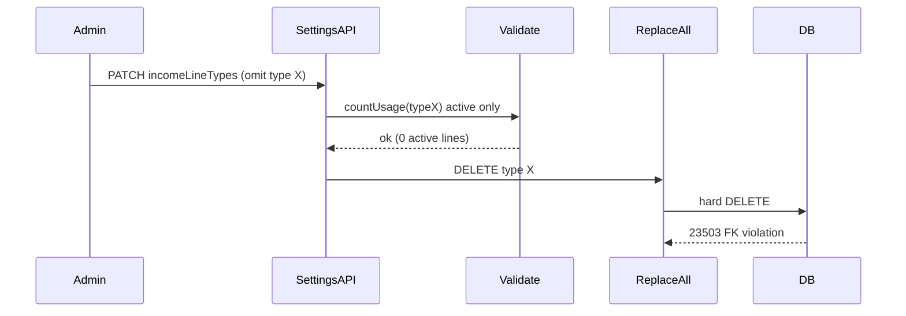

# Catalog type archive — Implementation Phases

Fix the property settings removal 500 (Postgres `23503` FK violation) by soft-deleting income line types and expense category types instead of hard-deleting them when removed from settings, while still blocking removal when **active** ledger rows reference the type.

## Deploy checklist

**Requires Postgres migration v71** (adds `is_deleted` / `deleted_at` on both catalog tables). Server-only change — no admin build dependency.

| Checkpoint | Ship | Notes |
|------------|------|-------|
| **A** | Server with migration v71 + DB/route changes | Safe before or after current admin |
| **B** | Tests (colocated server unit tests) | Ship with **A** or immediately after |

**Hard rule:** deploy server (migration runs on startup) before relying on archived-type behavior. Old server + new DB is fine (unused columns). New server + old DB will fail on startup until migration runs.

---

## Problem

Removing a catalog row from property settings runs a hard `DELETE` in `replaceAll`:

- [`apps/server/src/db/property-income-line-types.ts`](../apps/server/src/db/property-income-line-types.ts)
- [`apps/server/src/db/property-expense-category-types.ts`](../apps/server/src/db/property-expense-category-types.ts)

Ledger rows use soft delete (`is_deleted = false` filter in `countUsage`), so validation passes when only **soft-deleted** income/expense rows reference the type — then Postgres raises `23503` on delete.



## Desired behavior

| Scenario | Result |
|----------|--------|
| Type removed from settings, **0 active** ledger rows | **Archive** type (`is_deleted = true`, `deleted_at = now()`) |
| Type removed, **≥1 active** ledger row | **400** (existing validation message, unchanged) |
| Soft-deleted ledger rows still reference archived type | OK — FK preserved; list/export JOINs still resolve name |
| New expense/income assigned to archived type | **Blocked** on create/update routes |
| User re-adds same name after archive | **Restore** archived row (same id) instead of inserting duplicate |
| Settings GET / pickers | Show **active types only** |

No admin UI changes required: settings already drops the row locally and PATCHes the remaining list; server-side archive is sufficient.

---

## Phase 1 — Migration v71

Append to [`apps/server/src/db/migrations.ts`](../apps/server/src/db/migrations.ts) (after v70):

- Add to **both** `property_income_line_types` and `property_expense_category_types`:
  - `is_deleted BOOLEAN NOT NULL DEFAULT FALSE`
  - `deleted_at TIMESTAMPTZ`
- Add partial unique indexes so active names stay unique per property while archived names can coexist / be reused:

```sql
CREATE UNIQUE INDEX idx_property_income_line_types_property_name_active
  ON property_income_line_types (property_id, lower(name))
  WHERE is_deleted = false;

CREATE UNIQUE INDEX idx_property_expense_category_types_property_name_active
  ON property_expense_category_types (property_id, lower(name))
  WHERE is_deleted = false;
```

- `down`: drop indexes + columns (standard reversible migration).

**Exit criteria:** server starts cleanly; existing catalog rows have `is_deleted = false`.

---

## Phase 2 — DB module changes (mirror both catalogs)

Update:

- [`apps/server/src/db/property-income-line-types.ts`](../apps/server/src/db/property-income-line-types.ts)
- [`apps/server/src/db/property-expense-category-types.ts`](../apps/server/src/db/property-expense-category-types.ts)

### Query filters

- `findByProperty`: add `WHERE is_deleted = false` (settings GET, pickers, lease rent resolver).
- `findByIdForProperty`: add optional `activeOnly` param (default `false` for backward compat) **or** add `findActiveByIdForProperty` used by write routes.
- `seedDefaults`: check for **any** row (`COUNT(*)` or `findAnyByProperty`) — not active-only — so properties with only archived types are not re-seeded.

### `replaceAll` rewrite (core fix)

Replace hard `DELETE` branches with soft archive:

```sql
UPDATE … SET is_deleted = true, deleted_at = NOW(), updated_at = NOW()
WHERE property_id = $1 AND is_deleted = false
  AND NOT (id = ANY($2::uuid[]))   -- or all active rows when incomingIds empty
```

For each incoming row:

- **UPDATE by id**: set fields + `is_deleted = false, deleted_at = NULL` (supports explicit revive via API).
- **INSERT without id**: first try restore archived row by `(property_id, lower(name))`; if found, un-archive + update sort order (and `is_annual_amount` for expenses); else `INSERT`.

Return value: `findByProperty` (active only), unchanged API contract.

### Shared helper (DRY)

Extract a small internal helper used by both modules, e.g. `archiveCatalogRowsNotInIds` + `restoreOrInsertCatalogRow`, in something like [`apps/server/src/db/property-catalog-type-utils.ts`](../apps/server/src/db/property-catalog-type-utils.ts) to avoid duplicating the replaceAll archive logic twice.

**Exit criteria:** removing a type from settings archives it; re-adding same name restores the row; no `DELETE FROM property_*_types` in replaceAll.

---

## Phase 3 — Route guards (active types for new writes)

Validation in [`apps/server/src/routes/admin/property-settings-routes.ts`](../apps/server/src/routes/admin/property-settings-routes.ts) already uses `countUsage` with `is_deleted = false` — **no logic change**, but ensure `validate*Removal` compares against **active** `findByProperty` results (automatic once filtered).

Block archived types on ledger writes:

- [`apps/server/src/routes/admin/property-income-line-routes.ts`](../apps/server/src/routes/admin/property-income-line-routes.ts) — `resolveIncomeLineTypeForProperty`: require active type (`is_deleted = false`).
- [`apps/server/src/routes/admin/property-expense-routes.ts`](../apps/server/src/routes/admin/property-expense-routes.ts) — category lookup on create + category change on patch: require active category.

Historical reads (income entries UNION, exports, edit forms loading existing rows) keep `INNER JOIN` on type id **without** `ilt.is_deleted = false` — archived names still display.

[`apps/server/src/services/tenant-rent-payment-service.ts`](../apps/server/src/services/tenant-rent-payment-service.ts) uses `findByProperty` → automatically excludes archived types for new rent income (correct).

**Exit criteria:** create/update income or expense with archived type id returns 400.

---

## Phase 4 — Shared types (optional / minimal)

**Do not** expose `isDeleted` on [`packages/shared/src/property-income-line-type-config.ts`](../packages/shared/src/property-income-line-type-config.ts) / [`packages/shared/src/property-expense-category-type-config.ts`](../packages/shared/src/property-expense-category-type-config.ts) in settings API responses — archived rows are omitted server-side. No client changes expected.

---

## Phase 5 — Tests

Add colocated mock-client tests (pattern from [`apps/server/src/db/property-reservations-create-many.test.ts`](../apps/server/src/db/property-reservations-create-many.test.ts)):

**New:** `apps/server/src/db/property-income-line-types-replace.test.ts`

- Removing an omitted id emits `UPDATE … is_deleted = true` (not `DELETE`).
- Re-adding same name restores archived row (`is_deleted = false`) instead of `INSERT`.
- `findByProperty` SQL includes `is_deleted = false`.

**New:** `apps/server/src/db/property-expense-category-types-replace.test.ts` — same cases + `is_annual_amount` preserved on restore.

**Optional route-level assertion:** archived type id rejected on income/expense create (mock `findActiveByIdForProperty` returning null).

Run:

```bash
cd apps/server && bun test src/db/property-*-types-replace.test.ts
```

**Exit criteria:** all new tests pass; manual verification checklist below passes.

---

## Out of scope

- Restore-archived UI, admin “archived types” tab
- Channel commissions / tax rates (same hard-delete pattern exists but not in this bug path)
- Hard-delete purge job

---

## Verification checklist

1. Soft-delete an income line using type X → remove type X in settings → **succeeds** (type archived, not 500).
2. Active income line using type X → remove type X → **400** with usage message.
3. Archived type X no longer appears in settings or income/expense create dropdowns.
4. Soft-deleted income line still shows type X name in income table/export.
5. Repeat steps 1–4 for expense categories.
6. Re-add archived name → single row restored, no duplicate-name 400.

---

## Suggested commit

```bash
git add .
git commit -m "fix: archive property catalog types instead of hard-deleting on settings removal"
```
