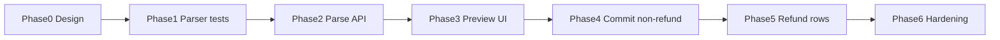

# Income CSV Import — Implementation Phases

Roadmap for importing short stays (reservations) from the Hotel Tax Calculator CSV format. v1 is a **deterministic parser** — not AI. Tenanto recomputes commission, taxes, and net/gross from `roomTotal`, `cleaningFee`, channel settings, and property tax rates.

**Related code today**

- Income page: `apps/admin/src/pages/property-income-page.tsx` — `ImportCsvButton`, upload-only `ImportIncomeCsvDialog`
- Shared CSV UI: `apps/admin/src/components/csv-import/` — button, upload step, dialog shell, footer
- Shared file utils: `apps/admin/src/lib/csv-file-import.ts`, `apps/admin/src/hooks/use-csv-file-selection.ts`
- Reservation create + computed fields: `apps/server/src/routes/admin/property-reservation-routes.ts` → `buildComputedFields()` → `calculateStayIncome()`
- Refunds (prerequisite): `refunded_at` on `property_reservations` (migration v49), `/refund` routes — see `docs/INCOME_REFUND_PHASES.md`
- Expense import pattern to mirror: `apps/server/src/routes/admin/property-expense-import-routes.ts` (parse → preview → commit)
- Golden fixture: `sanem Final_Hotel_Tax_Calculator 3 (1)-Hotel Tax Calculator.csv` (repo root)

**Already shipped (UI shell)**

- Reusable CSV upload components extracted from Expenses
- Income page has Import CSV button + upload-only dialog (Smart Read disabled)

---

## Guiding principles

1. **Parser before API, API before commit** — never bulk-insert until parse + preview are trustworthy.
2. **Deterministic over AI** — Hotel Tax Calculator headers are known; no OpenAI gate for v1 (unlike expense import).
3. **Tenanto computes money** — import `roomTotal` + `cleaningFee`; ignore pre-calculated tax/net/gross columns from CSV.
4. **Refund is orthogonal to status** — CSV `refund` → `stayed` + `refundedAt`, never `canceled`.
5. **Reuse expense import shape** — `parse` → preview → `commit`, same dialog flow.
6. **Fixture-driven tests** — use the sample CSV (or a trimmed copy under `apps/server/src/lib/__fixtures__/`) as the golden file.

---

## Target architecture

```
User → upload CSV(s) → POST .../income/import/parse
                              ↓
                    Deterministic row extractor
                              ↓
              Resolve unit + channel + validate dates
                              ↓
              calculateStayIncome() per row (preview)
                              ↓
User reviews/edits preview → POST .../income/import/commit
                              ↓
              createMany reservations (transaction)
                              ↓
              refund rows: stayed + refunded_at in same txn
                              ↓
              invalidate income / report caches
```

### CSV column map (v1 — Hotel Tax Calculator)

**Import these columns:**

| CSV column        | Tenanto field                 | Notes                                               |
| ----------------- | ----------------------------- | --------------------------------------------------- |
| `Guess Name`      | `guestName`                   | Header typo only                                    |
| `Room No`         | `unitId`                      | Resolve by unit label/name (e.g. `210`, `Abbott 3`) |
| `Check in date`   | `checkIn`                     | Normalize to `YYYY-MM-DD`                           |
| `Check out date`  | `checkOut`                    | Normalize to `YYYY-MM-DD`                           |
| `Number of Night` | validate vs computed `nights` | Server computes nights from dates                   |
| `Status`          | `status` (+ `refunded` flag)  | See status map below                                |
| `Room Rate`       | `roomTotal`                   | Strip `$` and commas                                |
| `Cleaning Fee`    | `cleaningFee`                 | Stored on reservation                               |
| `Channel`         | `channelCommissionId`         | Match via alias table                               |

**Ignore these columns:**

- `Month`
- `Channel Comission`
- `Sales Tax`, `Miami-Dade Surtax`, `Miami-Dade Tourist Tax`, `Miami Beach Resort Tax`
- `Bank Fee`
- `Net Income`, `Gross Income`

### Status map

| CSV `Status`      | Tenanto `status` | `refunded` (preview) | Notes                                    |
| ----------------- | ---------------- | -------------------- | ---------------------------------------- |
| `Checked`         | `stayed`         | `false`              | Completed stay                           |
| `Canceled`        | `canceled`       | `false`              | Import amounts as-is even when non-zero  |
| `No Show`         | `no_show`        | `false`              | Import amounts as-is even when non-zero  |
| `refund`          | `stayed`         | `true`               | Not `canceled`; see refund section below |
| empty / `Err:522` | skip row         | —                    | Junk rows at end of spreadsheet export   |

### Refund handling

Refund state is split across two dimensions (see `docs/INCOME_REFUND_PHASES.md`):

| Field                  | Parse API                        | Preview UI            | Commit                                     |
| ---------------------- | -------------------------------- | --------------------- | ------------------------------------------ |
| `refunded` (`boolean`) | Set from CSV (`refund` → `true`) | **Editable checkbox** | Re-validated from payload                  |
| `status`               | Mapped from CSV                  | **Editable select**   | Re-validated from payload                  |
| `refundedAt`           | Not set                          | Not shown             | `NOW()` when `refunded === true`           |
| `refundedBy`           | Not set                          | Not shown             | `request.user.userId` (the importing user) |

**Rules:**

- `refunded_by` is always the authenticated user performing the import at commit time — never from CSV, never editable in preview.
- Preview shows a **Refunded** checkbox (same pattern as expense import `taxFree` checkbox).
- When refund is checked → require/coerce `status = stayed`.
- When `status` is `canceled` or `no_show` and refund is checked → blocking validation error.
- Do not use `status = canceled` to represent a refund.

### Channel aliases (v1)

| CSV `Channel` | Match to property channel name            |
| ------------- | ----------------------------------------- |
| `Booking`     | `Booking.com`                             |
| `Airbnb`      | `Airbnb`                                  |
| `Expedia EC`  | Expedia channel(s) configured on property |
| `Expedia HC`  | Expedia channel(s) configured on property |
| `Direct`      | `Direct web / merchant`                   |

### Design decisions (lock in Phase 0)

| Decision                | Recommendation                                                                                                     |
| ----------------------- | ------------------------------------------------------------------------------------------------------------------ |
| Supported format v1     | Hotel Tax Calculator CSV only (detect by header signature)                                                         |
| Unit match              | `Room No` → unit `label` exact, then case-insensitive trim                                                         |
| Canceled/no-show with $ | Import amounts as-is (sample file has non-zero canceled/no-show rows)                                              |
| Duplicates v1           | Warn in preview; don't auto-skip unless exact match (guest + unit + check-in + check-out)                          |
| Row limits              | Start aligned with expenses: 5 files, 1 MB each, ~2000 rows total (add `INCOME_CSV_IMPORT_*` constants in Phase 6) |
| Financial preview       | Show **computed** commission/taxes/net/gross, not CSV columns                                                      |
| Cleaning fee            | Part of reservation (`cleaningFee`); not a separate income line in v1                                              |
| Date formats            | `MM-DD-YYYY`, `M/D/YYYY` → `YYYY-MM-DD`                                                                            |
| CSV parsing             | Proper parser for quoted commas (e.g. `"$1,375.20"`); reuse/share `parseCsvRecords()` from expense extractor       |

### Shared contract (`packages/shared`) — preview row shape

```typescript
interface IIncomeImportParsedRow {
  channelCommissionId: string;
  checkIn: string;
  checkOut: string;
  cleaningFee: number;
  guestName: string;
  nights: number;
  refunded: boolean; // editable checkbox in preview; NOT refundedBy/refundedAt
  roomTotal: number;
  rowIndex: number;
  sourceFileName: string;
  status: TReservationStatus;
  unitId: string;
  validationError?: string;
  // computed preview fields (read-only in UI):
  // channelCommission, grossIncome, netIncome, taxBreakdown, ...
}
```

---

## Phase 0 — Design spike

**Goal:** Lock rules before code spreads. No user-facing behavior change.

**Deliverable:** This document reviewed and signed off. Confirm:

- Status/refund mapping and preview checkbox behavior
- `refunded_by` = importing user at commit (not in parse response)
- Channel alias table matches property settings for target property
- Unit labels in Tenanto match `Room No` values in CSV (`210`, `Abbott 3`, etc.)
- Canceled/no-show amount policy
- Duplicate warning policy

**Exit criteria:** team agrees on all decisions in the tables above.

---

## Phase 1 — Shared contract + deterministic parser (server tests only)

**Goal:** Parse the CSV correctly with zero API/UI wiring.

### `packages/shared`

New `property-income-import-types.ts`:

- `INCOME_CSV_IMPORT_MAX_FILES`, `INCOME_CSV_IMPORT_MAX_BYTES_PER_FILE`, row limits
- `IIncomeImportParsedRow` — includes `refunded: boolean` (not `refundedBy` / `refundedAt`)
- `IIncomeImportFileResult`, `IIncomeImportParseResponse`
- `IIncomeImportCommitBody`, `IIncomeImportCommitResponse`

### Server

| File                                                    | Change                                                  |
| ------------------------------------------------------- | ------------------------------------------------------- |
| `lib/income-hotel-tax-calculator-csv-extractor.ts`      | Deterministic extractor for known headers               |
| `lib/income-hotel-tax-calculator-csv-extractor.test.ts` | Fixture tests against sample CSV                        |
| `lib/expense-csv-row-extractor.ts`                      | Extract/share `parseCsvRecords()` if not already shared |

**Parser responsibilities:**

- Detect Hotel Tax Calculator format by header row
- Parse quoted CSV fields and money values
- Normalize dates and status values (case-insensitive)
- Map CSV status → `status` + `refunded` boolean
- Skip empty / `Err:522` rows

**Test targets from sample file (~508 data rows):**

- ~372 `Checked` → `stayed`, `refunded: false`
- ~114 `Canceled` → `canceled`, `refunded: false`
- ~5 `No Show` → `no_show`, `refunded: false`
- ~3 `refund` → `stayed`, `refunded: true`
- ~13 junk rows skipped
- Quoted amounts (`"$1,375.20"`) parse correctly
- Mixed date formats (`02-07-2026`, `2/14/2026`) normalize

**Exit criteria:** all parser tests green; no routes yet.

---

## Phase 2 — Parse API + preview data (no commit)

**Goal:** Smart read returns reviewable rows; nothing is saved.

### Server

| File                                            | Change                        |
| ----------------------------------------------- | ----------------------------- |
| `routes/admin/property-income-import-routes.ts` | New route module              |
| `server.ts`                                     | Register income import routes |

**Endpoints:**

- `POST /properties/:propertyId/income/import/parse` — multipart CSV upload

**Per-row server work:**

1. Run deterministic extractor
2. Resolve `unitId` from `Room No`
3. Resolve `channelCommissionId` from `Channel` (+ aliases)
4. Run `calculateStayIncome()` for preview commission/taxes/net/gross
5. Attach `validationError` when unit/channel missing, dates invalid, nights mismatch, refund+status conflict, etc.

Return per-file results (`parsed` / `error` / `irrelevant`) like expense import. Response rows include `refunded: boolean` only — no `refundedBy` or `refundedAt`.

### Admin

| File                                             | Change                                                |
| ------------------------------------------------ | ----------------------------------------------------- |
| `lib/income-csv-import.ts`                       | `parseIncomeCsvFiles()` API client wrapper            |
| `lib/api-client.ts`                              | `incomeImport.parse` method                           |
| `components/income/import-income-csv-dialog.tsx` | Enable Smart Read; parse mutation; preview step shell |

**Exit criteria:** upload sample CSV → API returns parsed rows with computed financials and `refunded` flag; invalid rows show clear errors. Commit still disabled.

---

## Phase 3 — Preview UI (edit + validate)

**Goal:** User can review and fix rows before any commit.

### Admin (new income-specific preview components)

| File                                                     | Change                             |
| -------------------------------------------------------- | ---------------------------------- |
| `components/income/import-income-csv-preview-fields.tsx` | Editable preview table/cards       |
| `components/income/import-income-csv-preview-utils.ts`   | Validation helpers, column classes |

**Preview columns:**

- Editable: guest, unit, channel, dates, room total, cleaning fee, status, **refunded (checkbox)**
- Read-only computed: nights, commission, taxes, net, gross
- Remove row; block commit when any row has `validationError`

**Refund checkbox behavior (mirror expense `taxFree` checkbox):**

- Initialized from parse response (`refund` CSV rows → checked)
- User can toggle before commit
- Checking refund coerces/requires `status = stayed`
- Unchecking refund leaves status as user selected
- `canceled` / `no_show` + refund checked → validation error

Modeled on expense import preview (`import-expense-csv-preview-fields.tsx`). `RefundedBadge` is for the income table after import; preview uses the checkbox.

**Exit criteria:** full upload → parse → edit → remove flow works; refund checkbox toggles correctly; commit button hidden or disabled.

---

## Phase 4 — Commit API (non-refund rows)

**Goal:** Safest first write — `stayed`, `canceled`, `no_show` with `refunded: false` only.

### Server

| File                                            | Change                                                                          |
| ----------------------------------------------- | ------------------------------------------------------------------------------- |
| `db/property-reservations.ts`                   | `createMany()` for bulk insert (reservations lack this today; expenses have it) |
| `routes/admin/property-income-import-routes.ts` | `POST .../income/import/commit`                                                 |

**Commit behavior:**

- Re-validate every row server-side (never trust client edits blindly)
- Re-run `calculateStayIncome()` at commit time
- Insert in a single transaction
- Rows with `refunded: true` are **rejected or skipped** in this phase
- Cache invalidation for income/reservations/reports
- Structured log: `income_csv_import_commit`

### Admin

| File                                             | Change                                          |
| ------------------------------------------------ | ----------------------------------------------- |
| `components/income/import-income-csv-dialog.tsx` | Import button on preview footer                 |
| `lib/income-csv-import.ts`                       | `commitIncomeCsvImport()`                       |
| `lib/invalidate-property-*-caches.ts`            | Invalidate reservation/income caches on success |

---

## Phase 5 — Refund rows on import

**Goal:** Handle combined status from spreadsheet.

### Server

For rows where preview has `refunded: true`:

- Insert as `status: stayed`
- Set `refunded_at = NOW()` and `refunded_by = request.user.userId` in the **same transaction**
- Do not call POST `/refund` per row
- Support zero-amount refund rows (all 3 in sample file are `$0`)

Re-validate: `refunded: true` requires `status: stayed`; reject conflicting payloads.

### Admin

- Refund checkbox already wired from Phase 3
- Include refunded rows in commit count label (e.g. "Import 495 stay(s) (3 refunded)")

**Exit criteria:** 3 refund rows import as stayed + refunded badge; excluded from reports per existing refund rules; `refunded_by` equals importing user.

---

## Phase 6 — Hardening + polish

**Goal:** Production-ready UX and operability.

- Duplicate warnings in preview ("similar stay already exists")
- Dev-only mock parse (like `loadExpenseImportMockParseResponse` for local env)
- `INCOME_CSV_IMPORT_*` constants in shared (stop borrowing expense limits)
- Structured logging for parse + commit events
- Release notes entry in `apps/admin/src/config/release-notes.ts`
- Optional: import summary (created / skipped / refunded counts)
- Optional: rename "Smart read" → "Read CSV" in income dialog copy

**Exit criteria:** operator can import full sample file end-to-end with confidence; edge cases documented.

---

## Phase diagram



---

## Out of scope (v1)

- AI / generic CSV detection (unlike expenses)
- Importing **other income lines** (cleaning stays on reservation)
- Partial refunds
- Updating existing reservations on re-import
- Multiple CSV schemas (Airbnb export, Booking export, etc.)
- Importing CSV tax/commission/net/gross columns instead of computing them
- Exposing or editing `refundedBy` / `refundedAt` in parse or preview responses
- Moving shared CSV limits to a generic `csv-import-constants.ts` (optional follow-up)

---

## Manual test checklist

### Phase 2 (parse only)

- [ ] Upload sample CSV; Smart Read returns ~495 parsed rows
- [ ] `refund` CSV rows have `refunded: true` and `status: stayed` in response
- [ ] Response does not include `refundedBy` or `refundedAt`
- [ ] Junk `Err:522` rows skipped
- [ ] Missing unit/channel shows per-row validation error
- [ ] Computed net/gross differ from CSV when settings don't match spreadsheet (expected)

### Phase 3 (preview)

- [ ] Refunded checkbox visible and editable per row
- [ ] Checking refund coerces status to stayed
- [ ] Canceled + refund checked shows validation error
- [ ] User can uncheck refund on a `refund` CSV row before commit

### Phase 4 (commit)

- [ ] Import `stayed` rows; Income table shows new stays
- [ ] Reports reflect new revenue (non-refunded)
- [ ] Canceled / no-show rows import with correct status and amounts
- [ ] Re-import same file warns about duplicates (Phase 6)

### Phase 5 (refund)

- [ ] `refunded: true` rows import as stayed + refunded badge
- [ ] `refunded_by` on imported rows matches importing user
- [ ] Refunded rows excluded from report totals

### Regression

- [ ] Expense CSV import still works (shared components unchanged in behavior)
- [ ] Income upload-only dialog still resets files on close
