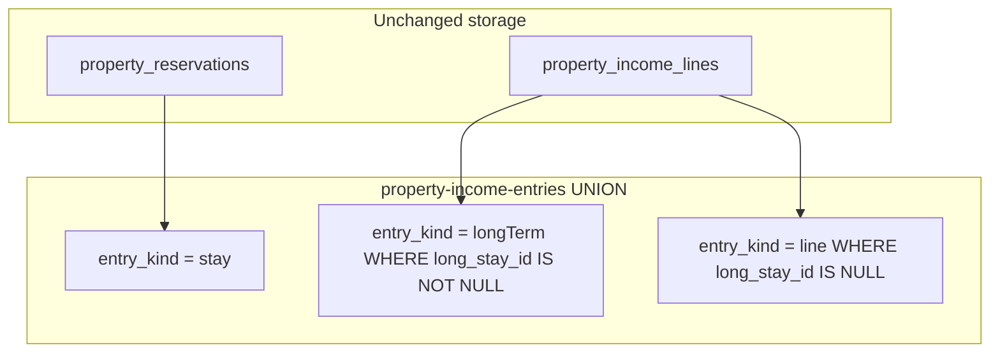

# Long-term entryKind — Implementation Phases

Phased rollout: expose lease rent income as `entryKind: "longTerm"` in the unified income-entries API (instead of fragile `entryKind: "line"` + `incomeLineTypeName: "Rent"`), then decouple lease rent creation from the **"Rent"** settings type name.

## Deploy checklist

**No Postgres migration** for this feature — classification is read-time (`long_stay_id IS NOT NULL`). You can develop all phases on one branch; these gates apply when **shipping to envs**.

### Before starting longTerm in prod

If migration **v70** (`tax_free` → `cash_expense`) is not live yet, deploy and verify it first (**server with migration, then admin** — or both together). Do not debug v70 and longTerm contract changes in the same prod window.

### Release checkpoints

| Checkpoint | Ship | Before |
|------------|------|--------|
| **A** | Phase **1 + 2** server (shared types + `/income-entries` 3-branch UNION, `?incomeType=longTerm`) | Phase **3** admin |
| **B** | Phase **3** admin (+ Phase **4** export if Type column must say **Long term**) | — deploy with or immediately after **A** |
| **C** | Phase **5** write path | Independent; anytime after **A** |

**Hard rule:** never deploy Phase 3 admin before Checkpoint **A** server. The long-term toolbar filter sends `incomeType=longTerm` to `/income-entries`; old server rejects it and routes the wrong way today.

**Safe to combine:** Checkpoint **A + B** in one release (server first or same deploy window, then admin).

### Skew matrix

| Deploy order | Effect |
|--------------|--------|
| Server Phase 2, old admin | All-view works (rows still render via `entry.line`); badge says **Rent** until Phase 3 |
| Admin Phase 3, old server | **Broken** long-term filter; do not ship |
| Phase 2 without Phase 4 | Export Type column still uses `incomeLineTypeName` (**Rent**) — not a crash |
| Roll back server Phase 2, keep Phase 3 admin | Long-term filter 400s until admin rolls back too |

### Known deploy side effects (acceptable)

- **Pagination:** keyset cursors embed `entryKind`; users mid-scroll may duplicate/skip until refresh.
- **`?incomeType=<rent-type-uuid>` on `/income-entries`:** long-term rows move out of the line branch (intentional). Admin Rent-type toolbar view still uses `/income-lines` and is unaffected.

**Related code today**

- [`packages/shared/src/property-income-line-types.ts`](../packages/shared/src/property-income-line-types.ts) — `TPropertyIncomeEntry`, `IncomeEntryKind` (`stay` | `line`)
- [`apps/server/src/db/property-income-entries.ts`](../apps/server/src/db/property-income-entries.ts) — 2-branch UNION (reservations + all income lines)
- [`packages/shared/src/property-income-line-type-config.ts`](../packages/shared/src/property-income-line-type-config.ts) — `resolveRentIncomeLineTypeId` (name match on `"Rent"`)
- [`apps/server/src/services/tenant-rent-payment-service.ts`](../apps/server/src/services/tenant-rent-payment-service.ts) — Stripe rent → `property_income_lines` with `longStayId`
- [`apps/admin/src/pages/property-income-page.tsx`](../apps/admin/src/pages/property-income-page.tsx) — income table; branches on `entryKind`

---

## Goals

- Unified list returns **`entryKind: "longTerm"`** for lease-linked income (`long_stay_id IS NOT NULL`).
- Type label in UI/export is stable (**Long term**), not tied to deletable settings catalog names.
- **`?incomeType=longTerm`** filter works like `?incomeType=stay`.
- Lease rent writes (manual + Stripe) no longer break when **Rent** is renamed or removed from settings.

## Non-goals

- New storage table for long-term rent (rows stay in `property_income_lines`)
- DB migration or backfill of existing rows
- Renaming `entryKind: "stay"` to `shortStay`
- Changing `/income-lines` list API in initial release (line-type filter view uses client-side `longStayId` badge fallback)

## Confirmed choices

- **Payload:** `{ entryKind: "longTerm", line: IPropertyIncomeLine }` (keep `line` key, not `longTerm`)
- **Classification:** `long_stay_id IS NOT NULL` → `longTerm`; no data rewrite
- **Write-path hardening:** included in Phase 5

---

## Architecture

---

## Phase 1 — Shared contract (3 files)

Extend the API contract only; no runtime behavior change yet.

| File | Change |
|------|--------|
| [`packages/shared/src/property-income-line-types.ts`](../packages/shared/src/property-income-line-types.ts) | Add `IncomeEntryKind.LONG_TERM = "longTerm"`; extend `TPropertyIncomeEntry` with `{ entryKind: "longTerm"; line: IPropertyIncomeLine }` |
| [`packages/shared/src/property-income-entries-types.ts`](../packages/shared/src/property-income-entries-types.ts) | Document `incomeType`: empty = all; `stay`; **`longTerm`**; otherwise income line type UUID (other lines only) |
| [`packages/shared/src/index.ts`](../packages/shared/src/index.ts) | Re-export if needed (usually automatic) |

**Exit criteria:** Typecheck passes; no server/admin behavior change.

---

## Phase 2 — Server unified list + filters (9 files)

Split the income-entries UNION into three branches and accept `?incomeType=longTerm`.

| File | Change |
|------|--------|
| [`apps/server/src/db/property-income-entries.ts`](../apps/server/src/db/property-income-entries.ts) | Add `buildLongTermBranchSql` (`long_stay_id IS NOT NULL`, `entry_kind = longTerm`); restrict `buildLineBranchSql` to `long_stay_id IS NULL`; update `resolveIncomeTypeFilter` + `mapUnifiedRow` |
| [`apps/server/src/routes/admin/parse-income-entries-filter-fields.ts`](../apps/server/src/routes/admin/parse-income-entries-filter-fields.ts) | Accept `IncomeEntryKind.LONG_TERM` in `parseIncomeTypeFilter` |
| [`apps/server/src/routes/admin/property-income-entries-routes.ts`](../apps/server/src/routes/admin/property-income-entries-routes.ts) | Update validation error copy (`stay`, `longTerm`, or UUID) |
| [`apps/server/src/routes/admin/parse-property-export-body.ts`](../apps/server/src/routes/admin/parse-property-export-body.ts) | Same `incomeType` validation for exports |
| [`apps/server/src/pagination/keyset-cursor.ts`](../apps/server/src/pagination/keyset-cursor.ts) | Prefer invalidating cursors on deploy (pagination resets); optional legacy decode compat |
| [`apps/server/src/pagination/keyset-cursor.test.ts`](../apps/server/src/pagination/keyset-cursor.test.ts) | Cover `longTerm` in round-trip |
| [`apps/server/src/test-fixtures/pagination/income-entries-pagination-rows.ts`](../apps/server/src/test-fixtures/pagination/income-entries-pagination-rows.ts) | Add longTerm fixture rows |
| [`apps/server/src/db/property-income-entries-pagination.test.ts`](../apps/server/src/db/property-income-entries-pagination.test.ts) | Tests for 3-branch UNION, `incomeType=longTerm`, line-type UUID excludes longTerm rows |
| [`apps/server/src/db/income-entry-list-sort.ts`](../apps/server/src/db/income-entry-list-sort.ts) | Map `longTerm` branch to same sort-key SQL as `line` |

**Exit criteria:** `GET /income-entries` returns `longTerm` for lease-linked lines; `?incomeType=longTerm` returns only those; existing rows unchanged in DB.

---

## Phase 3 — Admin income table + filters (7 files)

Wire the admin UI to the new kind.

| File | Change |
|------|--------|
| [`apps/admin/src/pages/property-income-page.tsx`](../apps/admin/src/pages/property-income-page.tsx) | `IncomeEntryRow`: handle `LONG_TERM`; update `getIncomeEntryKey`; add `isLongTermOnlyView`; fix `isLineTypeOnlyView`; column visibility |
| [`apps/admin/src/components/income/income-entry-type-badge.tsx`](../apps/admin/src/components/income/income-entry-type-badge.tsx) | `LONG_TERM` → label **Long term** |
| [`apps/admin/src/components/income/income-line-form-options.ts`](../apps/admin/src/components/income/income-line-form-options.ts) | Filter option `{ label: "Long term", value: IncomeEntryKind.LONG_TERM }` |
| [`apps/admin/src/lib/income-entry-sort.ts`](../apps/admin/src/lib/income-entry-sort.ts) | Treat `LONG_TERM` like `LINE` for sort helpers |
| [`apps/admin/src/lib/income-toolbar-filters.test.ts`](../apps/admin/src/lib/income-toolbar-filters.test.ts) | Update fixtures |

**Note:** Line-type-only view still uses `/income-lines`. When rendering those rows, show **Long term** badge if `line.longStayId != null`.

**Exit criteria:** All-view and longTerm-filter view show correct badge; edit/refund/delete still operate on `entry.line`.

---

## Phase 4 — Income export (2 files)

| File | Change |
|------|--------|
| [`apps/server/src/services/property-export/income-table-export.ts`](../apps/server/src/services/property-export/income-table-export.ts) | Map `entryKind === LONG_TERM` → Type column **Long term** |
| New [`apps/server/src/services/property-export/income-table-export.test.ts`](../apps/server/src/services/property-export/income-table-export.test.ts) | Unit tests for stay / line / longTerm type labels |

**Exit criteria:** CSV/XLSX export Type column stable when Rent type is renamed.

---

## Phase 5 — Write path decoupling (9 files)

Stop relying on the **"Rent"** type **name** for lease rent behavior; use **`longStayId`** as identity.

| File | Change |
|------|--------|
| [`packages/shared/src/property-income-line-type-config.ts`](../packages/shared/src/property-income-line-type-config.ts) | Add `resolveLeaseIncomeLineTypeId()` (prefer name "Rent", fallback first type) |
| [`packages/shared/src/property-income-line-type-config.test.ts`](../packages/shared/src/property-income-line-type-config.test.ts) | Tests for rename/delete Rent name fallback |
| [`apps/server/src/services/tenant-rent-payment-service.ts`](../apps/server/src/services/tenant-rent-payment-service.ts) | Use `resolveLeaseIncomeLineTypeId` |
| [`apps/server/src/services/tenant-rent-payment-apply-income.test.ts`](../apps/server/src/services/tenant-rent-payment-apply-income.test.ts) | Update mocks/expectations |
| [`apps/server/src/routes/admin/property-income-line-routes.ts`](../apps/server/src/routes/admin/property-income-line-routes.ts) | Rent receipt email on `longStayId` present, not `isRentIncomeLineType` |
| [`apps/server/src/routes/admin/property-income-line-create-lease-rent.test.ts`](../apps/server/src/routes/admin/property-income-line-create-lease-rent.test.ts) | Assert behavior when Rent type renamed |
| [`apps/admin/src/components/income/create-income-line-dialog.tsx`](../apps/admin/src/components/income/create-income-line-dialog.tsx) | Lease flows use `resolveLeaseIncomeLineTypeId` |
| [`apps/admin/src/pages/property-lease-detail-page.tsx`](../apps/admin/src/pages/property-lease-detail-page.tsx) | Same resolver for Record Rent prefill |
| [`apps/admin/src/lib/lease-record-rent-prefill.ts`](../apps/admin/src/lib/lease-record-rent-prefill.ts) | Type id still passed for FK; no Rent label dependency |

**Exit criteria:** Renaming/deleting "Rent" in settings does not break Stripe rent or manual record rent.

---

## Prod safety checklist

See **Deploy checklist** above for release order. Additional notes:

- No migration; no re-save of `tenant_rent_payments` or income lines
- Breaking API change: clients must handle `entryKind: "longTerm"` (admin updated in Phases 3–4)
- Only admin + server export consume `/income-entries`; no tenant/mobile client impact

## Verification

1. Lease with recorded rent + Stripe payment → `longTerm` in `/income-entries`
2. Other income lines → still `line`
3. Short stays → still `stay`
4. `?incomeType=longTerm` / toolbar filter → long-term rows only
5. `?incomeType=<extra-cleaning-uuid>` → no long-term rows
6. After Phase 5: rename Rent type in settings → record rent + Stripe still work
