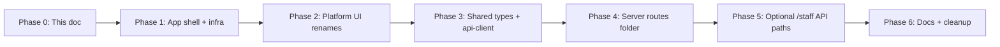

# Admin → Platform Rename — Implementation Phases

Roadmap to rename the operator SPA from **`apps/admin`** to **`apps/platform`**, and phase out **“admin”** from app-level naming (package name, scripts, UI shell components, shared API type prefixes, server route folder, Docker/Railway config, and docs). Early-stage app — prefer a clean break over long-lived aliases, but keep **temporary script aliases** (`dev:admin` → `dev:platform`) for one release if helpful.

**Related code today**

- Operator SPA: `apps/admin/` (Vite + React 19 + React Router)
- Package name: `apps/admin/package.json` → `"name": "admin"`
- Root scripts: `package.json` (`dev:admin`, `build:admin`, `lint:admin`, …)
- Shared API contract: `packages/shared/src/property-types.ts`, `support-types.ts`, `admin-audit-types.ts`, `admin-platform-stats-types.ts`, `app-config-types.ts`
- Server route modules: `apps/server/src/routes/admin/` (39 files)
- Staff-only HTTP paths: `apps/server/src/routes/admin/admin-routes.ts` (`/admin/stats`, `/admin/users`, …)
- Auth guard for staff role: `apps/server/src/auth/jwt.ts` (`requireAdmin` checks `UserType.ADMIN`)
- Docker: `docker/Dockerfile.admin`, `docker-compose.yml` service `admin`
- Railway: `apps/admin/railway.toml`
- Husky / lint-staged: `.husky/pre-push`, root `package.json` lint-staged paths
- Datadog RUM service name: `apps/admin/src/lib/datadog-rum.ts` → `propertyos-admin`
- Theme / prefs localStorage: `apps/admin/src/lib/theme-preference.ts`, `dark-preset-preference.ts`, `release-notes-preference.ts`, inline migration in `apps/admin/index.html`
- CSS tokens: `apps/admin/src/index.css` (`--admin-surface-glow-*`, `.admin-app-surface`)
- Prior rename pattern: `docs/REVENUE_NOTIFICATIONS_RENAME_PHASES.md`

---

## Goals

- The operator UI lives at **`apps/platform`** with package name **`platform`**.
- Root scripts read **`dev:platform`**, **`build:platform`**, **`lint:platform`**, etc.
- UI shell naming drops “admin”: `AdminLayout` → `AppLayout`, `AdminPageLayout` → `PageLayout`, `admin-nav.ts` → `app-nav.ts`, and similar.
- Shared types drop the misleading **`IAdmin*`** prefix for operator APIs (e.g. `IAdminCreatePropertyBody` → `ICreatePropertyBody`).
- Staff-only symbols and endpoints are renamed to **`Staff*`** / **`/staff/*`** where they mean `UserType.ADMIN`, not the app.
- Server internal folder `routes/admin/` becomes `routes/platform/` (organizational; most HTTP paths already omit `/admin/`).
- Infra (Docker, Railway, Husky, lint-staged, `.logawayrc.json`) references `platform`.
- All tests green; `bun run lint` / `build` pass in platform, server, shared, web.

## Non-goals (initial release)

- Renaming **`UserType.ADMIN`** enum value or the **`users.user_type`** column — this is a **staff role**, not the app name.
- Renaming **`PropertyRole`** (`owner | manager | accountant`) — property-scoped roles, unrelated to app name.
- DB migration for **`admin_audit_events`** table or **`AdminAuditAction`** enum in Postgres — optional cosmetic follow-up; table accurately describes staff audit trail.
- Rewriting historical **release-notes** bullets that say “admin”.
- Redirect middleware for old deploy URLs (optional; add only if production bookmarks exist).
- Renaming **`apps/web`** marketing copy that says “admin dashboard” unless explicitly desired.

---

## Guiding principles

1. **Separate app name from staff role** — “platform” is the product surface for operators; “admin/staff” is `UserType.ADMIN` (Users, Activity, App config, platform stats).
2. **`packages/shared` is the contract** — rename types here first (or in the same PR as server + platform); both sides import new symbols only.
3. **No dual naming** — avoid `IAdminCreatePropertyBody` aliases alongside `ICreatePropertyBody`; rename symbols and consumers together per phase.
4. **Use `git mv`** for folders and files to preserve history.
5. **One concern per PR** — mechanical infra first, then UI symbols, then shared types, then optional staff API path rename.
6. **Migrate client prefs** — localStorage keys (`propertyos-admin-theme` → `propertyos-platform-theme`) need the same legacy-read pattern already used for `propertyoss-admin-theme`.
7. **Most HTTP paths stay unchanged** — property, home, support, reports routes already live at `/properties`, `/home`, `/support`, etc.; only the **`/admin/*`** staff segment is a candidate for `/staff/*`.

---

## Vocabulary: what “admin” means today

| Meaning                                          | Examples                                                                 | Target                                                                        |
| ------------------------------------------------ | ------------------------------------------------------------------------ | ----------------------------------------------------------------------------- |
| **The app / package**                            | `apps/admin`, `"name": "admin"`, `dev:admin`, `Dockerfile.admin`         | **`platform`**                                                                |
| **UI shell**                                     | `AdminLayout`, `AdminPageLayout`, `admin-nav.ts`, `--admin-surface-glow` | **`App*` / `Platform*` / drop prefix**                                        |
| **Operator API types** (all authenticated users) | `IAdminCreatePropertyBody`, `IAdminPropertiesListQuery`                  | **`ICreatePropertyBody`**, **`IPropertiesListQuery`** (drop `Admin`)          |
| **Staff-only API types**                         | `IAdminPlatformStats`, `IAdminUsersListQuery`, `IAdminAuditEvent`        | **`IStaffPlatformStats`**, **`IStaffUsersListQuery`**, **`IStaffAuditEvent`** |
| **Staff role & guard**                           | `UserType.ADMIN`, `requireAdmin`                                         | **Keep** or rename guard to `requireStaff` in a dedicated PR                  |
| **Staff HTTP paths**                             | `/admin/stats`, `/admin/users`, `/admin/app-config`                      | **`/staff/*`** (optional phase)                                               |
| **Support table variant**                        | `variant: "admin" \| "user"`                                             | **`"staff" \| "user"`** when touching that code                               |
| **Audit of staff actions**                       | `admin_audit_events`, `AdminAuditAction`, `record-admin-audit.ts`        | **Keep** or rename to `staff_audit_*` later (low priority)                    |

---

## Target naming map

### App / monorepo

| Before                                                        | After                                                    |
| ------------------------------------------------------------- | -------------------------------------------------------- |
| `apps/admin/`                                                 | `apps/platform/`                                         |
| `"name": "admin"`                                             | `"name": "platform"`                                     |
| `dev:admin` / `build:admin` / `lint:admin` / `prettier:admin` | `dev:platform` / …                                       |
| `bun.lock` workspace `admin@workspace:apps/admin`             | `platform@workspace:apps/platform`                       |
| `docker/Dockerfile.admin`                                     | `docker/Dockerfile.platform`                             |
| `docker-compose.yml` service `admin`                          | `platform`                                               |
| `ADMIN_ORIGIN` (proxy CORS)                                   | `PLATFORM_ORIGIN` (optional; keep alias env var briefly) |
| `apps/admin/railway.toml`                                     | `apps/platform/railway.toml`                             |
| `apps/admin/.env.example` comment “Admin API”                 | “Platform API”                                           |

### Platform UI — files with `admin` in the name (11 files)

| Before                                    | After                                |
| ----------------------------------------- | ------------------------------------ |
| `components/layout/admin-layout.tsx`      | `components/layout/app-layout.tsx`   |
| `components/admin-page-layout.tsx`        | `components/page-layout.tsx`         |
| `components/admin-page-intro.tsx`         | `components/page-intro.tsx`          |
| `config/admin-nav.ts`                     | `config/app-nav.ts`                  |
| `components/admin-audit-shared.tsx`       | `components/audit-event-details.tsx` |
| `components/admin-user-audit-section.tsx` | `components/user-audit-section.tsx`  |
| `components/admin-theme-sync.tsx`         | `components/theme-sync.tsx`          |
| `components/admin-theme-switcher.tsx`     | `components/theme-switcher.tsx`      |
| `components/admin-dark-palette-menu.tsx`  | `components/dark-palette-menu.tsx`   |
| `hooks/use-resolved-admin-dark.ts`        | `hooks/use-resolved-dark-preset.ts`  |
| `lib/admin-audit-format.ts`               | `lib/audit-event-format.ts`          |

### Platform UI — symbols

| Before                                               | After                                          |
| ---------------------------------------------------- | ---------------------------------------------- |
| `AdminLayout`                                        | `AppLayout`                                    |
| `AdminPageLayout` / `AdminPageLayoutProps`           | `PageLayout` / `PageLayoutProps`               |
| `AdminPageIntro` / `AdminPageIntroProps`             | `PageIntro` / `PageIntroProps`                 |
| `AdminNavItem` / `AdminNavMatch` / `ADMIN_NAV_ITEMS` | `AppNavItem` / `AppNavMatch` / `APP_NAV_ITEMS` |
| `isAdminNavActive` / `getNavItemsForRole`            | `isAppNavActive` / … (keep logic)              |
| `useResolvedAdminDark`                               | `useResolvedDarkPreset`                        |
| `--admin-surface-glow-a/b`                           | `--platform-surface-glow-a/b`                  |
| `.admin-app-surface` / `.admin-dashboard-shell`      | `.app-surface` / `.dashboard-shell`            |

### Platform UI — localStorage & observability

| Before                                     | After                                                  |
| ------------------------------------------ | ------------------------------------------------------ |
| `propertyos-admin-theme`                   | `propertyos-platform-theme` (+ migrate from `-admin-`) |
| `propertyos-admin-dark-preset`             | `propertyos-platform-dark-preset`                      |
| `propertyos-admin-release-notes-seen`      | `propertyos-platform-release-notes-seen`               |
| Datadog `RUM_SERVICE = "propertyos-admin"` | `"propertyos-platform"`                                |

### Shared types — operator APIs (drop `Admin` prefix)

| Before                           | After                       |
| -------------------------------- | --------------------------- |
| `IAdminPropertiesListQuery`      | `IPropertiesListQuery`      |
| `IAdminPropertiesListResponse`   | `IPropertiesListResponse`   |
| `IAdminCreatePropertyBody`       | `ICreatePropertyBody`       |
| `IAdminUpdatePropertyBody`       | `IUpdatePropertyBody`       |
| `IAdminSetPropertyFavoriteBody`  | `ISetPropertyFavoriteBody`  |
| `IAdminAddPropertyMemberBody`    | `IAddPropertyMemberBody`    |
| `IAdminUpdatePropertyMemberBody` | `IUpdatePropertyMemberBody` |

### Shared types — staff / support triage

| Before                                   | After                                    |
| ---------------------------------------- | ---------------------------------------- |
| `IAdminPlatformStats`                    | `IStaffPlatformStats`                    |
| `IAdminPatchAppConfigBody`               | `IStaffPatchAppConfigBody`               |
| `IAdminAuditEvent`                       | `IStaffAuditEvent`                       |
| `IAdminAuditEventsListQuery`             | `IStaffAuditEventsListQuery`             |
| `IAdminAuditEventsListResponse`          | `IStaffAuditEventsListResponse`          |
| `AdminAuditAction` / `TAdminAuditAction` | `StaffAuditAction` / `TStaffAuditAction` |
| `IAdminSupportRequestListItem`           | `IStaffSupportRequestListItem`           |
| `TAdminSupportRequestSettableStatus`     | `TStaffSupportRequestSettableStatus`     |
| `IAdminSupportRequestPatchBody`          | `IStaffSupportRequestPatchBody`          |
| `IAdminSupportRequestsListResponse`      | `IStaffSupportRequestsListResponse`      |

### Shared — file renames

| Before                          | After                           |
| ------------------------------- | ------------------------------- |
| `admin-audit-types.ts`          | `staff-audit-types.ts`          |
| `admin-platform-stats-types.ts` | `staff-platform-stats-types.ts` |

### Platform `api-client.ts` — local-only types & API object

| Before                                              | After                                               |
| --------------------------------------------------- | --------------------------------------------------- |
| `IAdminUsersListQuery` / `IAdminUsersListResponse`  | `IStaffUsersListQuery` / `IStaffUsersListResponse`  |
| `IAdminUserDetailUser` / `IAdminUserDetailResponse` | `IStaffUserDetailUser` / `IStaffUserDetailResponse` |
| `adminApi`                                          | `staffApi`                                          |
| `getAdminStats`                                     | `getStaffPlatformStats`                             |
| `propertiesApi`, etc.                               | unchanged object names (already neutral)            |

### HTTP paths

Most operator endpoints **unchanged** (already neutral):

- `/properties/*`, `/home/*`, `/support/*`, `/notifications/stream`, portfolio reports, etc.

Staff-only segment (optional rename in Phase 5):

| Before                                     | After                                      |
| ------------------------------------------ | ------------------------------------------ |
| `GET /admin/stats`                         | `GET /staff/stats`                         |
| `GET /admin/audit-events`                  | `GET /staff/audit-events`                  |
| `GET /admin/users`                         | `GET /staff/users`                         |
| `GET /admin/users/:user_id`                | `GET /staff/users/:user_id`                |
| `GET /admin/users/:user_id/audit-events`   | `GET /staff/users/:user_id/audit-events`   |
| `POST /admin/users/:user_id/reset-account` | `POST /staff/users/:user_id/reset-account` |
| `GET/PATCH /admin/app-config`              | `GET/PATCH /staff/app-config`              |

### Server — folder & representative file renames

| Before                     | After                                                        |
| -------------------------- | ------------------------------------------------------------ |
| `routes/admin/`            | `routes/platform/`                                           |
| `admin-routes.ts`          | `staff-routes.ts`                                            |
| `admin-query-utils.ts`     | `platform-query-utils.ts`                                    |
| `record-admin-audit.ts`    | `record-staff-audit.ts` (optional)                           |
| `db/admin-audit-events.ts` | `db/staff-audit-events.ts` (optional; no DB rename required) |

### Docs & tooling

| Before                                 | After                                          |
| -------------------------------------- | ---------------------------------------------- |
| `CLAUDE.md` references to `apps/admin` | `apps/platform`                                |
| `.claude/skills/*` paths               | update to `apps/platform`                      |
| `.logawayrc.json` targetDir            | `apps/platform`                                |
| `.husky/pre-push` `apps/admin`         | `apps/platform`                                |
| `docs/ADMIN_CAPABILITIES_GAP.md`       | `docs/PLATFORM_CAPABILITIES_GAP.md` (optional) |
| Other `docs/*.md` path references      | batch update in Phase 6                        |

---

## Do **not** rename (unless doing a separate staff-role project)

| Symbol / concept                 | Reason                                                   |
| -------------------------------- | -------------------------------------------------------- |
| `UserType.ADMIN`                 | Staff role in DB and JWT                                 |
| `requireAdmin` (until staff PR)  | Checks `UserType.ADMIN`; name is accurate                |
| `PropertyRole`                   | Property member role, unrelated                          |
| Postgres `admin_audit_events`    | Accurate; migration cost > benefit                       |
| `parseAdminLimit` in query utils | Could become `parseStaffLimit` only with staff rename PR |

---

## Phased rollout



---

### Phase 0 — Plan (this document)

**Exit criteria**

- [ ] Team agrees on naming map (especially operator vs staff types).
- [ ] Decision recorded: rename `/admin/*` → `/staff/*` now vs later.

---

### Phase 1 — App shell & infra (mechanical, low logic risk)

**Scope:** folder rename + package + scripts + Docker/Railway/Husky; **no** shared type or component symbol changes.

**Steps**

1. `git mv apps/admin apps/platform`
2. `apps/platform/package.json`: `"name": "platform"`
3. Root `package.json`:
   - Add `dev:platform`, `build:platform`, `lint:platform`, `prettier:platform`
   - Update lint-staged path: `apps/platform/src/**/*.{ts,tsx}`
   - Update `reset:node_modules` path
   - Optionally keep `dev:admin` as alias: `"dev:admin": "npm run --filter platform dev"`
4. `git mv docker/Dockerfile.admin docker/Dockerfile.platform` — update all `apps/admin` paths inside
5. `docker-compose.yml`: service `admin` → `platform`, dockerfile path
6. `apps/platform/railway.toml`: paths and dockerfile
7. `.husky/pre-push`: `apps/platform`
8. `.logawayrc.json`: `apps/platform`
9. `bun install` at repo root (refresh `bun.lock`)
10. `apps/platform/.env.example`: update comment header

**Verify**

```bash
bun run dev:platform
bun run build:platform
bun run lint:platform
docker compose build platform   # if using Docker locally
```

**Exit criteria**

- [ ] Platform app runs and builds under new path.
- [ ] CI / pre-push hooks reference `apps/platform`.
- [ ] Optional `dev:admin` alias works (if kept).

**Suggested PR title:** `chore: rename apps/admin to apps/platform (infra only)`

---

### Phase 2 — Platform UI file & symbol renames

**Scope:** everything inside `apps/platform/src` that uses “admin” for **shell/layout/theme**, not staff role.

**Steps**

1. Rename the 11 files listed in [Platform UI — files](#platform-ui--files-with-admin-in-the-name-11-files) via `git mv`.
2. Update exports, `displayName`, and all imports (IDE rename recommended).
3. Update `app/router.tsx` to import `AppLayout` from `app-layout.tsx`.
4. Update `index.css` CSS variables and class names.
5. Update `index.html` inline localStorage migration:
   - Existing: `propertyoss-admin-theme` → `propertyos-admin-theme`
   - Add: `propertyos-admin-theme` → `propertyos-platform-theme` (same for dark-preset, release-notes-seen)
6. Update `theme-preference.ts`, `dark-preset-preference.ts`, `release-notes-preference.ts` keys + `LEGACY_*` constants.
7. Update `datadog-rum.ts` service name.
8. In support UI, rename table variant `"admin"` → `"staff"` and `ADMIN_COLUMNS` → `STAFF_COLUMNS` where applicable.

**Verify**

```bash
cd apps/platform && bun run lint && bun run build
# Manual: theme persists after refresh; dark preset persists
```

**Exit criteria**

- [ ] No files under `apps/platform` with `admin` in the filename (except tests referencing staff role if any).
- [ ] Grep for `AdminLayout|AdminPageLayout|admin-nav` in `apps/platform` returns zero.
- [ ] localStorage migration works for existing users.

**Suggested PR title:** `refactor(platform): rename admin shell components to app/platform naming`

---

### Phase 3 — Shared contract & `api-client`

**Scope:** `packages/shared` type renames + `apps/platform/src/lib/api-client.ts` + query keys + all platform imports. Server imports in Phase 4 can overlap if done in one PR.

**Steps**

1. Rename shared files: `admin-audit-types.ts` → `staff-audit-types.ts`, `admin-platform-stats-types.ts` → `staff-platform-stats-types.ts`.
2. Apply [operator](#shared-types--operator-apis-drop-admin-prefix) and [staff](#shared-types--staff--support-triage) type renames.
3. Update `packages/shared/src/index.ts` exports.
4. Update `apps/platform/src/lib/api-client.ts`:
   - Import new type names
   - Rename `adminApi` → `staffApi`, method names
   - Rename local `IAdminUsers*` interfaces
5. Update `apps/platform/src/lib/query-keys.ts` and hooks/pages importing old types (~53 TS files touch `IAdmin`/`Admin*` today).
6. Fix server files that import shared types (can be same PR or immediately follow).

**Verify**

```bash
bun run lint:platform
bun run lint:server
cd apps/platform && tsc -p tsconfig.app.json --noEmit
cd apps/server && bun test
```

**Exit criteria**

- [ ] No `IAdmin*` / `TAdmin*` exports remain in `packages/shared` (except intentional re-export shims — avoid).
- [ ] Platform app compiles with new types only.

**Suggested PR title:** `refactor(shared): rename IAdmin* types to platform/staff vocabulary`

---

### Phase 4 — Server route folder organization

**Scope:** move `apps/server/src/routes/admin/` → `routes/platform/`; update imports in `server.ts`, cross-route imports, tests.

**Steps**

1. `git mv apps/server/src/routes/admin apps/server/src/routes/platform`
2. Update all imports:
   - `apps/server/src/server.ts` (route registration block)
   - `apps/server/src/lib/income-csv-import-commit.ts`
   - `apps/server/src/routes/support-query-utils.ts`
   - Any `@/routes/admin/...` paths
3. Rename `admin-query-utils.ts` → `platform-query-utils.ts`
4. Rename `admin-routes.ts` → `staff-routes.ts` (registers `/admin/*` or `/staff/*` depending on Phase 5)
5. Update `apps/server/tsconfig.json` paths if any hard-coded

**Verify**

```bash
cd apps/server && bun run lint && bun test && bun run build
```

**Exit criteria**

- [ ] No `routes/admin/` directory.
- [ ] Server starts and registers all routes.

**Suggested PR title:** `refactor(server): move routes/admin to routes/platform`

---

### Phase 5 — Optional staff HTTP path rename (`/admin/*` → `/staff/*`)

**Scope:** breaking API change — only if no external clients depend on `/admin/*`.

**Steps**

1. In `staff-routes.ts`, change path prefix `/admin` → `/staff`.
2. Update `apps/platform/src/lib/api-client.ts` `staffApi` URLs.
3. Update JSDoc in shared types (`/** GET /admin/stats */` → `/staff/stats`).
4. Search server tests and any `apps/web` references.

**Verify**

- Exercise Users, Activity, Config pages as `UserType.ADMIN` user.
- Grep: `"/admin/` in server + platform → zero.

**Exit criteria**

- [ ] Staff endpoints live under `/staff/*`.
- [ ] Platform staff pages work end-to-end.

**Suggested PR title:** `refactor(api): rename staff endpoints from /admin to /staff`

**Optional:** rename `requireAdmin` → `requireStaff` in the same PR for consistency.

---

### Phase 6 — Docs, skills, aliases, release notes

**Scope:** non-code references and cleanup.

**Steps**

1. Update `CLAUDE.md`.
2. Update `.claude/skills/data-table/`, `release-notes/`, `implementation-plan/`.
3. Batch-update `docs/*.md` path references (`apps/admin` → `apps/platform`).
4. Optionally rename `docs/ADMIN_CAPABILITIES_GAP.md`.
5. Remove temporary script aliases (`dev:admin`, etc.) from root `package.json`.
6. Add release-notes entry in `apps/platform/src/config/release-notes.ts`.
7. Final grep audit:

```bash
# Should trend toward zero (excluding UserType.ADMIN, staff audit, historical notes)
rg -i '\badmin\b' apps/platform apps/server packages/shared --glob '!**/release-notes.ts'

# Path references repo-wide
rg 'apps/admin|dev:admin|Dockerfile\.admin' .
```

**Exit criteria**

- [ ] No stale `apps/admin` paths in docs/skills/CLAUDE.md.
- [ ] Script aliases removed (or documented as permanent — pick one).
- [ ] Release notes mention the rename for operators.

**Suggested PR title:** `docs: update admin → platform references across repo`

---

## PR strategy (recommended)

| PR  | Phase                    | Risk               | Can ship independently                       |
| --- | ------------------------ | ------------------ | -------------------------------------------- |
| 1   | Phase 1 — infra          | Low                | Yes                                          |
| 2   | Phase 2 — UI shell       | Medium             | After PR 1                                   |
| 3   | Phase 3 — shared types   | Medium–High        | After PR 1; ideally with server import fixes |
| 4   | Phase 4 — server folder  | Medium             | After PR 3                                   |
| 5   | Phase 5 — `/staff` paths | Medium (API break) | Optional                                     |
| 6   | Phase 6 — docs + cleanup | Low                | Last                                         |

Phases 3 + 4 can merge into one PR if the team prefers fewer review rounds.

---

## Search commands (scoping & verification)

```bash
# Monorepo / infra references
rg 'apps/admin|dev:admin|build:admin|lint:admin|filter admin|Dockerfile\.admin|ADMIN_ORIGIN' .

# Platform UI symbols
rg 'AdminLayout|AdminPageLayout|AdminPageIntro|admin-nav|AdminNav' apps/platform

# Shared + API types
rg 'IAdmin|TAdmin|AdminAudit|adminApi|getAdminStats' apps/platform packages/shared apps/server

# Staff HTTP surface
rg '"/admin/|requireAdmin' apps/server apps/platform

# Files with admin in the name
find apps/platform -name '*admin*' -type f
find apps/server -name '*admin*' -type f
find packages/shared -name '*admin*' -type f

# TypeScript compile gate (matches pre-push)
cd apps/platform && tsc -p tsconfig.app.json --noEmit
```

---

## Operational notes

### Bun workspaces

After renaming the package, always run `bun install` at the repo root so `bun.lock` updates (`admin@workspace:apps/admin` → `platform@workspace:apps/platform`).

### Datadog

Changing `RUM_SERVICE` from `propertyos-admin` to `propertyos-platform` creates a **new service** in Datadog. Update dashboards/monitors/SLOs that filter on the old name.

### Railway / production deploy

- Update Railway service **config file path** to `apps/platform/railway.toml`.
- Update **watch patterns** and Dockerfile path in Railway dashboard if not read from repo.
- Redeploy proxy if `ADMIN_ORIGIN` / `PLATFORM_ORIGIN` changes.

### Docker Compose local dev

Port mapping stays `3002:4173` unless intentionally changed. Service name in compose becomes `platform`; update any local scripts that `docker compose up admin`.

### localStorage backward compatibility

Pattern (already used for PropertyOS → PropertyOS):

```html
<!-- index.html inline script -->
var legacy = "propertyos-admin-theme"; var next = "propertyos-platform-theme"; if
(localStorage.getItem(legacy) !== null && localStorage.getItem(next) === null) {
localStorage.setItem(next, localStorage.getItem(legacy)); localStorage.removeItem(legacy); }
```

Repeat for dark-preset and release-notes-seen keys.

---

## Full checklist (copy for tracking)

### Phase 1 — Infra

- [ ] `git mv apps/admin apps/platform`
- [ ] Update `apps/platform/package.json` name
- [ ] Update root `package.json` scripts + lint-staged
- [ ] `git mv docker/Dockerfile.admin docker/Dockerfile.platform`
- [ ] Update `docker-compose.yml`
- [ ] Update `apps/platform/railway.toml`
- [ ] Update `.husky/pre-push`
- [ ] Update `.logawayrc.json`
- [ ] `bun install`
- [ ] Verify dev/build/lint

### Phase 2 — Platform UI

- [ ] Rename 11 admin-named files
- [ ] Rename layout/nav/page shell symbols
- [ ] Update CSS tokens and classes
- [ ] Migrate localStorage keys (+ legacy)
- [ ] Update Datadog RUM service name
- [ ] Support table `admin` variant → `staff`

### Phase 3 — Shared types

- [ ] Rename `admin-audit-types.ts`, `admin-platform-stats-types.ts`
- [ ] Operator types: drop `IAdmin` prefix
- [ ] Staff types: `IStaff*` / `StaffAuditAction`
- [ ] Update `index.ts` exports
- [ ] Update `api-client.ts`, query keys, hooks, pages

### Phase 4 — Server folder

- [ ] `git mv routes/admin routes/platform`
- [ ] Fix all imports
- [ ] Rename query utils + staff routes file

### Phase 5 — Staff API paths (optional)

- [ ] `/admin/*` → `/staff/*`
- [ ] Update api-client + docs
- [ ] Optional: `requireAdmin` → `requireStaff`

### Phase 6 — Cleanup

- [ ] CLAUDE.md, skills, docs
- [ ] Remove script aliases
- [ ] Release notes entry
- [ ] Final `rg` audit

---

## Related follow-ups (out of scope)

- **`UserType.ADMIN` → `UserType.STAFF`** — requires DB migration + JWT payload docs + every role check.
- **`admin_audit_events` table rename** — cosmetic; needs migration vN+.
- **Marketing site** (`apps/web`) copy mentioning “admin”.
- **Future `apps/tenant/`** — see `docs/TENANT_PORTAL_PHASES.md`; platform name clarifies operator vs tenant apps.
