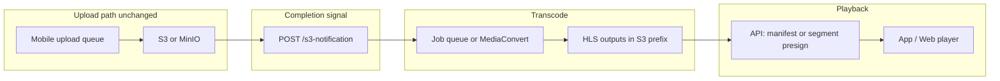
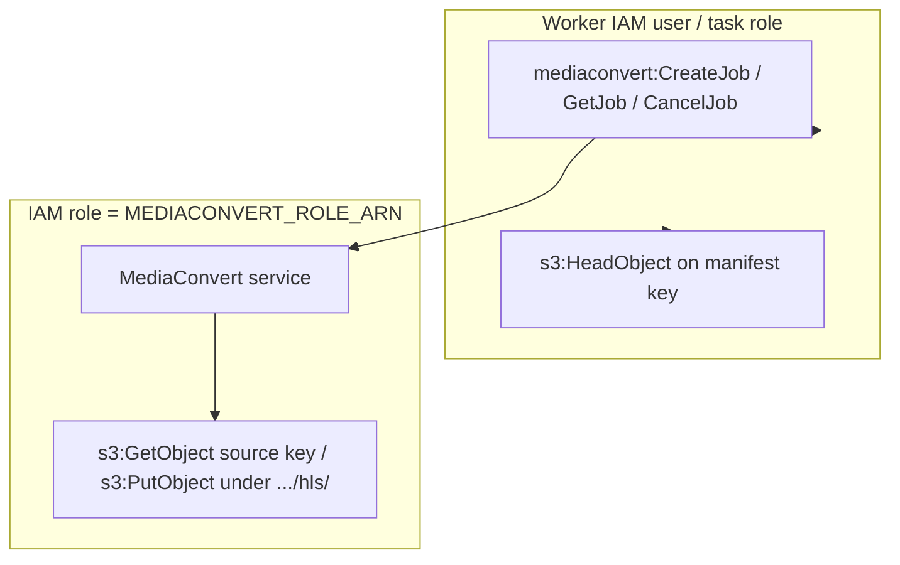

# Production-ready video streaming (HLS / ABR)

## Goals and standards

- **Delivery**: **HTTP Live Streaming (HLS)** — de facto standard for mobile (native AVPlayer / Android ExoPlayer) and Safari; pair with **fragmented MP4 (fMP4) / CMAF** segments for modern interoperability (Apple recommends fMP4 for broad device support in current tooling).
- **Encoding (v1)**: **H.264** video + **AAC-LC** audio for maximum compatibility; **one output resolution/bitrate** only (e.g. single 720p or 1080p rung — pick one default in the job template). Ship **`master.m3u8` referencing a single variant** (or a variant playlist alone); players treat this as non-adaptive HLS, which is fine.
- **Later (ABR)**: Add more renditions to the same output prefix and extend `master.m3u8` — no change to the overall security or URL model if manifests stay relative under a gated prefix.
- **Security**: Keep authorization in **your API** (same mental model as today’s presigned download URL). Avoid exposing long-lived public segment URLs.
- **Optional later**: Sample **AES-128** encryption for HLS (keys delivered only to authenticated clients), or **DRM** (FairPlay / Widevine) only if vault content requires studio-grade protection — significantly more cost and complexity.

## Current integration points (reuse)

- **Upload completes**: [`apps/server/src/routes/s3-routes.ts`](apps/server/src/routes/s3-routes.ts) — `/s3-notification` already processes `ObjectCreated`, resolves `vault_item` by `uniqueFileName`, sets `FileUploadStatus.UPLOADED`, and updates storage usage. Extend this path (or a worker fed by it) to **start transcoding for `fileType === "video"`** with **idempotency** (same object may notify twice; use `vault_item_id` + job state).
- **Playback today**: [`apps/server/src/s3/s3-commands.ts`](apps/server/src/s3/s3-commands.ts) `generateDownloadUrl` — single-object GET presigns for the **source** file. Streaming adds a **second artifact tree** under the same vault prefix (see below).
- **Clients**: [`apps/mobile/components/vault-form/vault-item-previewer.tsx`](apps/mobile/components/vault-form/vault-item-previewer.tsx) uses `expo-video` with a URI — **HLS master playlist URL** works natively on iOS; verify Android `expo-video` behavior for `.m3u8` (most stacks support HLS URLs directly).

## Target architecture

**Storage layout (recommended)**

- **Source** (unchanged): `userId/vaultId/{uniqueFileName}` — keep as archival / “original download.”
- **Derived**: `userId/vaultId/{uniqueFileName}/hls/` — `master.m3u8`, variant playlists, `*.m4s` segments (and `init.mp4` per variant if using fMP4).

## Processing options (pick one for prod; align dev)

| Approach                       | Pros                                                                                                                                                                      | Cons                                                           |
| ------------------------------ | ------------------------------------------------------------------------------------------------------------------------------------------------------------------------- | -------------------------------------------------------------- |
| **AWS Elemental MediaConvert** | Managed, scalable, fits your **production AWS S3** client ([`apps/server/src/s3/s3-client.ts`](apps/server/src/s3/s3-client.ts)), built-in HLS jobs (one or many outputs) | AWS-only; IAM + queue wiring; **usage-based cost** (see below) |
| **Worker + FFmpeg**            | Works with **MinIO** locally, full control                                                                                                                                | You own scaling, monitoring, codec tuning                      |

**Practical split**: **MediaConvert (or Lambda→MediaConvert)** in production; **Dockerized FFmpeg worker** (or local script) in dev against MinIO so engineers can test without AWS transcoding. Same output layout and DB states in both.

**Job triggering**

- **Minimum change**: From `/s3-notification`, after marking `UPLOADED`, enqueue a **transcode job** (see queue below) when item is video and not yet `streaming_ready`.
- **Alternative (AWS-native)**: S3 Event → SNS/SQS → worker that calls MediaConvert; keep `/s3-notification` for upload status + storage accounting only — avoids duplicating logic if you prefer one ingress.

There is **no Redis/SQS in-repo today** — introduce **either**:

1. **AWS SQS** + small worker (ECS/Lambda) that starts MediaConvert, **or**
2. **Postgres-backed job table** + a **new worker process** (second PM2 app or separate container) polling pending jobs — fewer new services, fits monorepo.

## Data model

Extend [`vault_items`](apps/server/src/db/vault-items.ts) / [`IVaultItem`](packages/shared/src/vault-types.ts) with fields such as:

- `streaming_status`: `none | queued | processing | ready | failed` (or reuse a nullable `hls_manifest_key` only when ready).
- `streaming_manifest_key` (S3 key for `master.m3u8`) when `ready`.
- `streaming_error` (optional text, last failure).
- `streaming_updated_at` for observability.

**Shared types**: Export new fields from [`packages/shared`](packages/shared/src/vault-types.ts) so mobile/web responses stay typed.

## Playback API design (critical for “production-ready”)

Presigning **only** `master.m3u8` is **not enough**: playlists reference segments; players request many `.m4s` / `.ts` files.

**Industry patterns**:

1. **CloudFront signed URLs/cookies** in front of S3, restricted to `userId/vaultId/.../hls/*` — best UX (relative URLs in playlists work); requires CloudFront in production.
2. **API manifest rewrite**: authenticated endpoint returns `master.m3u8` / variant playlists with **absolute URLs** where each segment URL is a **short-lived presigned GET** — works without CloudFront but CPU-heavy unless cached; acceptable at small scale.
3. **Segment proxy** — avoid for full bitrate ladders at scale (less critical with a **single** rendition, but still prefer CDN or presigned segments over proxying bytes through the API).

**Recommendation**: Plan **CloudFront + signed cookies or signed URL pattern** for production AWS; for **MinIO dev**, use presigned segment URLs or a thin NGINX in docker-compose.

### AWS Elemental MediaConvert pricing (reference)

Pricing is **per normalized output minute**, not per input minute. Resolution, codec, frame rate, and tier change **multipliers** (e.g. Basic tier AVC HD ≤30 fps ≈ **2×** SD). Rates are **region-specific** and use **volume tiers** (the effective $/normalized-minute **drops** as monthly usage grows).

Illustrative **US East (Ohio)** on-demand **Basic** tier from [AWS MediaConvert pricing](https://aws.amazon.com/mediaconvert/pricing/) (check your region; numbers change):

- First **100,000** normalized minutes / month: **$0.0075** per normalized minute
- Next **900,000**: **$0.0053**
- Higher tiers: lower rates (e.g. **$0.0038** in published examples)

**Rough intuition (single HD rendition, Basic AVC ~30 fps):** output **1 minute** of video ≈ **2** normalized minutes → at the entry tier about **2 × $0.0075 ≈ $0.015** per minute of encoded output in that example region (before discounts/tier crossover). **Low volume** = mostly the higher per-minute brackets.

**Also bill:** S3 storage for source + HLS objects, S3 GETs, optional **CloudFront** data transfer, and any **SQS/Lambda/ECS** you add to trigger jobs — MediaConvert is only the transcode line item.

Add endpoints parallel to existing download URL handlers in [`download-vault-file.ts`](apps/server/src/routes/vaults/download-vault-file.ts) / [`download-vault-file-by-token.ts`](apps/server/src/routes/vault-access/download-vault-file-by-token.ts):

- e.g. `GET .../stream-manifest` (auth rules mirror download) returning either a **redirect** to CloudFront signed URL or **JSON** `{ masterPlaylistUrl, expiresAt }` after verifying vault access.

Clients:

- **Mobile**: If `streaming_status === ready`, pass **HLS URL** to `useVideoPlayer`; else fall back to progressive **source** presign (current behavior) or show “Processing HD stream…” with spinner.
- **Web**: Native `<video>` supports HLS in Safari; for Chrome/Firefox use **hls.js** only if you embed in-page playback (today [`vault-access-content.tsx`](apps/web/app/vault/access/vault-access-content.tsx) opens downloads in a new tab — revisit if you want in-browser streaming).

## Reliability and ops

- **Idempotent jobs**: starting transcode twice must not corrupt state (DB unique constraint or `WHERE streaming_status IN ('none','failed')`).
- **Retries**: exponential backoff for transient FFmpeg/MediaConvert failures.
- **Stale processing**: cron similar to [`stale-upload-cron.ts`](apps/server/src/scheduler/stale-upload-cron.ts) to flag stuck `processing` items.
- **Cleanup**: on vault item delete, delete **both** source key and HLS prefix (lifecycle or explicit batch delete).
- **Observability**: structured logs with `vault_item_id`, job id, MediaConvert job id; metrics for queue depth and transcoder duration.

## Documentation

- Short **runbook** in `docs/` covering env vars (MediaConvert role, queue URL, CloudFront domain), **single-rendition** job JSON (and how to extend to a ladder), and local FFmpeg parity.

## Phased rollout (small steps)

Each phase should be **merged and understood** before the next. You can stop after any phase and still have a coherent system (later phases replace or extend behavior).

### Phase 1 — Data model only

**Goal:** Database and API know about streaming state; behavior unchanged.

- Add migration: `streaming_status`, `streaming_manifest_key`, `streaming_error`, timestamps (as in [Data model](#data-model)).
- Extend [`IVaultItem`](packages/shared/src/vault-types.ts) and [`mapVaultItemRow`](apps/server/src/db/mappers.ts) (or equivalent).
- Default existing rows to `streaming_status = none` (or null mapped to none).
- Ensure vault detail / list responses include the new fields so mobile can compile.

**Learn:** Where vault items surface in API responses and typing flow through shared package.

---

### Phase 2 — Offline HLS by hand (no automation)

**Goal:** Understand **manifests and segments** before any worker code.

- On your laptop, run **FFmpeg** once to produce `master.m3u8`, variant `.m3u8`, and `.m4s`/`.ts` segments (single bitrate).
- Upload that folder to **MinIO** under the planned prefix: `userId/vaultId/{uniqueFileName}/hls/`.
- Manually set **one** vault item row to `streaming_status = ready` and `streaming_manifest_key` pointing at `master.m3u8`.

**Learn:** What files exist on disk, how `master.m3u8` references variants and segments (relative paths).

---

### Phase 3 — Presigned GET for manifest + segments

**Goal:** Understand why playback needs **many** URLs, not one.

- Add a small server helper (and optionally an **internal/dev-only** HTTP handler) that generates **presigned GET** URLs for:
  - `streaming_manifest_key`
  - Any sibling keys under `.../hls/` when given a relative segment name (or batch-presign prefix listing — keep it dumb for learning).
- Try opening the **master** URL in Safari / VLC / curl with `Range` headers.

**Learn:** Presigned URL query strings; relative URLs inside `.m3u8` resolve against the manifest URL host/path.

---

### Phase 4 — Real playback API (pick simplest strategy first)

**Goal:** Authorized users get a playable HLS experience **without** mobile worker yet.

**Option A (fastest to ship):** API returns JSON `{ masterPlaylistUrl }` where `masterPlaylistUrl` is presigned; ensure playlist segment lines use **absolute presigned URLs** via **manifest rewrite** (server reads `.m3u8` from S3 or builds response, rewrites `URI=` / segment lines). Acceptable at small volume.

**Option B:** Skip rewrite initially — only works if you serve manifest from a **single origin** where relative segment paths work (e.g. CloudFront in Phase 10); until then use Option A.

Mirror auth from [`download-vault-file.ts`](apps/server/src/routes/vaults/download-vault-file.ts) and token route for keyholders.

**Learn:** End-to-end “who can fetch this manifest” matches download permissions.

---

### Phase 5 — Mobile player switches on `streaming_status`

**Goal:** App prefers HLS when `ready`, falls back to today’s progressive presign.

- In [`vault-item-previewer.tsx`](apps/mobile/components/vault-form/vault-item-previewer.tsx) (and any other video surfaces), call new stream endpoint when `fileType === video` and `streaming_status === ready`.
- Show subtle **“Preparing stream…”** when `queued`/`processing`; on `failed` or `none`, keep current progressive behavior.

**Learn:** expo-video / AVPlayer with `.m3u8` on device; confirm Android behavior.

---

### Phase 6 — Job queue storage + empty worker loop

**Goal:** Introduce **queue abstraction** without FFmpeg yet.

- Add table `vault_streaming_jobs` **or** reuse columns on `vault_items` with `queued` state (pick one; separate jobs table scales better for retries metadata).
- Worker process (script or second PM2 app): polls `queued`, transitions to `processing`, **sleeps**, marks `ready` with a **fake** manifest key **or** skips until Phase 7 — optional stub to prove deployment wiring.

**Learn:** Exactly-once vs at-least-once; why idempotency matters for S3 notifications.

---

### Phase 7 — Dev FFmpeg worker (automated transcode)

**Goal:** Upload → **eventually** HLS on MinIO without MediaConvert cost.

- Worker runs FFmpeg (container or host binary), reads source key from S3, writes `.../hls/` outputs, updates DB to `ready` + manifest key.
- Log duration and exit codes.

**Learn:** Operational constraints (disk space, FFmpeg CLI, timeouts).

**Docker Compose:** The `vault-streaming-worker` service in [`docker-compose.yml`](../docker-compose.yml) runs the worker CLI in a **separate container** (same image as `server`), with FFmpeg available for FFmpeg mode. Compose defaults the worker to **`mediaconvert`**; use **`ffmpeg`** in `.env` when testing against MinIO locally (see [`VAULT_HLS_PHASE6_QUEUE.md`](./VAULT_HLS_PHASE6_QUEUE.md)).

---

### Phase 8 — Wire `/s3-notification`

**Goal:** Production upload path sets **queued** for videos automatically.

- In [`s3-routes.ts`](apps/server/src/routes/s3-routes.ts), after successful `UPLOADED` path for `fileType === video`, insert/update job to `queued` **if** not already queued/processing/ready (idempotent).

**Learn:** Duplicate ObjectCreated notifications; race with multipart completion.

#### Push-based ingress (AWS Lambda → API)

For **AWS production**, you can trigger the **same** logic by attaching **S3 event notifications** to a **Lambda** that posts to `POST /s3-notification` with **`X-Internal-Secret`** (see [`getS3NotificationAuthStatus`](apps/server/src/routes/s3-routes.ts)).

- **In-repo implementation:** [`lambda/s3-notification/index.mjs`](lambda/s3-notification/index.mjs) forwards the **native S3 event** JSON to `${API_PUBLIC_URL}/s3-notification` (see [`lambda/s3-notification/README.md`](lambda/s3-notification/README.md)). The server only needs `Records[].eventName` and `Records[].s3.object.key`, which the standard S3 event provides.
- **Env on Lambda:** `API_PUBLIC_URL` (API base, no trailing path), `AWS_INTERNAL_SECRET` (must match the API server).
- **IAM:** For **S3 → Lambda**, add the usual resource policy so the bucket can invoke the function, plus CloudWatch Logs for the execution role. No VPC is required if the API URL is reachable from the public internet.
- **What stays pull-based:** The **vault streaming worker** still **polls Postgres** and runs FFmpeg or MediaConvert. Push only changes **how** `/s3-notification` is invoked (Lambda vs MinIO webhook, etc.).

---

### Phase 9 — AWS MediaConvert (production encoder)

**Goal:** In production (or explicit staging/dev flags), the vault streaming worker runs **AWS Elemental MediaConvert** instead of FFmpeg. Outputs use the same layout as the dev path: **`dirname(vault_items.file_url)/hls/`** with **`master.m3u8`** at [`vaultMasterManifestKeyFromSourceKey`](apps/server/src/s3/vault-object-keys.ts). **MinIO + FFmpeg** remains the default for local development.

#### Behavior (in-repo)

- Worker mode **`VAULT_STREAMING_WORKER_MODE=mediaconvert`** runs the MediaConvert pipeline when the runtime is allowed (see below).
- **`CreateJob`** uses **`MEDIACONVERT_ROLE_ARN`** (MediaConvert → S3) and **`MEDIACONVERT_QUEUE_ARN`**. After submit, the worker stores **`vault_streaming_jobs.mediaconvert_job_id`** for debugging.
- Completion (**MVP**): the worker **polls `GetJob`** until **`COMPLETE`**, **`ERROR`**, or **`CANCELED`**, or until **`MEDIACONVERT_POLL_TIMEOUT_MS`**. On **`COMPLETE`**, it **`HeadObject`**-checks the expected manifest key, then marks the vault item **`ready`** (same as FFmpeg). Failures call **`failJob`**; the MediaConvert id is left on the row on failure so you can trace jobs in AWS.

#### When MediaConvert is allowed (avoid accidental AWS jobs from MinIO)

The worker **refuses to start** with `...MODE=mediaconvert` unless **any** of:

1. **`NODE_ENV=production`**, or
2. **`VAULT_STREAMING_ENCODER=mediaconvert`** (e.g. staging without coupling only to `NODE_ENV`), or
3. **`VAULT_STREAMING_MEDIACONVERT_ALLOW_DEV=true`** (explicit local/staging override).

Use **`VAULT_STREAMING_WORKER_MODE=ffmpeg`** against MinIO for normal dev transcoding.

#### Environment variables

| Variable | Required | Description |
|----------|----------|-------------|
| `AWS_REGION` | Yes | Same region as the S3 bucket and MediaConvert queue. |
| `MINIO_BUCKET` | Yes | Production S3 bucket name (same as app uploads). |
| `AWS_ACCESS_KEY_ID` / `AWS_SECRET_ACCESS_KEY` | Yes (prod worker) | IAM principal for **MediaConvert API** calls (`CreateJob`, `GetJob`) and S3 `HeadObject`. |
| `MEDIACONVERT_ROLE_ARN` | Yes | IAM **service role** assumed **by MediaConvert** for S3 read/write (not the same as the worker user). |
| `MEDIACONVERT_QUEUE_ARN` | Yes | MediaConvert queue ARN for `CreateJob`. |
| `MEDIACONVERT_ENDPOINT` | No | Custom MediaConvert API endpoint URL if your account requires it; otherwise the regional client is used. |
| `MEDIACONVERT_POLL_INTERVAL_MS` | No | Poll interval for `GetJob` (default **15000**). |
| `MEDIACONVERT_POLL_TIMEOUT_MS` | No | Max time to wait for a terminal job status (default **6 hours**). |

#### IAM checklist (two principals — do not merge)

1. **Worker / application IAM** (the credentials in **`AWS_ACCESS_KEY_ID`** / **`AWS_SECRET_ACCESS_KEY`** on the worker): grant **`mediaconvert:CreateJob`**, **`mediaconvert:GetJob`**, optionally **`mediaconvert:CancelJob`**, plus **`s3:HeadObject`** on the bucket (manifest verification). Restrict resources if policy size allows (e.g. queue ARN for MediaConvert actions).
2. **MediaConvert service role** (`MEDIACONVERT_ROLE_ARN`): trust **`mediaconvert.amazonaws.com`**; attach policies allowing **`s3:GetObject`** on source prefixes and **`s3:PutObject`** / **`s3:ListBucket`** as needed for **`…/hls/`** outputs. This role is **only** passed into **`CreateJob`** as **`Role`** — it is **not** the worker’s access key.

**Manual validation (recommended once per account):** run a short test job in the MediaConvert console targeting **`s3://bucket/<dirname(file_url)>/hls/`** and confirm the top-level playlist lands as **`master.m3u8`** (matches [`vaultMasterManifestKeyFromSourceKey`](apps/server/src/s3/vault-object-keys.ts)). Adjust job settings or **Name modifier** / destination base name if your defaults differ.

#### Troubleshooting

| Symptom | What to check |
|---------|----------------|
| Worker exits at startup with mediaconvert mode error | `NODE_ENV`, `VAULT_STREAMING_ENCODER`, or `VAULT_STREAMING_MEDIACONVERT_ALLOW_DEV`. |
| `AccessDenied` on **CreateJob** | Worker IAM missing MediaConvert API permissions or wrong queue ARN. |
| Job **ERROR** in MediaConvert | Job details / event history in console; often **S3** permission on the **service role** (`MEDIACONVERT_ROLE_ARN`), KMS key policy, or wrong input URI. |
| **COMPLETE** but `HeadObject` fails on manifest | Output naming differs from **`master.m3u8`**; confirm destination base / modifiers in console test; align with [`vault-object-keys.ts`](apps/server/src/s3/vault-object-keys.ts). |
| Stuck **PROGRESSING** until timeout | Raise **`MEDIACONVERT_POLL_TIMEOUT_MS`** or inspect queue backlog / account limits. |

**Learn:** MediaConvert console vs API; billing aligns with [pricing](#aws-elemental-mediaconvert-pricing-reference).

---

### Phase 10 — CloudFront in front of `hls/` prefix

**Goal:** Manifest rewrite becomes optional; relative segment URLs work.

- Distribution with OAC to private bucket; signed URLs or cookies for `/hls/*`.
- Playback API returns CloudFront URL (or cookie bootstrap) instead of per-segment presign spam.

**Learn:** TTLs, cache behavior for `.m3u8` vs segments.

---

### Phase 11 — Reliability and lifecycle

**Goal:** Production operations.

- Retries with backoff for failed jobs; max attempts → `streaming_status = failed` + `streaming_error`.
- Cron for stuck `processing` (heartbeat or timeout).
- Delete HLS prefix when vault item removed; optional S3 lifecycle for orphaned prefixes.

**Learn:** Observable pipeline (structured logs, optional metrics).

---

### Phase 12 — Web (optional)

**Goal:** In-browser vault viewer experience.

- Embedded `<video>` or **hls.js** for non-Safari; align with [`vault-access-content.tsx`](apps/web/app/vault/access/vault-access-content.tsx) flows.

---

### Suggested pause points

| After phase | You have                                           |
| ----------- | -------------------------------------------------- |
| 3           | Deep understanding of HLS files + presigns         |
| 5           | User-visible streaming on mobile (if Phase 4 done) |
| 8           | Fully automated dev pipeline on MinIO              |
| 10          | Production-shaped delivery (AWS encoder + CDN)     |
