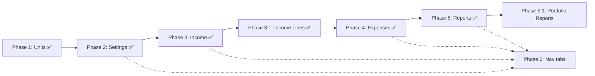

# Property Accounting — Implementation Phases

Roadmap for the property pre-accounting module (ön muhasebe). Each property can have multiple units; revenue and expenses are tracked per property with reporting at unit, property, and aggregate levels.

---

## Phase 1 — Property Units (Odalar) ✅ Complete

**Goal:** Define rentable units inside each property.

### Scope

- DB: `property_units` — unit number, layout (`1+0`, `1+1`, …), rental type (`short_term` | `long_term`)
- API: CRUD at `/properties/:propertyId/units`
- UI: Units tab, create/edit dialogs with layout picker (presets + custom rooms/salon)
- Access: list for all members; create/update/delete for admin, creator, and owner members

### Notes

- Predefined unit numbers (101–112, 201–212) are created manually via UI, not seeded in migrations
- Unit rental type drives net-income rules in Phase 3

---

## Phase 2 — Property Default Settings ✅ Complete

**Goal:** Store per-property tax and channel commission rates used in income calculations.

### DB (migration v14)

Table: `property_settings` (1:1 with `properties`) or extend `properties` with settings columns.

| Field | Default | Notes |
|-------|---------|-------|
| `sales_tax_rate` | 6% | |
| `miami_dade_surtax_rate` | 1% | |
| `convention_development_tax_rate` | 3% | CDT |
| `resort_tax_rate` | 4% | Total tax = 14% on net room + cleaning (short term) |
| `airbnb_commission_rate` | 15.5% | On net room + cleaning |
| `booking_commission_rate` | 15% | |
| `expedia_commission_rate` | 15% | |
| `direct_commission_rate` | 3.5% | Direct web / merchant |

### API

- `GET /properties/:propertyId/settings`
- `PATCH /properties/:propertyId/settings` — owner, creator, admin only

### UI

- New **Settings** tab under property shell
- Form to view/edit all rates (percent inputs)
- Reset-to-defaults button optional

### Why before Phase 3

Income entry calculations should read from settings, not hardcoded constants.

---

## Phase 3 — Reservations / Income Entries (Gelir Gir) ✅ Complete

**Goal:** Record stays and revenue with automatic gross/net breakdown.

### DB (migration v15)

Table: `property_reservations` (or `property_income_entries`)

**Relations:** `property_id`, `unit_id` (FK → `property_units`)

**Input fields**

| Field | Type | Notes |
|-------|------|-------|
| Unit | FK | From property units |
| Guest name | text | |
| Reservation number | text | |
| Check-in / check-out | date | |
| Stay duration | computed | nights = checkout − checkin |
| Status | enum | `stayed`, `canceled`, `no_show`, `active` |
| Channel | enum | `airbnb`, `booking`, `expedia`, `direct` |
| Room rate | decimal | Net room rate (after discounts) |
| Cleaning fee | decimal | |

**Additional income lines** — implemented in Phase 3.1 (see below). Room rate / room + cleaning remain stay fields.

**Stored computed fields** (short term, room + cleaning):

- `gross_income` = net room + cleaning + taxes
- `sales_tax`, `miami_dade_surtax`, `cdt`, `resort_tax` (each line item)
- `channel_commission`
- `net_income` = (room + cleaning) − taxes − commission

### Calculation rules

| Scenario | Taxes | Commission | Net |
|----------|-------|------------|-----|
| Long-term unit | None | None | Room rate |
| Short-term: room + cleaning | 14% split per settings | Per channel on room + cleaning | As defined |
| Cleaning only | None | None | Full amount |
| Extra cleaning / extra service / beach rental | None | None | Full amount |

### API

- `GET /properties/:propertyId/reservations` — list with filters (date range, unit, channel, status, rental type)
- `POST /properties/:propertyId/reservations`
- `PATCH /properties/:propertyId/reservations/:id`
- `DELETE /properties/:propertyId/reservations/:id`

Server-side calculation on create/update; rates from Phase 2 settings.

### UI

- New **Income** tab
- “Add Income” dialog / page with unit selector, dates, channel, amounts
- Table with gross/net columns and filters

### Shared

- Types in `packages/shared`
- Calculation utility: `apps/server/src/services/property-income-calculator.ts`

---

## Phase 3.1 — Additional Income Lines ✅ Complete

**Goal:** Record non-stay revenue (cleaning only, extra cleaning, extra service, beach rental) alongside stays in a unified Income tab.

### Approach

Dual-ledger model (industry-aligned with PMS fee types / accounting income items):

- **Stays** — `property_reservations` (unchanged from Phase 3)
- **Income lines** — `property_income_lines` with optional `reservation_id` link

### DB (migration v16)

Table: `property_income_lines`

| Field | Notes |
|-------|-------|
| `line_type` | `cleaning_only`, `extra_cleaning`, `extra_service`, `beach_equipment_rental` |
| `amount`, `transaction_date` | Input |
| `unit_id` | Required |
| `reservation_id` | Optional FK to stay |
| `description`, `guest_name` | Optional |
| computed money columns | gross = net = amount; no tax/commission |

### API

- CRUD at `/properties/:propertyId/income-lines`
- Filters: date range, unit, line type, reservation

### UI

- Income tab: merged stays + lines, sorted by date
- **Add Stay** and **Add Other Income** actions
- Income type filter (Stay | line types)

### Notes

- Room rate only / room + cleaning are stay fields, not separate line types
- Phase 5 reports will UNION stays + income_lines for sales-type breakdown

---

## Phase 4 — Expenses (Gider Gir) ✅ Complete

**Goal:** Track operational costs per property.

### DB (migration v17)

Table: `property_expenses`

| Field | Type | Notes |
|-------|------|-------|
| `property_id` | FK | |
| `category` | enum | 22 categories (commissions, utilities, tax, insurance, etc.) |
| `amount` | decimal | |
| `expense_date` | date | Optional |
| `person_name` | text | Optional — Cleaning, Salary |
| `description` | text | Required for Material, Maintenance, Other |

**Categories**

- Airbnb / Booking / Expedia / Merchant commission (included for manual expense entry; may overlap stay deductions)
- Property Tax (annual → ÷12 in reports)
- Insurance (annual → ÷12 in reports)
- Credit payment, Electricity, Water, Internet, Gas
- Fire alarm, Sewerage, Waste management, Phone
- Legal fee / permit, Subscription
- Cleaning, Salary, Material, Maintenance, Other

### API

- CRUD at `/properties/:propertyId/expenses`
- Category-specific validation (description required for Material/Maintenance/Other)
- List filters: date range, category

### UI

- **Expenses** tab under property shell
- “Add Expense” dialog with dynamic fields per category
- Expense list with date and category filters

---

## Phase 5 — Reports & Export (Raporlar) ✅ Complete

**Goal:** Financial summaries and CSV download.

### Report types (implemented)

| Report | Dimensions |
|--------|------------|
| Room-based income | Per unit (expenses property-level) |
| Monthly summary | Property (`byMonth`) |
| Occupancy rate | Per unit |
| ADR | Per unit (room rate / nights) |
| Channel summary | Gross, commission, stay count |
| Sales-type breakdown | Room, cleaning, extra cleaning, extra service, beach rental |
| Rental type filter | Short term / long term / both |

### Metric rules

- **Stays** bucketed by `check_in`; **income lines** by `transaction_date`; **expenses** by `expense_date` (null-date expenses in property totals only)
- Occupancy/ADR: only `stayed` and `active` reservations
- **Annual expenses** (`property_tax`, `insurance`): full amount in property totals; `amount / 12` in monthly buckets
- **Operational net** = net income − total expenses

### API

- `GET /properties/:propertyId/reports/summary?from=&to=&rentalType=&unitId=&channel=`
- `GET /properties/:propertyId/reports/export` — CSV download

### UI

- **Reports** tab under property shell
- Filter bar (date range, unit, channel, rental type)
- Summary cards + detail tables
- **Download CSV** action

---

## Phase 5.1 — Multi-property Reports (planned)

**Goal:** Portfolio-level reports across all accessible properties.

| Item | Description |
|------|-------------|
| API | `GET /reports/summary?from=&to=` — aggregate across member properties |
| Sidebar | Global **Reports** nav item at `/reports` |
| Page | Portfolio totals + per-property breakdown table |

Reuses `buildPropertyReportSummary` per property and rolls up totals.

---

## Phase 6 — Property Shell Navigation

**Goal:** Unified navigation across accounting features.

Extend [`PropertyPageShell`](../apps/admin/src/components/properties/property-page-shell.tsx) tabs as each phase ships:

```
Overview | Units | Income | Expenses | Reports | Settings
```

Add routes under `/properties/:propertyId/*` and gate write access consistently (admin, creator, owner).

---

## Cross-cutting / optional improvements

| Item | Phase | Notes |
|------|-------|-------|
| Auto-add creator as `property_members` owner on property create | Any | Simplifies permission checks |
| Block inviting/adding creator as duplicate member | Any | Avoid duplicate rows |
| Protect creator from member PATCH/DELETE | Done (API) | UI filter pending |
| Multi-property dashboard totals | Phase 5+ | Home page aggregates for owners |
| i18n (TR/EN labels) | Later | Menus: Gelir Gir, Gider Gir, etc. |

---

## Suggested implementation order



1. **Phase 2** — Small; unblocks configurable calculations  
2. **Phase 3** — Largest; core business value  
3. **Phase 4** — Expenses; needed for full P&L  
4. **Phase 5** — Read-only aggregation on 3 + 4  
5. **Phase 6** — Incremental with each phase (don’t wait until the end)

---

## Access control (all phases)

| Action | Admin | Creator | Owner member | Manager / Accountant |
|--------|-------|---------|--------------|----------------------|
| View property data | Yes | Yes | Yes | Yes (member) |
| Manage units | Yes | Yes | Yes | No |
| Edit settings | Yes | Yes | Yes | No |
| Add/edit income & expenses | No | Yes | Yes | No |
| View reports | Yes | Yes | Yes | Yes |

Finalize manager/accountant write permissions when planning Phase 4.
