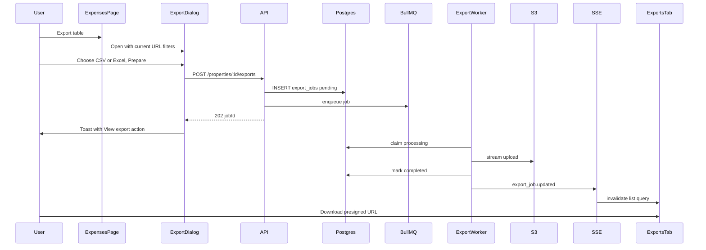

# Property Exports — Implementation Phases

Roadmap for async CSV and Excel exports of property table data. v1 ships **expenses** first; the pipeline is generic so income, leases, and other tables can reuse the same job table, worker, Exports tab, and SSE channel later.

Stack: **Postgres** (source of truth) + **BullMQ** (job execution) + **S3** (file storage) + **SSE** (live status on the Exports tab).

**Related code today**

- Expenses list/filters: `apps/server/src/db/property-expenses.ts`, `packages/shared/src/property-expense-types.ts`
- Sync report CSV (different use case): `apps/server/src/services/property-report-service.ts` (`csvRow`)
- S3 presigned URLs: `apps/server/src/s3/s3-commands.ts`
- Email worker pattern: `apps/server/src/queues/tenant-email-queue.ts`, `apps/server/src/services/tenant-email-send-worker.ts`, `apps/server/src/workers/tenant-email-worker.cli.ts`, `docs/RAILWAY_TENANT_EMAIL_WORKER.md`
- SSE hub: `apps/server/src/services/notification-stream-hub.ts`
- Stream types: `packages/shared/src/notification-stream-types.ts`
- Admin stream client: `apps/admin/src/hooks/use-notification-stream.ts`, `apps/admin/src/lib/notification-stream-handlers.ts`
- Property tabs/router: `apps/admin/src/config/property-shell-tabs.ts`, `apps/admin/src/app/router.tsx`, `apps/admin/src/lib/property-shell-tab-visibility.ts`
- Permissions: `apps/admin/src/hooks/use-property-permissions.ts`
- Radio dialog pattern: `apps/admin/src/components/ui/radio-option.tsx`, `apps/admin/src/components/income/refund-entry-dialog.tsx`
- Toast action pattern: `apps/admin/src/lib/show-notification-toast.ts`
- Expiry cleanup cron (reference): `apps/server/src/scheduler/refresh-token-cleanup-cron.ts`

---

## Goals

- Property members can queue filtered **expense** exports (CSV first; Excel once the pipeline is stable).
- New **Exports** tab on the property shell shows job history, live status, and download for completed jobs.
- **Export table** on Expenses opens a dialog (CSV / Excel via `RadioGroupFieldset`); **Prepare** queues the job.
- After queue: **toast with "View export" action** navigating to `/properties/:propertyId/exports?highlightJobId=…`.
- Async execution via **BullMQ worker** (separate Railway service); **Postgres** is source of truth.
- Live list updates via **SSE** `export_job.updated` to the requesting user.

## Non-goals (initial release)

- Portfolio-wide exports across all properties
- Export triggers on income/leases tables (schema supports it; UI deferred)
- Sync CSV fallback on the table page
- In-app notification bell entry (optional Phase 5)
- Client-side pagination export loops
- Scheduled / recurring exports

---

## Guiding principles

1. **Build the pipeline once** — one generic `export_jobs` table, one worker, per-`resourceType` serializers (`csv` | `xlsx`).
2. **Exports tab is the product surface** — SSE keeps the list fresh; never rely on SSE alone for discoverability.
3. **Postgres before queue** — insert `pending` row, then enqueue; worker re-enqueues stuck jobs on startup.
4. **SSE for UX, GET for truth** — list/detail/download always work on refresh without an open stream.
5. **CSV before Excel** — prove DB streaming, S3 upload, worker, and UI with lower memory risk.
6. **No client-side export** — never loop infinite-scroll pages in the browser; always use the filter snapshot on the job row.

---

## Target architecture

```
Expenses page → Export table dialog → POST /properties/:id/exports → export_jobs (pending)
                                                                              ↓
                                                                    BullMQ enqueue
                                                                              ↓
                                                          Export worker (separate process)
                                                                              ↓
                                              Stream DB rows → CSV or XLSX → upload S3
                                                                              ↓
                                              mark completed + SSE export_job.updated
                                                                              ↓
Exports tab ← invalidate list query ← notification stream (sender userId)
     ↓
GET .../exports/:jobId/download → presigned URL → browser download
```



### Permissions

v1 exports are **read-only data access** — any property member who can view the property (`canView`: owner, manager, accountant, admin, creator) may queue and download exports for that property.

- Mirror on server routes (`assertPropertyMemberAccess`) and client (Exports tab visible to all property shell viewers).
- Do **not** require `canManageLedger` — accountants need exports too.

### Feature flag

`VITE_PROPERTY_EXPORTS_ENABLED` — gate API routes, worker enqueue, Exports tab, and Export table dialog until production-ready. Server-side equivalent env if needed for route registration.

---

## Data model (sketch)

### `export_jobs`

| Column          | Notes                                                              |
| --------------- | ------------------------------------------------------------------ |
| `id`            | UUID                                                               |
| `property_id`   | FK                                                                 |
| `created_by`    | User who queued                                                    |
| `resource_type` | `expenses` (v1); later `income`, `leases`                          |
| `format`        | `csv` \| `xlsx`                                                    |
| `filters`       | JSONB snapshot (e.g. `from`, `to`, `categoryId`, `q` for expenses) |
| `status`        | `pending` \| `processing` \| `completed` \| `failed` \| `expired`  |
| `row_count`     | Set on completion                                                  |
| `file_name`     | Display + download name                                            |
| `s3_key`        | Internal only — never sent to client                               |
| `error_message` | On failure                                                         |
| `expires_at`    | File + job TTL (48–72h)                                            |
| `created_at`    |                                                                    |
| `updated_at`    |                                                                    |
| `completed_at`  | Set when terminal                                                  |

Index: `(property_id, created_at DESC)` for Exports tab list.

**Filter snapshot:** filters are copied into the job row at create time so processing is deterministic even if the user changes URL filters later.

**Expense export columns (v1):**

| Column      | Source        |
| ----------- | ------------- |
| Date        | `expenseDate` |
| Category    | `categoryName` |
| Description | `description` |
| Amount      | `amount`      |
| Tax-free    | `taxFree`     |
| Created at  | `createdAt` (optional) |

---

## Shared contract (`packages/shared`)

| Type                                      | Purpose                                                                 |
| ----------------------------------------- | ----------------------------------------------------------------------- |
| `TExportJobStatus`                        | `pending` \| `processing` \| `completed` \| `failed` \| `expired`       |
| `TExportFormat`                           | `csv` \| `xlsx`                                                         |
| `TExportResourceType`                     | `expenses` (v1); extend for `income`, `leases`                          |
| `IExportJob`                              | List/detail row                                                         |
| `IPropertyExportCreateRequest`            | `resourceType`, `format`, `filters` (discriminated by `resourceType`)   |
| `IPropertyExportCreateResponse`           | `{ jobId }`                                                             |
| `IPropertyExportsListQuery`               | Cursor pagination for Exports tab                                       |
| `IPropertyExportsListResponse`            | Paginated jobs for property                                             |
| `IExportJobDownloadResponse`              | `{ downloadUrl, expiresAt }` — presigned URL, never raw S3 key          |
| `INotificationStreamExportJobUpdatedData` | SSE payload                                                             |

Expense filters reuse `TPropertyExpensesListFilters` inside a discriminated union keyed by `resourceType`.

---

## API (sketch)

| Method | Path                                              | Notes                                       |
| ------ | ------------------------------------------------- | ------------------------------------------- |
| `POST` | `/properties/:propertyId/exports`                 | **202** + `{ jobId }`; create row + enqueue |
| `GET`  | `/properties/:propertyId/exports`                 | Paginated list for Exports tab              |
| `GET`  | `/properties/:propertyId/exports/:jobId`          | Job detail                                  |
| `GET`  | `/properties/:propertyId/exports/:jobId/download` | Presigned URL; 403 unless `completed`       |

Auth: `assertPropertyMemberAccess` on all routes; authorize at create **and** download time.

---

## SSE events

Extend `packages/shared/src/notification-stream-types.ts`:

- Event type: `export_job.updated`
- Payload: `{ jobId, propertyId, status, rowCount?, format, resourceType }`

Worker publishes to the **requesting user's `userId`** via `notificationStreamHub`. Always emit on terminal states (`completed`, `failed`, `expired`); optional throttle on `processing` progress. Admin handler in `notification-stream-handlers.ts` invalidates `queryKeys.propertyExports(propertyId)`.

**Do not** send presigned download URLs over SSE — client fetches those via the download endpoint when the user clicks Download.

Polling is **not** the primary UX; GET list/detail is the reconnect/refresh fallback.

---

## BullMQ worker

- Queue name: `property-export-jobs`
- Queue module: `apps/server/src/queues/property-export-queue.ts`
- Worker: `apps/server/src/services/property-export-worker.ts`
- CLI: `apps/server/src/workers/property-export-worker.cli.ts`
- Railway: `apps/server/railway.export-worker.toml` + `docs/RAILWAY_PROPERTY_EXPORT_WORKER.md`
- Local dev: `bun run worker:export` (alongside `bun run worker:email`)
- **One Bull job per export** — no fan-out (unlike tenant email per-recipient jobs)
- Re-enqueue stuck `pending` / `processing` jobs on worker startup
- S3 key: `exports/{propertyId}/{jobId}.{csv|xlsx}`
- Retries: exponential backoff for transient S3/DB errors; permanent failures → `failed` with message
- Row cap: e.g. 100k rows; fail job with a clear message
- Processing timeout: stuck `processing` → `failed`

CSV generator (isolated, testable first):

- `apps/server/src/services/property-export/expenses-csv-export.ts`
- Reuse `buildPropertyExpenseListConditions` and the same JOIN as the list query
- Batch/keyset read from Postgres (no OFFSET)
- Extract shared `csvRow()` from report service into a reusable util
- Unit tests: escaping, headers, empty result, date/money formatting

Excel (Phase 5):

- Add `exceljs` with **streaming** writer — not whole-workbook-in-memory
- `apps/server/src/services/property-export/expenses-xlsx-export.ts` — same row iterator interface as CSV

---

## UI — Exports tab + export dialog

### 1. Exports tab

- Add to `apps/admin/src/config/property-shell-tabs.ts`: `{ label: "Exports", path: "exports" }`
- Route: `apps/admin/src/pages/property-exports-page.tsx` (new); register in `apps/admin/src/app/router.tsx`
- Gate on feature flag + `canView`
- Table columns: requested at, resource type, format, filter summary, status, row count, actions
  - **Download** when `completed` (calls download endpoint → presigned URL)
  - Error message when `failed`
  - Clear copy when `expired` (no download)
- Reads from GET list; updates live via SSE (no polling loop)
- Read `highlightJobId` from URL search params to scroll/highlight the newly queued row

### 2. Export table dialog (Expenses v1)

- Component: `apps/admin/src/components/exports/property-table-export-dialog.tsx` (reusable for future tables)
- Trigger: **Export table** button on `apps/admin/src/pages/property-expenses-page.tsx` via `usePropertyShellActions` (match reports "Download CSV" placement)
- Shows snapshotted filter summary (read-only) from current URL params (`from`, `to`, `categoryId`, `q`)
- Format: `RadioGroupFieldset` with CSV + Excel options (Excel **disabled** until Phase 5 ships)
- Primary button: **Prepare** → `POST` export → close dialog on success

### 3. Post-queue toast (required UX)

After successful **202**, show Sonner toast (pattern from `apps/admin/src/lib/show-notification-toast.ts`):

```ts
toast.success("Export queued", {
  description: "We'll prepare your file in the background.",
  action: {
    label: "View export",
    onClick: () => {
      router.navigate(
        `/properties/${propertyId}/exports?highlightJobId=${jobId}`,
      );
    },
  },
});
```

- **Do not** auto-navigate on queue — user may want to keep working on Expenses
- **Do not** close the dialog with a toast that has no action — the Exports tab must be one click away
- Phase 5 (optional): on SSE `completed` while user is on a different page, show completion toast with the same **View export** action

### 4. Download on Exports tab

- Download button calls GET download → `window.location.href` or anchor with presigned URL
- Handle popup blockers gracefully (show copy if auto-navigation fails)
- Handle `expired` with clear copy; hide download button

---

## Phased rollout

### Phase 0 — Foundation (no user-facing feature)

**Goal:** Infrastructure and contracts without exposing the feature.

- [ ] DB migration: `export_jobs` table + enums
- [ ] Shared types in `packages/shared`
- [ ] API client stubs in `apps/admin/src/lib/api-client.ts`
- [ ] Query keys: `queryKeys.propertyExports(propertyId)`, `queryKeys.propertyExport(propertyId, jobId)`
- [ ] Feature flag `VITE_PROPERTY_EXPORTS_ENABLED`

**Exit criteria:** Types compile; migration runs; flag hides all UI.

---

### Phase 1 — Backend pipeline (no UI)

**Goal:** End-to-end export via API/script, not the Exports tab.

- [ ] `db/export-jobs.ts` — create, getById, listByProperty, markProcessing, markCompleted, markFailed, markExpired
- [ ] Routes: POST create, GET list, GET detail, GET download (403 until `completed`)
- [ ] CSV generator + unit tests (`expenses-csv-export.ts`)
- [ ] Extract shared `csvRow()` util from report service
- [ ] BullMQ queue + export worker + S3 upload
- [ ] `process-export-job.ts` — claim job → stream rows → CSV → S3 → mark completed

**Exit criteria:** Queue expense export via script/Postman → worker completes → S3 object exists → download URL works.

**Optional Phase 1b — dry-run:** endpoint or script that runs CSV generator to stdout without S3 (QA).

---

### Phase 2 — SSE progress

**Goal:** Live updates before full UI.

- [ ] Add `export_job.updated` to shared stream types
- [ ] Extend `notificationStreamHub` publish path for export job events
- [ ] Worker emits on status transitions (always terminal; optional throttle on `processing`)
- [ ] Admin stream handler invalidates exports list query
- [ ] GET list/detail as reconnect fallback

**Exit criteria:** Script-triggered export emits SSE on connected admin session; GET restores state after page refresh.

---

### Phase 3 — UI MVP (first shippable)

**Goal:** First usable UI — **CSV export live**.

- [ ] Exports tab + `property-exports-page.tsx`
- [ ] Export table dialog on Expenses + **View export** toast
- [ ] Wire TanStack Query; no polling loop on expenses page
- [ ] `highlightJobId` scroll/highlight on Exports tab

**Exit criteria:** User queues from Expenses → clicks **View export** → sees job on Exports tab → downloads CSV.

---

### Phase 4 — Hardening

**Goal:** Production-safe.

| Concern       | Action                                                                           |
| ------------- | -------------------------------------------------------------------------------- |
| Stuck jobs    | Worker startup re-enqueue; processing timeout → `failed`                         |
| TTL           | Cron or S3 lifecycle rule on `exports/` prefix + mark jobs `expired`             |
| Dedup         | Reject duplicate active job (same user + property + resource + filters + format) |
| Row cap       | e.g. 100k; fail with clear message                                               |
| Observability | Structured logs: jobId, duration, rowCount, format, resourceType                 |
| Railway       | Deploy `server-export-worker` service (mirror email worker docs)                 |

**Exit criteria:** Load test large export; worker stable under restart; failure modes documented in code/comments.

---

### Phase 5 — Enhancements (post-launch)

- Excel (`exceljs` streaming writer) — enable Excel radio option in dialog
- Export dialog on income/leases tables (new `resourceType` handlers in worker)
- In-app notification on completion (`export_ready`) for users not on Exports tab
- Completion toast with **View export** when SSE fires and user is not on Exports tab
- Portfolio-wide export across all properties (separate epic)

---

## Dependency graph

```
Phase 0 (foundation)
    │
    ├─ Phase 1 (CSV generator + worker + S3)
    │     │
    │     └─ Phase 2 (SSE)
    │           │
    │           └─ Phase 3 (Exports tab + dialog + View export toast)  ★ First shippable
    │                 │
    │                 ├─ Phase 4 (hardening)
    │                 │
    │                 └─ Phase 5 (Excel + other tables + notifications)
```

**Parallelism:** CSV generator tests can run while migration/API shell is in review. SSE (Phase 2) before Exports tab (Phase 3).

**Solo dev order:** Phase 0 → 1 → 2 → 3 minimizes rework.

---

## Suggested PR sequence

| #   | PR                                        | User value                 |
| --- | ----------------------------------------- | -------------------------- |
| 1   | Shared types + migration + API shell      | Internal                   |
| 2   | CSV generator + tests                     | Foundation                 |
| 3   | BullMQ worker + S3 + SSE                  | Internal E2E               |
| 4   | Exports tab + dialog + View export toast  | **CSV export live**        |
| 5   | Hardening + Railway worker docs           | Production-ready           |
| 6   | Excel + enable radio option               | Excel live                 |
| 7   | Notifications (optional)                  | Cross-page discoverability |

---

## CSV vs Excel phasing

|                  | CSV (Phase 1)            | Excel (Phase 5)                   |
| ---------------- | ------------------------ | --------------------------------- |
| Streaming        | Native text chunks       | Requires streaming XLSX writer    |
| Memory           | Low                      | Higher if implemented incorrectly |
| Dependencies     | None (reuse CSV helpers) | New dep (`exceljs`)               |
| User expectation | Raw data dump            | Formatted spreadsheet             |
| Risk             | Low                      | Medium (OOM, slow generation)     |

**Industry norm:** ship async CSV first; add Excel once the job system is stable.

---

## What not to do

1. Do **not** use in-process cron as the primary processor — use BullMQ worker (Redis already exists for tenant email).
2. Do **not** poll the expenses page every 2s as primary UX — Exports tab + SSE.
3. Do **not** queue without the **View export** toast action — users must know where to go.
4. Do **not** auto-download on the expenses page as the only path — Exports tab is the download surface.
5. Do **not** build sync CSV and async CSV — one async path only.
6. Do **not** buffer the full file in memory before S3 upload — stream rows or use multipart upload.
7. Do **not** export via infinite scroll on the client — no looping `fetchNextPage` in the browser.
8. Do **not** tie export to currently loaded table rows — always use the filter snapshot on the job.
9. Do **not** expose raw S3 keys to the client — only presigned download URLs with TTL.
10. Do **not** skip property access checks on download — authorize at create **and** download time.
11. Do **not** leave stuck jobs in `processing` forever — timeout → `failed` with a recoverable message.
12. Do **not** merge CSV + Excel + full UI into one giant PR — keep steps reviewable.
13. Do **not** rely on SSE alone for discoverability — the Exports tab and **View export** toast are required.

---

## Safest sequencing summary

1. **Postgres row + shared types before BullMQ enqueue** — jobs rebuild from persisted rows.
2. **CSV generator tests before worker integration** — correctness is the highest risk.
3. **Worker + S3 E2E before any UI** — prove the pipeline via script/Postman.
4. **SSE before Exports tab** — validate live refresh path before building the UI.
5. **Exports tab + View export toast before Excel** — first shippable slice is CSV only.
6. **Hardening after first user-visible slice** — tune limits from real timings.

---

## Future (out of scope for initial phases)

- Read replica for export queries
- Separate worker process scaling policy (horizontal workers on same queue)
- Email with download link (alternative to in-app notification)
- Export scheduling / recurring exports
