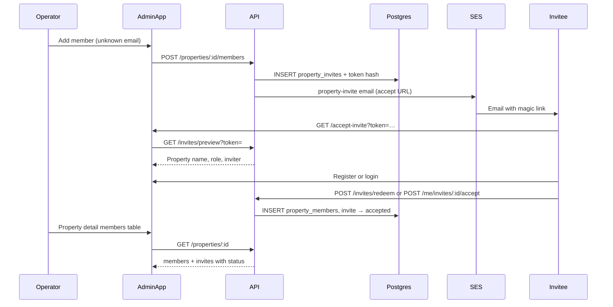

# Property Member Invite — Implementation Phases

Roadmap to migrate **operator property member invites** from the legacy “email + silent auto-join on register/login” flow to an **explicit token-based invite** pattern aligned with the tenant portal: magic link → `/accept-invite` → manual accept/decline → visible status in admin.

Stack: **Postgres** (`property_invites`, `property_members`, `users`) + **SES** (invite emails) + **platform JWT** (`apps/admin` auth).

**Related code today**

- Legacy invite storage: `apps/server/src/db/property-invites.ts` (statuses: `pending`, `accepted`, `email_failed`)
- Add member + invite send: `apps/server/src/routes/admin/property-routes.ts` (`POST /properties/:id/members`)
- Silent auto-accept (to phase out): `apps/server/src/services/property-invite-acceptance-service.ts` (register, login, Google, Apple)
- Platform register hook: `apps/server/src/services/auth-realms/platform-email-auth-realm.ts`
- OAuth routes: `apps/server/src/routes/auth/auth-routes.ts`
- Property detail (members only, no invites): `apps/server/src/db/properties.ts` (`findDetailById`), `apps/admin/src/pages/property-detail-page.tsx`
- Add member dialog: `apps/admin/src/components/properties/add-property-member-dialog.tsx`
- Invite email (generic signup CTA): `apps/server/templates/property-invite.html`, `sendPropertyInviteEmail` in `apps/server/src/ses/transactional-emails.ts`
- Shared types: `packages/shared/src/property-types.ts` (`PropertyInviteStatus`, `IPropertyInvite`)
- **Reference implementation (tenant portal — mirror, do not reuse routes):**
  - Token + URL: `apps/server/src/ses/tenant-portal-invite-token.ts`
  - Invite service: `apps/server/src/services/tenant-portal-invite-service.ts`
  - Accept/decline/redeem: `apps/server/src/routes/tenant/tenant-lease-routes.ts`
  - Accept page: `apps/tenant/src/pages/accept-invite-page.tsx`
  - Admin status + actions: `apps/admin/src/lib/lease-portal-access-display.ts`, `apps/admin/src/components/leases/lease-tenants-section.tsx`
  - Status transitions: `packages/shared/src/tenant-membership-transitions.ts`
- Migrations: `apps/server/src/db/migrations.ts` (next version: **63**)

---

## Goals

- Operators see **pending property member invites** on property detail (not only accepted `property_members` rows).
- Invitees receive a **tokenized magic link** to `PLATFORM_APP_URL/accept-invite?token=…` (admin app — **not** tenant app).
- Invitees **explicitly accept or decline** before gaining property access (no silent auto-join).
- Admin shows invite **status badges** and **Invite / Resend / Revoke** actions (parity with lease portal access UX).
- Existing users with a platform account still get added immediately when invited (no invite row) — unchanged.
- Technical bar: shared types in `packages/shared`, server-side transition rules, idempotent accept, phased rollout.

## Non-goals (initial release through Phase 4)

- Tenant portal (`tenant_users`) changes — property invites remain on **platform** `users`
- Reusing `apps/tenant` `/accept-invite` for property invites (different JWT audience)
- Portfolio-wide pending-invite inbox for operators (property-scoped only)
- Email campaigns / bulk property invites
- Property invite SMS
- Merging `property_invites` into a new table name in v1 (extend existing table unless audit requirements force a new one)
- Auto-accept on register/login/OAuth removed in Phase 3 (after accept/decline ships)

---

## Guiding principles

1. **Invite row ≠ member row** — `property_invites` is pre-acceptance intent; `property_members` is granted access after explicit accept (or immediate add when `users` already exists).
2. **Mirror tenant portal patterns** — token hash, preview, redeem, pending list, transition enum, resend/revoke — but on **platform auth** and **admin app** surfaces.
3. **Show before you switch** — expose pending invites in admin (Phase 1) before turning off auto-accept (Phase 3).
4. **Postgres before email** — persist invite + token hash, then send SES; recoverable from DB on email failure (`email_failed`).
5. **Explicit acceptance** — new email → signup + accept; existing `users` row → `pending_acceptance` until confirm (match tenant naming).
6. **Idempotent accept** — safe on retry, race, or duplicate login; mark invite `accepted` even if member row already exists.
7. **Reuse server patterns** — OTP register flow, transactional emails, `property-route-access`, mappers, `HttpStatus` from shared.

---

## Today vs target

|            | **Legacy (today)**                            | **Target (v2)**                                                                                      |
| ---------- | --------------------------------------------- | ---------------------------------------------------------------------------------------------------- |
| Storage    | `property_invites`                            | Extended `property_invites` (or successor with same role)                                            |
| Statuses   | `pending`, `accepted`, `email_failed`         | `pending_invite`, `pending_acceptance`, `accepted`, `declined`, `revoked`, `expired`, `email_failed` |
| Email link | `PLATFORM_APP_URL/signup`                     | `PLATFORM_APP_URL/accept-invite?token=…`                                                             |
| Acceptance | Auto via `property-invite-acceptance-service` | Manual accept/decline + token redeem                                                                 |
| Admin UI   | Members table only                            | Members + pending invite rows, badges, resend/revoke                                                 |
| Invitee UI | None                                          | Admin app `/accept-invite`, optional `/me/invites/pending`                                           |

---

## Target architecture

```
Admin: property detail → Add Member → POST .../members (no users row)
                                              ↓
                                    property_invites (pending_*)
                                              ↓
                                    SES invite email (magic link)
                                              ↓
Admin app: /accept-invite?token=… → register or login → accept/decline
                                              ↓
                                    property_members row + invite → accepted
```



### Permissions

- **Invite / resend / revoke:** property owners + platform admins (`assertPropertyStructureAccess`) — same as today’s add member.
- **Preview invite (public token):** unauthenticated; token is the secret.
- **Accept / decline:** authenticated platform user whose email matches `invite_email` (normalized).
- Mirror on server routes and client visibility (property detail actions).

---

## Data model (sketch)

### Extend `property_invites`

| Column                                     | Notes                              |
| ------------------------------------------ | ---------------------------------- |
| `id`                                       | UUID (existing)                    |
| `property_id`                              | FK → `properties` (existing)       |
| `email`                                    | Normalized invite email (existing) |
| `role`                                     | `property_role` (existing)         |
| `invited_by`                               | FK → `users` (existing)            |
| `status`                                   | Expand enum — see below            |
| `invite_token_hash`                        | SHA-256 hex of raw token (new)     |
| `expires_at`                               | TTL, default 30 days (existing)    |
| `email_error`                              | SES failure message (existing)     |
| `invited_at`                               | Optional; default `created_at`     |
| `accepted_at`, `declined_at`, `revoked_at` | Lifecycle timestamps (new)         |
| `created_at`, `updated_at`                 | Timestamps                         |

**Status enum (target):**

| Status               | Meaning                                              |
| -------------------- | ---------------------------------------------------- |
| `pending_invite`     | No `users` row for email — must register then accept |
| `pending_acceptance` | `users` row exists — must log in and accept          |
| `accepted`           | Member added to `property_members`                   |
| `declined`           | Invitee declined                                     |
| `revoked`            | Operator revoked                                     |
| `expired`            | Past `expires_at` (cron)                             |
| `email_failed`       | SES send failed (existing)                           |

**Migration note:** Map legacy `pending` → `pending_invite` or `pending_acceptance` based on `users` lookup at migration time; `accepted` unchanged.

**Uniqueness:** Today `UNIQUE (property_id, email)` blocks re-invite after decline. **Product rule for v2:** allow new invite row after `declined` / `expired` / `revoked` (drop or relax unique constraint; prefer partial unique on non-terminal statuses only — mirror tenant membership dedup pattern).

### `property_members` (unchanged)

Created only on **accept** or when inviting an **existing** platform user (`addExistingPropertyMember`).

---

## Shared contract (`packages/shared`)

| Type                                      | Purpose                                                 |
| ----------------------------------------- | ------------------------------------------------------- |
| `PropertyMemberInviteStatus`              | Lifecycle enum (mirror `TenantMembershipStatus` subset) |
| `IPropertyMemberInvite`                   | Invite row for admin + accept preview                   |
| `IPropertyInvitePreviewResponse`          | Public preview by token                                 |
| `IPropertyMemberInviteSummary`            | Property name, role label for accept screen             |
| `ICreatePropertyMemberInviteResult`       | Admin invite/resend result (`emailSent`, `emailError`)  |
| `IPropertyPendingMemberInvite`            | Logged-in user pending list item                        |
| `canTransitionPropertyMemberInviteStatus` | Server-enforced transitions                             |
| Extend `IPropertyDetail`                  | Optional `invites: IPropertyMemberInvite[]`             |

---

## API (sketch)

### Admin — operator (extend `property-routes.ts` or dedicated module)

| Method | Path                                                      | Notes                                               |
| ------ | --------------------------------------------------------- | --------------------------------------------------- |
| `POST` | `/properties/:propertyId/members`                         | Existing; v2 creates token + sends accept URL email |
| `GET`  | `/properties/:propertyId`                                 | Include `invites[]` or nested in detail             |
| `GET`  | `/properties/:propertyId/member-invites`                  | Optional dedicated list                             |
| `POST` | `/properties/:propertyId/member-invites/:inviteId/resend` | New token + email                                   |
| `POST` | `/properties/:propertyId/member-invites/:inviteId/revoke` | → `revoked`                                         |

### Public invite redemption (platform, not tenant)

| Method | Path                      | Notes                             |
| ------ | ------------------------- | --------------------------------- |
| `GET`  | `/invites/preview?token=` | Property summary; no auth         |
| `POST` | `/invites/redeem`         | Token + platform session → accept |

### Authenticated platform user

| Method | Path                            | Notes                                             |
| ------ | ------------------------------- | ------------------------------------------------- |
| `GET`  | `/me/invites/pending`           | Pending property invites for `request.user.email` |
| `POST` | `/me/invites/:inviteId/accept`  | → `property_members` + `accepted`                 |
| `POST` | `/me/invites/:inviteId/decline` | → `declined`                                      |

---

## Email

| Template                        | When                                 |
| ------------------------------- | ------------------------------------ |
| `property-invite-new.html`      | No `users` row — signup + accept CTA |
| `property-invite-existing.html` | Account exists — login + accept CTA  |

Link target: `PLATFORM_APP_URL/accept-invite?token=…` (new helper in `property-member-invite-token.ts`, mirror `tenant-portal-invite-token.ts`).

Update or retire misleading copy in `property-invite.html` (“membership will be activated automatically”).

---

## UI surfaces

### `apps/admin` (operator + invitee)

| Surface                                                                    | Phase |
| -------------------------------------------------------------------------- | ----- |
| Property detail — pending invite rows + status badges                      | 1     |
| Property detail — Resend / Revoke actions                                  | 4     |
| `/accept-invite` public route + preview + register/login inline            | 2–3   |
| Optional home banner / settings for pending property invites               | 3     |
| Add member dialog — unchanged entry; result toasts reference invite status | 4     |

Reuse `@/packages/app-ui` patterns from tenant accept page where possible (auth shells, summary card component for **property** context).

### Admin status labels (convention — match lease portal)

| Status                                 | Label        | Tone    |
| -------------------------------------- | ------------ | ------- |
| `pending_invite`, `pending_acceptance` | Pending      | pending |
| `accepted` / member row                | Active       | active  |
| `declined`                             | Declined     | muted   |
| `revoked`                              | Revoked      | muted   |
| `expired`                              | Expired      | muted   |
| `email_failed`                         | Email failed | muted   |
| (no invite)                            | Not invited  | neutral |

Display helper: `apps/admin/src/lib/property-member-invite-display.ts` (mirror `lease-portal-access-display.ts`).

---

## Phased rollout

### Phase 0 — Foundation (no user-facing feature)

**Goal:** Schema, shared types, token utilities, transition rules — legacy behavior unchanged until later phases.

- [x] Migration v62+: extend `property_invite_status` enum; add `invite_token_hash`, lifecycle timestamps; relax/replace `UNIQUE (property_id, email)` if needed
- [x] Backfill migration: legacy `pending` → `pending_invite` / `pending_acceptance`; generate token hashes for existing pending rows (or mark `expired` + require resend)
- [x] `packages/shared`: status enum, invite types, transition helpers + tests
- [x] `property-member-invite-token.ts`: generate, hash, verify, `buildPropertyInviteAcceptUrl`
- [x] Expiry cron (mirror `portal-invite-expiry-cron.ts`): pending → `expired`

**Exit criteria:** Migrations apply; token unit tests pass; no UI/API behavior change yet.

---

### Phase 1 — Admin visibility (read-only)

**Goal:** Operators see pending invites on property detail; fix “invite sent but not in members” confusion without changing acceptance.

- [x] `propertiesDb.findDetailById` (or parallel query): attach non-terminal `property_invites` for property
- [x] Extend `IPropertyDetail` + admin API client
- [x] Property detail Members card: render invite rows (email, role, status badge) alongside members
- [x] `property-member-invite-display.ts` for labels/tones
- [x] Keep legacy email + `property-invite-acceptance-service` auto-accept

**Exit criteria:** After inviting unknown email, admin sees Pending row; after legacy auto-accept, member appears and invite shows Accepted (or invite row hidden).

---

### Phase 2 — Tokenized email + accept page (admin app)

**Goal:** New invites use magic links and accept preview; legacy auto-accept remains until Phase 3.

- [x] `property-member-invite-service.ts`: create invite with token; branch `pending_invite` vs `pending_acceptance`; send new email templates
- [x] `GET /invites/preview?token=` (public)
- [x] Admin app: route `/accept-invite`, page mirroring tenant accept flow (property summary, not lease)
- [x] Wire `POST /properties/:id/members` to invite service
- [x] Resend path for legacy pending rows without tokens

**Exit criteria:** New invite email opens admin `/accept-invite` with correct property/role; user can register or log in on that page.

---

### Phase 3 — Manual accept / decline (phase out auto-accept)

**Goal:** Explicit accept/decline; remove silent auto-join.

- [ ] `GET /me/invites/pending`, `POST /me/invites/:inviteId/accept`, `POST /me/invites/:inviteId/decline`
- [ ] `POST /invites/redeem` (token + session)
- [ ] Accept page: Accept / Decline when authenticated; signup/register path calls redeem
- [ ] Remove `acceptPendingPropertyInvitesForUser` from register, login, Google, Apple
- [ ] Idempotent accept service (extend or replace `property-invite-acceptance-service.ts`)

**Exit criteria:** User must Accept to appear in members; Decline shows in admin; auto-accept does not run.

---

### Phase 4 — Operator controls (full lifecycle)

**Goal:** Resend, revoke, re-invite after terminal states — parity with lease portal admin.

- [ ] `POST .../member-invites/:inviteId/resend` and `.../revoke`
- [ ] Property detail: Resend / Revoke on pending rows; Invite again after declined/expired
- [ ] Update `add-property-member-dialog.tsx` result handling for v2 response shapes
- [ ] 409 on duplicate non-terminal invite (same email + property)
- [ ] Observability: structured logs for invite sent / accepted / declined / revoked

**Exit criteria:** Operator manages full invite lifecycle from property detail without DB access.

---

### Phase 5 — Cleanup

**Goal:** Remove legacy path; single invite model in production.

- [ ] Remove `acceptPendingPropertyInvitesForUser` hooks from auth routes and platform realm (or delete service)
- [ ] Retire `property-invite.html` or redirect to split new/existing templates
- [ ] Document operator flow in README or ops docs
- [ ] Delete dead code paths in `property-routes.ts` (`sendPropertyMemberInvite` inline logic → service only)

**Exit criteria:** No auto-accept code; one email template pair; all pending invites have token flow.

---

### Phase 6 — Enhancements (post-launch)

- Pending property invites banner on admin home for logged-in invitees
- Notification stream event when property invite received
- Optional: “copy invite link” for operators (support/debug)
- Partial unique index performance audit if invite volume grows

---

## What not to do

- Do **not** route property accept links to `TENANT_APP_URL` — wrong user table and JWT audience.
- Do **not** remove auto-accept before Phase 3 accept/decline APIs and admin accept page work.
- Do **not** show only `property.members` in admin — invites live in `property_invites` until accepted.
- Do **not** skip transition rules — ad-hoc status updates will break resend/revoke and expiry cron.
- Do **not** reuse tenant portal redeem handlers verbatim — duplicate with platform auth and `users` FK targets.
- Do **not** block re-invite after `declined` without migrating off `UNIQUE (property_id, email)`.
- Do **not** promise “automatic activation” in email copy after Phase 3 ships.

---

## Safest sequencing summary

1. **Phase 1 first** — visible pending invites fix operator confusion with minimal risk.
2. **Schema + shared types before accept page** — Phase 0 before Phase 2.
3. **Token + preview before manual accept** — Phase 2 before Phase 3.
4. **Disable auto-accept only after accept path is tested** — Phase 3.
5. **Resend/revoke after core accept works** — Phase 4.
6. **Delete legacy auto-accept last** — Phase 5 after backfill and production validation.

---

## Related docs

- Tenant portal invite reference: [TENANT_PORTAL_PHASES.md](./TENANT_PORTAL_PHASES.md)
- Platform register OTP: [REGISTER_EMAIL_OTP.md](./REGISTER_EMAIL_OTP.md)
- Tenant portal failure modes (409, resend): [TENANT_PORTAL_FAILURE_MODES.md](./TENANT_PORTAL_FAILURE_MODES.md)
