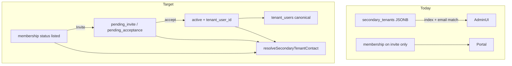

# Secondary tenant identity via memberships only

## Context

Today secondaries exist in **two places**:

| Layer       | Storage                                                            | Used for                                                  |
| ----------- | ------------------------------------------------------------------ | --------------------------------------------------------- |
| Lease JSONB | `property_long_stays.secondary_tenants[]` `{ name, email, phone }` | Add/edit/delete, admin list, campaigns, unit search       |
| Portal      | `lease_tenant_memberships` (`role = secondary`)                    | Invites only; matched to JSONB by **email + array index** |

Primary consolidation (Phases 0–3, done) established the pattern in [`packages/shared/src/lease-primary-tenant-contact.ts`](packages/shared/src/lease-primary-tenant-contact.ts). Secondaries need the same treatment, plus a schema change because **membership rows have no phone column** and **no row exists until invite**.

**Your choice:** new `listed` status — add secondary → membership row immediately; Invite → `pending_invite`.

## Guiding principles (extend primary doc)

1. **`tenant_users` canonical when linked** — active secondary + `tenant_user_id` → name/email/phone from `tenant_users`.
2. **`listed` / pending membership is pre-link intent** — `display_name`, `invite_email`, `contact_phone` on membership row.
3. **No JSONB on accept** — accept links user only; optional dual-write snapshot during transition.
4. **Reuse primary patterns** — shared resolver, detail API additive fields, admin badge, linked write rules, accept phone sync.
5. **Key by `membershipId`**, not JSONB index — replaces `secondaryIndexes` in invite API and admin acting targets.

## Schema changes (new migration)

Append to [`apps/server/src/db/migrations.ts`](apps/server/src/db/migrations.ts):

| Change                                                         | Purpose                                                                     |
| -------------------------------------------------------------- | --------------------------------------------------------------------------- |
| `ALTER TYPE tenant_membership_status ADD VALUE 'listed'`       | Pre-invite secondary occupant                                               |
| `contact_phone VARCHAR` nullable on `lease_tenant_memberships` | Operator-entered phone (JSONB parity); used when unlinked / pending         |
| Update partial unique index                                    | `listed` is non-terminal (same `(lease_id, invite_email, role)` uniqueness) |

Extend [`packages/shared/src/tenant-membership-transitions.ts`](packages/shared/src/tenant-membership-transitions.ts):

- `listed` → `pending_invite`, `ended` (delete occupant)
- `pending_invite` / `pending_acceptance` unchanged
- Terminal rules unchanged

## Shared contract ([`packages/shared`](packages/shared))

| Addition                                                                                                        | Purpose                                                                    |
| --------------------------------------------------------------------------------------------------------------- | -------------------------------------------------------------------------- |
| `TSecondaryTenantContactSource`                                                                                 | `'linked_user' \| 'membership_pending' \| 'membership_listed'`             |
| `ILeaseSecondaryTenantContact`                                                                                  | `membershipId`, effective name/email/phone, source, status, `tenantUserId` |
| `resolveSecondaryTenantContact(membership, tenantUser?)`                                                        | Pure resolver + tests                                                      |
| `selectSecondaryMembershipForContact(memberships, inviteEmail)`                                                 | Per-row lookup (email-keyed; replaces index)                               |
| Extend `IPropertyLongStayDetailResponse`                                                                        | `secondaryTenantContacts: ILeaseSecondaryTenantContact[]` (additive)       |
| Deprecate `IPropertyLongStaySecondaryTenant` / `secondaryTenants` on lease (JSDoc first; remove in final phase) |

Phone resolution (mirror primary):

| State                | Phone                      |
| -------------------- | -------------------------- |
| Linked active        | `tenant_users.phone`       |
| Pending invite       | `membership.contact_phone` |
| Listed (not invited) | `membership.contact_phone` |

## Phased rollout

### S0 — Foundation (no behavior change)

- Add resolver + transitions for `listed` in shared package
- Server: `loadSecondaryMembershipsForLease(leaseId)` (all `role = secondary`, non-terminal + listed)
- Tests only; no API/UI change
- **Exit:** resolver tests pass; `listed` in enum + transitions

### S1 — Read path (API + admin display)

**Server**

- [`resolve-secondary-tenant-contacts-service.ts`](apps/server/src/services/) (mirror [`lease-primary-tenant-contact-service.ts`](apps/server/src/services/lease-primary-tenant-contact-service.ts))
- `GET .../long-stays/:id` → include `secondaryTenantContacts[]`
- Keep `longStay.secondaryTenants` JSONB unchanged (transition)

**Admin**

- [`lease-tenants-section.tsx`](apps/admin/src/components/leases/lease-tenants-section.tsx): render secondaries from `secondaryTenantContacts` when present
- [`LeaseSecondaryTenantRow`](apps/admin/src/components/leases/lease-tenant-block.tsx): **“Portal account linked”** badge when `source === 'linked_user'`
- Portal row still uses membership from contact object (not email+index guess)

**Exit:** linked secondary shows `tenant_users` contact + badge; listed/pending show membership fields

### S2 — Accept sync (secondary)

- Extend [`sync-lease-phone-to-tenant-on-accept.ts`](apps/server/src/services/sync-lease-phone-to-tenant-on-accept.ts): **secondary role**; copy `membership.contact_phone` → `tenant_users.phone` when user phone null (same rules as primary)
- **Exit:** accept secondary invite with phone on membership → `/tenant/me` has phone

### S3 — Write path (CRUD + invites)

**New API surface** (prefer dedicated routes over JSONB PATCH):

| Method   | Path                                                   | Behavior                                                                                                                                                                                                                  |
| -------- | ------------------------------------------------------ | ------------------------------------------------------------------------------------------------------------------------------------------------------------------------------------------------------------------------- |
| `POST`   | `.../long-stays/:id/secondary-occupants`               | Create `listed` membership (`display_name`, `invite_email`, `contact_phone`); dual-write JSONB snapshot                                                                                                                   |
| `PATCH`  | `.../long-stays/:id/secondary-occupants/:membershipId` | Branch linked vs unlinked (same rules as [`update-primary-tenant-contact-service.ts`](apps/server/src/services/update-primary-tenant-contact-service.ts)); sync pending `display_name` / `invite_email` / `contact_phone` |
| `DELETE` | `.../long-stays/:id/secondary-occupants/:membershipId` | Terminal transition (`ended`); remove JSONB snapshot entry                                                                                                                                                                |

**Invite API migration**

- [`ICreateLeasePortalInviteBody`](packages/shared/src/tenant-portal-types.ts): add `secondaryMembershipIds?: string[]`; deprecate `secondaryIndexes`
- [`tenant-portal-invite-service.ts`](apps/server/src/services/tenant-portal-invite-service.ts): invite by membership id; `listed` → `pending_invite` + token
- Admin [`lease-portal-access-display.ts`](apps/admin/src/lib/lease-portal-access-display.ts): acting target `{ kind: 'secondary', membershipId }` instead of `index`

**Admin dialogs**

- [`add-secondary-tenant-dialog.tsx`](apps/admin/src/components/leases/add-secondary-tenant-dialog.tsx), [`edit-secondary-tenant-dialog.tsx`](apps/admin/src/components/leases/edit-secondary-tenant-dialog.tsx) → new API; disable email when linked; invalidate detail + portal caches

**Exit:** add/edit/delete + invite work without relying on JSONB as write source; linked edit updates `/tenant/me`

### S4 — Backfill + downstream readers

| Reader                                                                                         | Action                                                                                                                                         |
| ---------------------------------------------------------------------------------------------- | ---------------------------------------------------------------------------------------------------------------------------------------------- |
| **Backfill script**                                                                            | For each lease JSONB secondary without matching non-terminal secondary membership (by normalized email), insert `listed` row + `contact_phone` |
| [`tenant-email-recipient-resolver.ts`](packages/shared/src/tenant-email-recipient-resolver.ts) | Resolve secondary recipients via membership + linked user (server pre-join or shared helper)                                                   |
| [`lease-tenant-utils.ts`](packages/shared/src/lease-tenant-utils.ts)                           | Occupancy names from effective contacts                                                                                                        |
| [`property-units.ts`](apps/server/src/db/property-units.ts)                                    | Replace JSONB ILIKE with membership JOIN for secondary search                                                                                  |
| Drift check                                                                                    | Log leases where JSONB ≠ membership snapshot                                                                                                   |

**Exit:** campaigns and search use memberships; backfill zero gaps in staging

### S5 — Drop JSONB `secondary_tenants`

- Stop dual-write to JSONB
- Migration: drop column (or rename `_legacy_secondary_tenants`)
- Remove `secondaryTenants` from [`IPropertyLongStay`](packages/shared/src/property-long-stay-types.ts), PATCH parser, mappers, admin fallbacks
- Remove `secondaryIndexes` from invite contract

**Exit:** no code references JSONB secondaries; max-10 enforced via membership count

## Dependencies and sequencing

- **After primary Phases 0–3** (done) — reuse services/errors patterns
- **Ideally after primary Phase 4** (campaigns) — avoid double-migrating campaign resolver
- **Independent of primary Phase 5** (drop `guest_name` columns) — secondary JSONB drop is separate DDL
- Update [`docs/LEASE_TENANT_IDENTITY_CONSOLIDATION_PHASES.md`](docs/LEASE_TENANT_IDENTITY_CONSOLIDATION_PHASES.md) Phase 6 section with this breakdown when implementing

## What not to do

- Do not key secondaries by JSONB array index in new code
- Do not drop JSONB before S4 backfill + reader migration
- Do not relax invite email match on accept/redeem
- Do not overwrite verified `tenant_users.phone` from operator edits
- Do not add `secondary_tenant_user_id` on lease — membership remains the join

## Risks

| Risk                                               | Mitigation                                                                    |
| -------------------------------------------------- | ----------------------------------------------------------------------------- |
| Email change on listed row breaks invite targeting | Block email change when linked; re-invite policy for pending                  |
| Duplicate JSONB + membership during transition     | Dual-write + drift script in S4                                               |
| `listed` rows without valid email                  | Require email on create (same as today for invite); allow optional phone only |
