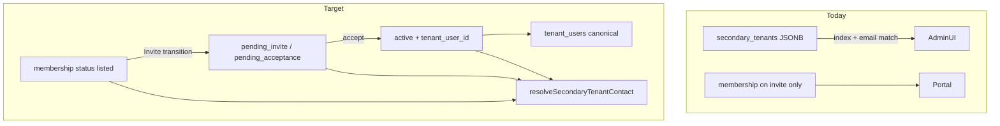

# Secondary tenant identity via memberships only

## Context

Today secondaries exist in **two places**:

| Layer       | Storage                                                            | Used for                                                  |
| ----------- | ------------------------------------------------------------------ | --------------------------------------------------------- |
| Lease JSONB | `property_long_stays.secondary_tenants[]` `{ name, email, phone }` | Add/edit/delete, admin list, campaigns, unit search       |
| Portal      | `lease_tenant_memberships` (`role = secondary`)                    | Invites only; matched to JSONB by **email + array index** |

Primary consolidation (Phases 0–3, done) established the pattern in [`packages/shared/src/lease-primary-tenant-contact.ts`](packages/shared/src/lease-primary-tenant-contact.ts). Secondaries need the same treatment, plus a schema change because **membership rows have no phone column** and **no row exists until invite**.

**Your choice:** new `listed` status — add secondary → membership row immediately; Invite → `pending_invite`.



## Guiding principles (extend primary doc)

1. **`tenant_users` canonical when linked** — active secondary + `tenant_user_id` → name/email/phone from `tenant_users`.
2. **`listed` / pending membership is pre-link intent** — `display_name`, `invite_email`, `contact_phone` on membership row.
3. **No JSONB on accept** — accept links user only; optional dual-write snapshot during transition.
4. **Reuse primary patterns** — shared resolver, detail API additive fields, admin badge, linked write rules, accept phone sync.
5. **Key by `membershipId`**, not JSONB index — replaces `secondaryIndexes` in invite API and admin acting targets.

## Schema changes (new migration)

Append to [`apps/server/src/db/migrations.ts`](apps/server/src/db/migrations.ts):

| Change                                                         | Purpose                                                                     |
| -------------------------------------------------------------- | --------------------------------------------------------------------------- |
| `ALTER TYPE tenant_membership_status ADD VALUE 'listed'`       | Pre-invite secondary occupant                                               |
| `contact_phone VARCHAR` nullable on `lease_tenant_memberships` | Operator-entered phone (JSONB parity); used when unlinked / pending         |
| Partial unique index unchanged                                 | `listed` is non-terminal (same `(lease_id, invite_email, role)` uniqueness) |

Extend [`packages/shared/src/tenant-membership-transitions.ts`](packages/shared/src/tenant-membership-transitions.ts):

- `listed` → `pending_invite`, `ended` (delete occupant)
- `pending_invite` / `pending_acceptance` unchanged
- Terminal rules unchanged

**Lifecycle cleanup:** extend [`endAllNonTerminalForLease`](apps/server/src/db/lease-tenant-memberships.ts) to include `listed` — when a lease ends, listed occupant rows must transition to `ended` (today only `active`, `pending_invite`, `pending_acceptance` are covered).

## Shared contract ([`packages/shared`](packages/shared))

| Addition                                                                                                        | Purpose                                                                                            |
| --------------------------------------------------------------------------------------------------------------- | -------------------------------------------------------------------------------------------------- |
| `contactPhone: string \| null` on `ILeaseTenantMembership`                                                      | Map new DB column; used by resolver and accept sync                                                |
| `TSecondaryTenantContactSource`                                                                                 | `'linked_user' \| 'membership_pending' \| 'membership_listed' \| 'legacy_jsonb'` (transition only) |
| `ILeaseSecondaryTenantContact`                                                                                  | `membershipId`, effective name/email/phone, source, status, `tenantUserId`                         |
| `resolveSecondaryTenantContact(membership, tenantUser?)`                                                        | Pure resolver + tests                                                                              |
| `resolveSecondaryTenantContactsForLease(memberships, tenantUsers, jsonbOrphans?)`                               | Merge memberships + unmatched JSONB entries during transition                                      |
| `selectSecondaryMembershipForContact(memberships, inviteEmail)`                                                 | Per-row lookup (email-keyed; replaces index)                                                       |
| Extend `IPropertyLongStayDetailResponse`                                                                        | `secondaryTenantContacts: ILeaseSecondaryTenantContact[]` (additive)                               |
| Deprecate `IPropertyLongStaySecondaryTenant` / `secondaryTenants` on lease (JSDoc first; remove in final phase) |

Phone resolution (mirror primary):

| State                | Phone                      |
| -------------------- | -------------------------- |
| Linked active        | `tenant_users.phone`       |
| Pending invite       | `membership.contact_phone` |
| Listed (not invited) | `membership.contact_phone` |
| Legacy JSONB orphan  | JSONB `phone` (transition) |

---

## Deployment gates (must-have)

These are **hard ordering requirements** — skipping them causes missing secondaries in admin, duplicate invites, or broken portal actions.

| Gate   | Deploy                     | Must happen before           | Why                                                                                                                |
| ------ | -------------------------- | ---------------------------- | ------------------------------------------------------------------------------------------------------------------ |
| **G1** | S0 server                  | S1, S2, S3, S1b backfill     | Migration adds `listed` enum + `contact_phone`; resolver/transitions depend on it                                  |
| **G2** | S1 server                  | S1 admin                     | Admin reads `secondaryTenantContacts`; old admin + new server is OK (field absent → fallback)                      |
| **G3** | S1 admin                   | —                            | Requires G2. Resolver **must merge legacy JSONB orphans** (`source: legacy_jsonb`) unless G4 already ran           |
| **G4** | S1b backfill (script)      | S5; removing S1 legacy merge | Without backfill **or** merge, JSONB-only secondaries vanish from admin. Backfill is required before S5 regardless |
| **G5** | S2 server                  | —                            | Independent of admin. Extends accept phone sync for new secondary accepts                                          |
| **G6** | S3 server                  | S3 admin                     | New CRUD routes + invite-by-`membershipId` + **listed→pending transition** (not INSERT)                            |
| **G7** | S3 admin                   | —                            | Requires G6. Sends `secondaryMembershipIds`; must not ship before server invite transition exists                  |
| **G8** | S4 downstream              | S5                           | Campaigns/search must read memberships; drift check zero in staging                                                |
| **G9** | S5 server + admin together | —                            | Drop JSONB column + remove fallbacks/`secondaryIndexes` in one release                                             |

**Safe minimum deploy sequences:**

```
Option A (recommended):  S0 → S1 server+admin (with merge) → S1b backfill → S2 → S3 server+admin → S4 → S5
Option B (backfill-first): S0 → S1b backfill → S1 server+admin (merge optional) → S2 → S3 → S4 → S5
```

**Can deploy independently (no paired release):** S0 alone, S2 alone (after S0), S1b alone (after S0).

**Never deploy:** S1 admin that reads only memberships with no merge **and** no prior backfill (G3 + G4).

**Already-linked secondaries:** no re-invite or re-link needed. G1–G3 do not affect existing `active` memberships with `tenant_user_id`.

---

## Phased rollout

### S0 — Foundation (no behavior change)

- Migration: `listed` status + `contact_phone` column
- Add `contactPhone` to `ILeaseTenantMembership` + mapper
- Resolver + transitions for `listed` in shared package
- Server: `loadSecondaryMembershipsForLease(leaseId)` (all `role = secondary`, non-terminal incl. `listed`)
- Extend `endAllNonTerminalForLease` to end `listed` rows on lease end
- Tests only; no API/UI change
- **Exit:** resolver tests pass; `listed` in enum + transitions; lease-end ends listed rows

### S1 — Read path (API + admin display)

**Server**

- [`resolve-secondary-tenant-contacts-service.ts`](apps/server/src/services/) (mirror [`lease-primary-tenant-contact-service.ts`](apps/server/src/services/lease-primary-tenant-contact-service.ts))
- `GET .../long-stays/:id` → include `secondaryTenantContacts[]`
- **Transition merge:** for each JSONB entry with no matching non-terminal secondary membership (by normalized email), append contact with `source: 'legacy_jsonb'` and `membershipId: null`. Prevents JSONB-only secondaries from disappearing before backfill (G3).
- Keep `longStay.secondaryTenants` JSONB unchanged (transition)

**Admin**

- [`lease-tenants-section.tsx`](apps/admin/src/components/leases/lease-tenants-section.tsx): prefer `secondaryTenantContacts` when present
- **Fallback:** if `secondaryTenantContacts` absent (old server) or empty, keep current JSONB + email-match behavior
- [`LeaseSecondaryTenantRow`](apps/admin/src/components/leases/lease-tenant-block.tsx): **“Portal account linked”** badge when `source === 'linked_user'`
- Portal row uses membership from contact object (not email+index guess); legacy JSONB rows use email-match against portal-access memberships until backfilled

**Exit:** linked secondary shows `tenant_users` contact + badge; listed/pending show membership fields; JSONB-only secondaries still visible via merge

### S1b — Data backfill (script; no feature flag)

Run after S0 (needs schema). **Required before S5 (G4).** Should run in staging before production S3 if operators will invite existing JSONB-only secondaries via new UI.

**Backfill buckets (idempotent; safe to re-run):**

| Existing state                                    | Action                                                                                   |
| ------------------------------------------------- | ---------------------------------------------------------------------------------------- |
| JSONB only (never invited)                        | `INSERT` `listed` row: `display_name`, `invite_email`, `contact_phone` from JSONB        |
| Pending (`pending_invite` / `pending_acceptance`) | `UPDATE` membership: `display_name`, `contact_phone` from JSONB; **do not insert**       |
| Active + linked (`tenant_user_id` set)            | No insert; optional `UPDATE` snapshot fields on membership; display reads `tenant_users` |
| Terminal membership + still in JSONB              | `INSERT` new `listed` row (unique index excludes terminal rows)                          |

**Edge cases:**

- **Duplicate JSONB emails** on same lease — log, pick one canonical row, skip or merge duplicates (unique index will reject otherwise)
- **Email drift** (JSONB email ≠ membership `invite_email`) — prefer membership email; log drift for manual review
- **JSONB deleted but active membership remains** — log drift; do not delete membership

**Verification query (staging exit):** for each active lease, count of valid JSONB secondaries equals count of non-terminal secondary memberships (by normalized email set).

**Optional (same script or follow-up):** for `active` + linked secondaries where `tenant_users.phone` is null and membership/JSONB has valid E.164, copy phone once (null-only; no `phone_verified_at`) — helps existing linked accounts, not just future accepts.

**Exit:** verification query zero gaps in staging; drift log reviewed

### S2 — Accept sync (secondary)

- Extend [`sync-lease-phone-to-tenant-on-accept.ts`](apps/server/src/services/sync-lease-phone-to-tenant-on-accept.ts): **secondary role**; copy `membership.contact_phone` → `tenant_users.phone` when user phone null (same rules as primary; update test that currently expects secondary skip)
- **Exit:** accept secondary invite with phone on membership → `/tenant/me` has phone

### S3 — Write path (CRUD + invites)

**New API surface** (prefer dedicated routes over JSONB PATCH):

| Method   | Path                                                   | Behavior                                                                                                                                                                                                                  |
| -------- | ------------------------------------------------------ | ------------------------------------------------------------------------------------------------------------------------------------------------------------------------------------------------------------------------- |
| `POST`   | `.../long-stays/:id/secondary-occupants`               | Create `listed` membership; dual-write JSONB snapshot; enforce max-10 on **membership count**                                                                                                                             |
| `PATCH`  | `.../long-stays/:id/secondary-occupants/:membershipId` | Branch linked vs unlinked (same rules as [`update-primary-tenant-contact-service.ts`](apps/server/src/services/update-primary-tenant-contact-service.ts)); sync pending `display_name` / `invite_email` / `contact_phone` |
| `DELETE` | `.../long-stays/:id/secondary-occupants/:membershipId` | Terminal transition (`ended`); remove JSONB snapshot entry                                                                                                                                                                |

**Dual-write cap:** during transition, enforce max-10 on both membership count and JSONB length so snapshots cannot diverge.

**Invite API migration**

- [`ICreateLeasePortalInviteBody`](packages/shared/src/tenant-portal-types.ts): add `secondaryMembershipIds?: string[]`; deprecate `secondaryIndexes`
- **Deprecation window:** server accepts **both** `secondaryMembershipIds` and `secondaryIndexes` for one release; admin migrates to `membershipId` first; remove `secondaryIndexes` in S5
- [`tenant-portal-invite-service.ts`](apps/server/src/services/tenant-portal-invite-service.ts):
  - **Critical:** for secondaries, **transition existing `listed` row** → `pending_invite` / `pending_acceptance` + set token — **do not INSERT** a new membership (would hit `DuplicatePortalInviteError` after backfill)
  - `secondaryIndexes` path (deprecated): resolve index → find or create `listed` row → transition
  - `secondaryMembershipIds` path: load row by id → assert `listed` or re-invite policy → transition
- Admin [`lease-portal-access-display.ts`](apps/admin/src/lib/lease-portal-access-display.ts): acting target `{ kind: 'secondary', membershipId }` instead of `index`

**Admin dialogs**

- [`add-secondary-tenant-dialog.tsx`](apps/admin/src/components/leases/add-secondary-tenant-dialog.tsx), [`edit-secondary-tenant-dialog.tsx`](apps/admin/src/components/leases/edit-secondary-tenant-dialog.tsx) → new API; disable email when linked; invalidate detail + portal caches

**Exit:** add/edit/delete + invite work without JSONB as write source; linked edit updates `/tenant/me`; invite never duplicates membership rows

### S4 — Downstream readers + remove legacy merge

| Reader                                                                                         | Action                                                                                                      |
| ---------------------------------------------------------------------------------------------- | ----------------------------------------------------------------------------------------------------------- |
| [`tenant-email-recipient-resolver.ts`](packages/shared/src/tenant-email-recipient-resolver.ts) | Resolve secondary recipients via membership + linked user (server pre-join or shared helper)                |
| [`lease-tenant-utils.ts`](packages/shared/src/lease-tenant-utils.ts)                           | Occupancy names from effective contacts                                                                     |
| [`property-units.ts`](apps/server/src/db/property-units.ts)                                    | Replace JSONB ILIKE with membership JOIN for secondary search                                               |
| Drift check                                                                                    | Log leases where JSONB ≠ membership snapshot (name/email/phone)                                             |
| S1 merge removal                                                                               | After S1b verification green in prod, remove `legacy_jsonb` merge path from resolver + admin JSONB fallback |

**Exit:** campaigns and search use memberships; drift zero in staging; legacy merge removed

### S5 — Drop JSONB `secondary_tenants`

- Stop dual-write to JSONB
- Migration: drop column (or rename `_legacy_secondary_tenants` first)
- Remove `secondaryTenants` from [`IPropertyLongStay`](packages/shared/src/property-long-stay-types.ts), PATCH parser, mappers, admin fallbacks
- Remove `secondaryIndexes` from invite contract
- Max-10 enforced via non-terminal secondary membership count only

**Exit:** no code references JSONB secondaries

## Dependencies and sequencing

- **After primary Phases 0–3** (done) — reuse services/errors patterns
- **Ideally after primary Phase 4** (campaigns) — avoid double-migrating campaign resolver
- **Independent of primary Phase 5** (drop `guest_name` columns) — secondary JSONB drop is separate DDL
- Update [`docs/LEASE_TENANT_IDENTITY_CONSOLIDATION_PHASES.md`](docs/LEASE_TENANT_IDENTITY_CONSOLIDATION_PHASES.md) Phase 6 section with this breakdown when implementing

## What not to do

- Do not key secondaries by JSONB array index in new code
- Do not drop JSONB before S1b backfill + S4 reader migration (G4, G8)
- Do not ship S1 admin without merge fallback unless S1b backfill already ran (G3 + G4)
- Do not INSERT a new membership on secondary invite when a `listed` (or pending) row already exists — transition instead
- Do not relax invite email match on accept/redeem
- Do not overwrite verified `tenant_users.phone` from operator edits
- Do not add `secondary_tenant_user_id` on lease — membership remains the join

## Risks

| Risk                                               | Mitigation                                                                    |
| -------------------------------------------------- | ----------------------------------------------------------------------------- |
| JSONB-only secondaries vanish on S1 read flip      | G3 merge resolver + G4 backfill; admin JSONB fallback until S4                |
| Email change on listed row breaks invite targeting | Block email change when linked; re-invite policy for pending                  |
| Duplicate JSONB + membership during transition     | Dual-write + drift script in S4; max-10 on both layers in S3                  |
| Duplicate JSONB emails block backfill              | Detect in S1b; log + pick canonical row                                       |
| Invite INSERT after backfill                       | S3 transition-only invite path (G6)                                           |
| `listed` rows orphaned on lease end                | Include `listed` in `endAllNonTerminalForLease` (S0)                          |
| `listed` rows without valid email                  | Require email on create (same as today for invite); allow optional phone only |
