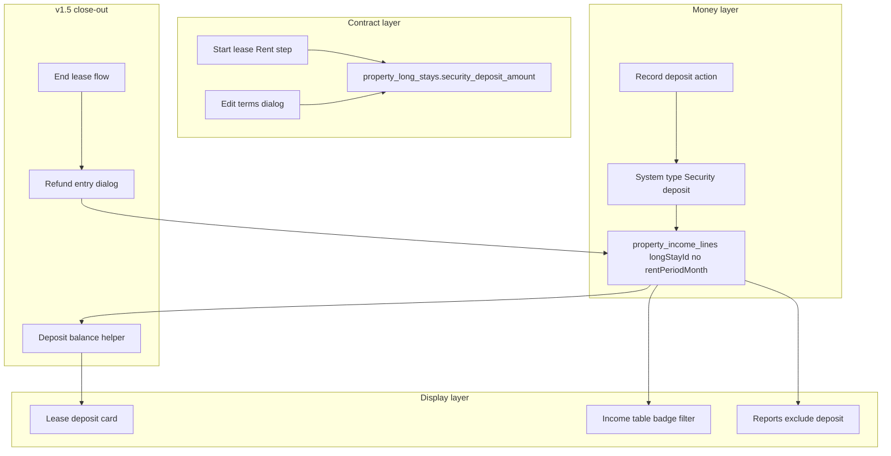

# Security Deposit — Phased Plan (v1 → v1.5)

Write the living doc at [`docs/SECURITY_DEPOSIT_PHASES.md`](docs/SECURITY_DEPOSIT_PHASES.md) in Phase 0 (same structure as [`docs/LEASE_TERMS_EDIT_PHASES.md`](docs/LEASE_TERMS_EDIT_PHASES.md)).

## Goals (v1)

- Store **contractual security deposit amount** on each long-term lease (optional; custom $ or preset “1× rent” snapshot).
- Capture at **Start lease** (Rent step) and **Edit terms** (same ledger gate as today’s terms edit).
- **Display** expected deposit on lease detail; do **not** attach to rent schedule / `rentPeriodMonth`.
- **Record deposit received** as a lease-linked income line using a **system income type** (`Security deposit`), mirroring [`SYSTEM_LEASE_RENT_INCOME_TYPE_NAME`](packages/shared/src/property-income-line-type-config.ts).
- **Show in Income table** with clear typing; **exclude from rent rollup and revenue composition**.

## Goals (v1.5)

- Show **deposit balance** on lease detail: expected vs collected vs outstanding.
- At **End lease**, guide operator to **refund / withhold** deposit using existing **partial refund** flow on the deposit income line ([`refund-entry-dialog.tsx`](apps/admin/src/components/income/refund-entry-dialog.tsx)).
- End-lease email mentions deposit settlement status when relevant.

## Non-goals (through v1.5)

- Stripe / tenant portal deposit payment ([`docs/TENANT_STRIPE_RENT_PAYMENTS.md`](docs/TENANT_STRIPE_RENT_PAYMENTS.md) already defers deposits).
- Pet deposit as separate product, deposit interest, state compliance engine, trust-account tracking.
- Auto-increase deposit when rent increases on **Extend** (amount is frozen at agreement; top-up is a future amendment flow).
- Negative-amount income lines (server enforces non-negative [`property-income-line-routes.ts`](apps/server/src/routes/admin/property-income-line-routes.ts)); refunds use existing `refundedAmount` / `refundedAt`.

## Guiding principles

1. **Deposit ≠ rent** — never set `rentPeriodMonth`; never include in [`buildLeaseRentSchedule`](packages/shared/src/lease-rent-schedule.ts) or [`rollupLeaseRentByPeriod`](packages/shared/src/lease-rent-period-rollup.ts).
2. **Snapshot amount** — preset “1× rent” resolves to a **fixed dollar** at save time; extend does not recompute.
3. **Same ledger gate as terms edit** — editable while [`deriveLeaseTermsEditability`](packages/shared/src/lease-terms-edit-utils.ts) is `editable`; blocked once income / succeeded Stripe / rent-period history exists.
4. **System income type** — follow [`ensureLeaseRentIncomeLineType`](apps/server/src/db/property-income-line-types.ts) pattern; requires **migration** to allow **multiple** `is_system` rows per property (today’s unique index allows only one — see Phase 2a).
5. **≤8 files per sub-phase** — counts include new test files; shared `index.ts` re-exports count when touched.

## Data model

### Migration v76 — lease column

| Column                    | Type                 | Notes                        |
| ------------------------- | -------------------- | ---------------------------- |
| `security_deposit_amount` | `NUMERIC(12,2) NULL` | `NULL` = no deposit required |

Add to [`IPropertyLongStay`](packages/shared/src/property-long-stay-types.ts), [`ICreatePropertyLongStayBody`](packages/shared/src/property-long-stay-types.ts), [`IEditPropertyLongStayTermsBody`](packages/shared/src/property-long-stay-types.ts) (optional field).

> Note: Plan originally said v75; that version was taken by `rename_rent_period_columns`, so the deposit column ships as **v76**.

### Migration v77 — multiple system income types

Replace one-system-per-property index in [`migrations.ts`](apps/server/src/db/migrations.ts) (v72) with uniqueness on `(property_id, lower(name)) WHERE is_system AND NOT is_deleted`. Backfill `Security deposit` system row per property. Update `ensureLeaseRentIncomeLineType` queries to filter by name (not “any system row”).

### Shared helpers (new)

| Module                                                                                                            | Responsibility                                                                                    |
| ----------------------------------------------------------------------------------------------------------------- | ------------------------------------------------------------------------------------------------- |
| [`packages/shared/src/lease-deposit-utils.ts`](packages/shared/src/lease-deposit-utils.ts)                        | Validation, preset resolution (`none` / `one_month_rent` / `custom`), optional non-negative money |
| [`packages/shared/src/lease-deposit-balance-utils.ts`](packages/shared/src/lease-deposit-balance-utils.ts) (v1.5) | `expected`, `collected`, `outstanding`, `status` from lease amount + deposit-typed income lines   |
| [`packages/shared/src/lease-deposit-income-utils.ts`](packages/shared/src/lease-deposit-income-utils.ts)          | `isDepositIncomeLineType`, `SYSTEM_SECURITY_DEPOSIT_INCOME_TYPE_NAME`                             |

---

## Phase 0 — Doc scaffold

**Goal:** Checklist doc only; no product code.

| #   | File                                                                 |
| --- | -------------------------------------------------------------------- |
| 1   | [`docs/SECURITY_DEPOSIT_PHASES.md`](docs/SECURITY_DEPOSIT_PHASES.md) |

**Exit criteria:** Goals, non-goals, data model, and sub-phase checklist committed.

---

## Phase 1a — Schema + shared contract

**Goal:** DB column + shared types/validation; no UI.

| #   | File                                                                                                         |
| --- | ------------------------------------------------------------------------------------------------------------ |
| 1   | [`apps/server/src/db/migrations.ts`](apps/server/src/db/migrations.ts) — v76                                 |
| 2   | [`packages/shared/src/property-long-stay-types.ts`](packages/shared/src/property-long-stay-types.ts)         |
| 3   | [`packages/shared/src/lease-deposit-utils.ts`](packages/shared/src/lease-deposit-utils.ts) _(new)_           |
| 4   | [`packages/shared/src/lease-deposit-utils.test.ts`](packages/shared/src/lease-deposit-utils.test.ts) _(new)_ |
| 5   | [`packages/shared/src/index.ts`](packages/shared/src/index.ts)                                               |
| 6   | [`apps/server/src/db/mappers.ts`](apps/server/src/db/mappers.ts)                                             |

**Exit criteria:** Shared tests pass; mapper maps `securityDepositAmount`; create/update bodies accept optional deposit.

---

## Phase 1b — Server lease CRUD

**Goal:** Create/read/update deposit on lease; terms validation includes deposit.

| #   | File                                                                                                                                           |
| --- | ---------------------------------------------------------------------------------------------------------------------------------------------- |
| 1   | [`apps/server/src/db/property-long-stays.ts`](apps/server/src/db/property-long-stays.ts) — create, `updateTerms`, reads                        |
| 2   | [`apps/server/src/routes/admin/property-long-stay-routes.ts`](apps/server/src/routes/admin/property-long-stay-routes.ts) — create + GET detail |
| 3   | [`apps/server/src/db/property-long-stays-deposit.test.ts`](apps/server/src/db/property-long-stays-deposit.test.ts) _(new)_                     |
| 4   | [`packages/shared/src/lease-terms-edit-utils.ts`](packages/shared/src/lease-terms-edit-utils.ts)                                               |
| 5   | [`packages/shared/src/lease-terms-edit-utils.test.ts`](packages/shared/src/lease-terms-edit-utils.test.ts)                                     |

**Exit criteria:** API creates lease with deposit; PATCH terms updates deposit when gate open; 409 when locked; no-op validation includes deposit field.

---

## Phase 2a — System income type (Security deposit)

**Goal:** Server can ensure deposit type; rent ensure still works with multi-system index.

| #   | File                                                                                                                                                         |
| --- | ------------------------------------------------------------------------------------------------------------------------------------------------------------ |
| 1   | [`apps/server/src/db/migrations.ts`](apps/server/src/db/migrations.ts) — v77                                                                                 |
| 2   | [`packages/shared/src/property-income-line-type-config.ts`](packages/shared/src/property-income-line-type-config.ts)                                         |
| 3   | [`packages/shared/src/property-income-line-type-config.test.ts`](packages/shared/src/property-income-line-type-config.test.ts)                               |
| 4   | [`apps/server/src/db/property-income-line-types.ts`](apps/server/src/db/property-income-line-types.ts) — `ensureLeaseDepositIncomeLineType`, fix rent ensure |
| 5   | [`apps/server/src/db/property-income-line-types-system.test.ts`](apps/server/src/db/property-income-line-types-system.test.ts)                               |
| 6   | [`packages/shared/src/lease-deposit-income-utils.ts`](packages/shared/src/lease-deposit-income-utils.ts) _(new)_                                             |
| 7   | [`packages/shared/src/index.ts`](packages/shared/src/index.ts)                                                                                               |

**Exit criteria:** Every property has both system types; `ensureLeaseDepositIncomeLineType` idempotent; rent writes unchanged.

---

## Phase 2b — Report / rent isolation

**Goal:** Deposit lines never affect rent schedule math or revenue charts.

| #   | File                                                                                                                                                                                                                                                      |
| --- | --------------------------------------------------------------------------------------------------------------------------------------------------------------------------------------------------------------------------------------------------------- |
| 1   | [`packages/shared/src/lease-deposit-income-utils.test.ts`](packages/shared/src/lease-deposit-income-utils.test.ts) _(new)_                                                                                                                                |
| 2   | [`packages/shared/src/property-report-chart-utils.ts`](packages/shared/src/property-report-chart-utils.ts) — exclude deposit from `other` bucket                                                                                                          |
| 3   | [`packages/shared/src/property-report-chart-utils.test.ts`](packages/shared/src/property-report-chart-utils.test.ts)                                                                                                                                      |
| 4   | [`apps/server/src/db/property-income-entries-pagination.test.ts`](apps/server/src/db/property-income-entries-pagination.test.ts) — assert deposit lines don’t get `longTerm` entryKind conflation _(or server list mapper if classification lives there)_ |

**Exit criteria:** Fixture deposit line excluded from composition breakdown tests; deposit + rent lines on same lease don’t affect `isPaid` schedule.

---

## Phase 3a — Start lease UI

**Goal:** Rent step captures optional deposit (None / 1× rent / Custom).

| #   | File                                                                                                                                       |
| --- | ------------------------------------------------------------------------------------------------------------------------------------------ |
| 1   | [`apps/admin/src/lib/start-lease-form-schema.ts`](apps/admin/src/lib/start-lease-form-schema.ts)                                           |
| 2   | [`apps/admin/src/lib/start-lease-form-schema.test.ts`](apps/admin/src/lib/start-lease-form-schema.test.ts)                                 |
| 3   | [`apps/admin/src/lib/start-lease-deposit-field.ts`](apps/admin/src/lib/start-lease-deposit-field.ts) _(new — presets + labels)_            |
| 4   | [`apps/admin/src/components/leases/start-lease-form.tsx`](apps/admin/src/components/leases/start-lease-form.tsx) — Rent step fields        |
| 5   | [`apps/admin/src/hooks/use-start-lease-form.ts`](apps/admin/src/hooks/use-start-lease-form.ts) — map preset → amount on submit             |
| 6   | [`apps/admin/src/lib/start-lease-draft-storage.ts`](apps/admin/src/lib/start-lease-draft-storage.ts) — persist deposit mode + custom value |

**Exit criteria:** Start lease sends `securityDepositAmount` (or null); draft round-trips; weekly leases use same preset copy (“1× rent amount” = current rent field value).

---

## Phase 3b — Lease detail + Edit terms

**Goal:** Show deposit on Terms; edit when `termsEditability.editable`.

| #   | File                                                                                                                           |
| --- | ------------------------------------------------------------------------------------------------------------------------------ |
| 1   | [`apps/admin/src/components/leases/lease-terms-section.tsx`](apps/admin/src/components/leases/lease-terms-section.tsx)         |
| 2   | [`apps/admin/src/components/leases/lease-overview-section.tsx`](apps/admin/src/components/leases/lease-overview-section.tsx)   |
| 3   | [`apps/admin/src/components/leases/edit-lease-terms-dialog.tsx`](apps/admin/src/components/leases/edit-lease-terms-dialog.tsx) |
| 4   | [`apps/admin/src/lib/lease-deposit-display.ts`](apps/admin/src/lib/lease-deposit-display.ts) _(new)_                           |
| 5   | [`apps/admin/src/lib/lease-deposit-display.test.ts`](apps/admin/src/lib/lease-deposit-display.test.ts) _(new)_                 |

**Exit criteria:** Terms card shows “Security deposit: $X” or “None”; edit dialog matches start-lease deposit UX; blocked copy unchanged when gate fails.

---

## Phase 4a — Record deposit (admin UX)

**Goal:** One-click “Record deposit” from lease detail when expected > 0 and not fully collected (v1: simple — show button if expected set).

| #   | File                                                                                                                                                                                                                            |
| --- | ------------------------------------------------------------------------------------------------------------------------------------------------------------------------------------------------------------------------------- |
| 1   | [`apps/admin/src/lib/build-lease-record-deposit-prefill.ts`](apps/admin/src/lib/build-lease-record-deposit-prefill.ts) _(new — mirror [`build-lease-record-rent-prefill.ts`](apps/admin/src/lib/lease-record-rent-prefill.ts))_ |
| 2   | [`apps/admin/src/lib/build-lease-record-deposit-prefill.test.ts`](apps/admin/src/lib/build-lease-record-deposit-prefill.test.ts) _(new)_                                                                                        |
| 3   | [`apps/admin/src/components/leases/lease-deposit-section.tsx`](apps/admin/src/components/leases/lease-deposit-section.tsx) _(new)_                                                                                              |
| 4   | [`apps/admin/src/pages/property-lease-detail-page.tsx`](apps/admin/src/pages/property-lease-detail-page.tsx)                                                                                                                    |
| 5   | [`apps/admin/src/components/income/create-income-line-dialog.tsx`](apps/admin/src/components/income/create-income-line-dialog.tsx) — locked deposit type when prefilled                                                         |

**Exit criteria:** Record deposit opens income dialog with `longStayId`, amount prefilled, no rent period field, type hidden (system-assigned).

---

## Phase 4b — Income write path (server)

**Goal:** POST income with `longStayId` + deposit intent resolves system type; rejects `rentPeriodMonth` on deposit lines.

| #   | File                                                                                                                                                              |
| --- | ----------------------------------------------------------------------------------------------------------------------------------------------------------------- |
| 1   | [`apps/server/src/routes/admin/property-income-line-routes.ts`](apps/server/src/routes/admin/property-income-line-routes.ts)                                      |
| 2   | [`apps/server/src/db/property-income-lines.ts`](apps/server/src/db/property-income-lines.ts) _(if create helper needed)_                                          |
| 3   | [`apps/server/src/routes/admin/property-income-line-deposit.test.ts`](apps/server/src/routes/admin/property-income-line-deposit.test.ts) _(new)_                  |
| 4   | [`packages/shared/src/property-income-line-types.ts`](packages/shared/src/property-income-line-types.ts) — document optional type when deposit flag/body shape    |
| 5   | [`apps/server/src/services/tenant-rent-payment-service.ts`](apps/server/src/services/tenant-rent-payment-service.ts) — assert Stripe path never uses deposit type |

**Exit criteria:** Manual deposit POST succeeds; rent Stripe path still uses Long-term rent only.

---

## Phase 5 — Income table + badges (v1 complete)

**Goal:** Deposits visible and filterable; v1 feature-complete for operators.

| #   | File                                                                                                                                               |
| --- | -------------------------------------------------------------------------------------------------------------------------------------------------- |
| 1   | [`apps/admin/src/components/income/income-entry-type-badge.tsx`](apps/admin/src/components/income/income-entry-type-badge.tsx) — `DEPOSIT` variant |
| 2   | [`apps/admin/src/components/income/income-line-form-options.ts`](apps/admin/src/components/income/income-line-form-options.ts)                     |
| 3   | [`apps/admin/src/lib/income-toolbar-filters.ts`](apps/admin/src/lib/income-toolbar-filters.ts)                                                     |
| 4   | [`apps/admin/src/lib/income-toolbar-filters.test.ts`](apps/admin/src/lib/income-toolbar-filters.test.ts)                                           |
| 5   | [`apps/admin/src/pages/property-income-page.tsx`](apps/admin/src/pages/property-income-page.tsx) — type filter chip                                |
| 6   | [`apps/admin/src/config/release-notes.ts`](apps/admin/src/config/release-notes.ts)                                                                 |
| 7   | [`TODO.md`](TODO.md) — mark deposit flow in progress/done                                                                                          |

**Exit criteria (v1):** Operator can set, edit (pre-ledger), record, and find deposit in Income; property reports unchanged by deposit collections.

---

## Phase 6a — Deposit balance (v1.5 foundation)

**Goal:** Shared + server summary for lease detail.

| #   | File                                                                                                                                                              |
| --- | ----------------------------------------------------------------------------------------------------------------------------------------------------------------- |
| 1   | [`packages/shared/src/lease-deposit-balance-utils.ts`](packages/shared/src/lease-deposit-balance-utils.ts) _(new)_                                                |
| 2   | [`packages/shared/src/lease-deposit-balance-utils.test.ts`](packages/shared/src/lease-deposit-balance-utils.test.ts) _(new)_                                      |
| 3   | [`packages/shared/src/index.ts`](packages/shared/src/index.ts)                                                                                                    |
| 4   | [`apps/server/src/lib/lease-deposit-summary.ts`](apps/server/src/lib/lease-deposit-summary.ts) _(new — load deposit-typed lines for lease)_                       |
| 5   | [`apps/server/src/routes/admin/property-long-stay-routes.ts`](apps/server/src/routes/admin/property-long-stay-routes.ts) — include `depositSummary` on GET detail |
| 6   | [`apps/server/src/lib/lease-deposit-summary.test.ts`](apps/server/src/lib/lease-deposit-summary.test.ts) _(new)_                                                  |

**Exit criteria:** GET lease returns `{ expected, collected, outstanding, status: 'none'|'due'|'partial'|'held'|'refunded' }`.

---

## Phase 6b — Deposit balance UI (v1.5)

**Goal:** Lease deposit card shows progress and links to record/refund.

| #   | File                                                                                                                                        |
| --- | ------------------------------------------------------------------------------------------------------------------------------------------- |
| 1   | [`apps/admin/src/components/leases/lease-deposit-section.tsx`](apps/admin/src/components/leases/lease-deposit-section.tsx) — balance states |
| 2   | [`apps/admin/src/lib/lease-deposit-display.ts`](apps/admin/src/lib/lease-deposit-display.ts)                                                |
| 3   | [`apps/admin/src/lib/api-client.ts`](apps/admin/src/lib/api-client.ts) — typed detail response                                              |
| 4   | [`apps/admin/src/lib/invalidate-property-long-stay-caches.ts`](apps/admin/src/lib/invalidate-property-long-stay-caches.ts)                  |
| 5   | [`apps/admin/src/lib/lease-deposit-display.test.ts`](apps/admin/src/lib/lease-deposit-display.test.ts)                                      |

**Exit criteria:** Card shows Expected / Collected / Outstanding; CTA hides when `expected` is null or fully collected.

---

## Phase 7a — End lease deposit guidance (v1.5)

**Goal:** End lease flow surfaces deposit settlement before/after move-out.

| #   | File                                                                                                                                                                               |
| --- | ---------------------------------------------------------------------------------------------------------------------------------------------------------------------------------- |
| 1   | [`apps/admin/src/components/leases/end-lease-dialog.tsx`](apps/admin/src/components/leases/end-lease-dialog.tsx) — deposit status callout                                          |
| 2   | [`apps/admin/src/components/leases/lease-deposit-close-out-dialog.tsx`](apps/admin/src/components/leases/lease-deposit-close-out-dialog.tsx) _(new — explains refund vs withhold)_ |
| 3   | [`packages/shared/src/lease-deposit-close-out-utils.ts`](packages/shared/src/lease-deposit-close-out-utils.ts) _(new)_                                                             |
| 4   | [`packages/shared/src/lease-deposit-close-out-utils.test.ts`](packages/shared/src/lease-deposit-close-out-utils.test.ts) _(new)_                                                   |
| 5   | [`apps/admin/src/pages/property-lease-detail-page.tsx`](apps/admin/src/pages/property-lease-detail-page.tsx) — post-end lease deposit CTA                                          |

**Exit criteria:** Ending lease with held deposit shows next step; no new API required beyond refund.

---

## Phase 7b — Refund + notifications (v1.5 complete)

**Goal:** Close deposit via existing refund machinery; email mentions settlement.

| #   | File                                                                                                                                                                         |
| --- | ---------------------------------------------------------------------------------------------------------------------------------------------------------------------------- |
| 1   | [`apps/admin/src/components/income/refund-entry-dialog.tsx`](apps/admin/src/components/income/refund-entry-dialog.tsx) — deposit-friendly copy when type is Security deposit |
| 2   | [`apps/server/src/services/lease-notifications.ts`](apps/server/src/services/lease-notifications.ts)                                                                         |
| 3   | [`apps/server/src/services/lease-notifications.test.ts`](apps/server/src/services/lease-notifications.test.ts)                                                               |
| 4   | [`apps/server/templates/lease-ended.html`](apps/server/templates/lease-ended.html) — optional deposit paragraph                                                              |
| 5   | [`apps/admin/src/config/release-notes.ts`](apps/admin/src/config/release-notes.ts)                                                                                           |

**Exit criteria (v1.5):** Full/partial refund on deposit line updates balance to `refunded`; end-lease email includes deposit line when collected; [`TODO.md`](TODO.md) item closed.

---

## Deploy order

| Checkpoint | Ship                                                                                       |
| ---------- | ------------------------------------------------------------------------------------------ |
| **A**      | Phase 1a + 1b (migration v76 + API) — backward compatible (`NULL` deposit)                 |
| **B**      | Phase 2a + 2b (migration v77 + report guards) — deploy server before deposit income writes |
| **C**      | Phase 3–5 admin — **v1**                                                                   |
| **D**      | Phase 6–7 — **v1.5**                                                                       |

**Hard rule:** migration v77 before any code calling `ensureLeaseDepositIncomeLineType`.

---

## Key product answers (encoded in plan)

| Question                 | Answer in this plan                                    |
| ------------------------ | ------------------------------------------------------ |
| Start lease form?        | Yes — Rent step, optional                              |
| Income table?            | Yes — system type + badge/filter; not in rent schedule |
| 1× rent preset + extend? | Snapshot at save; **no auto bump** on extend           |
| Custom deposit?          | Yes — always allow custom $                            |
| Extend top-up?           | Non-goal through v1.5                                  |
