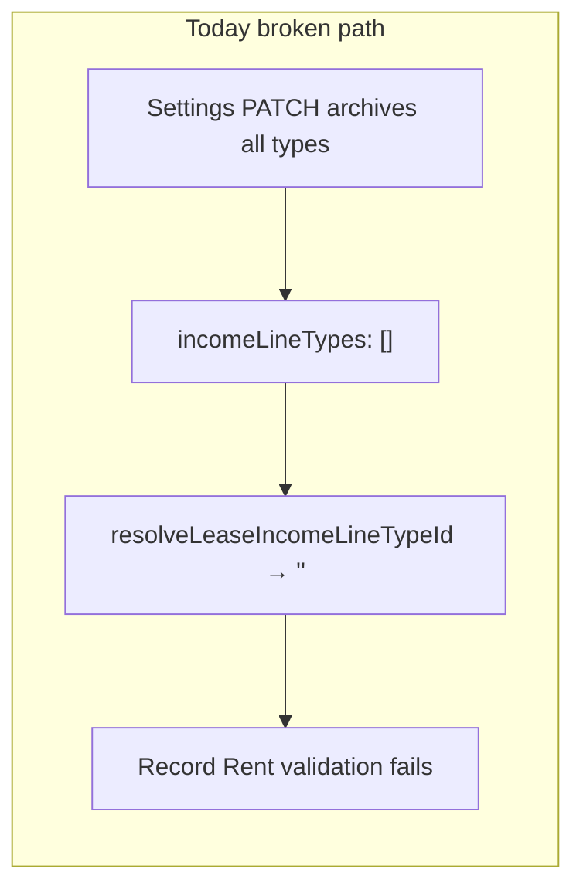
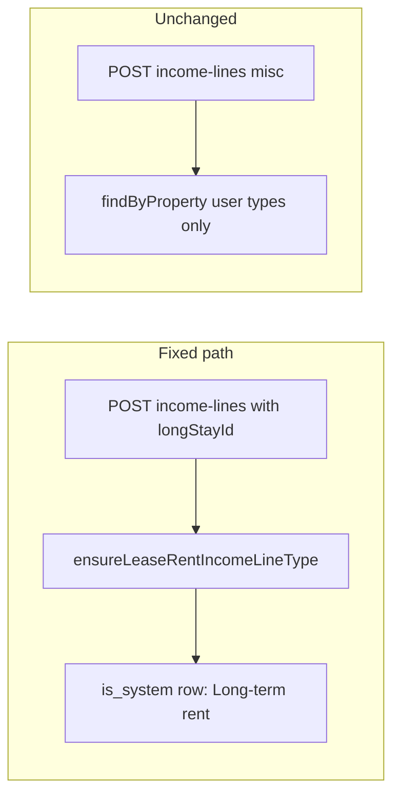

# System lease rent income type — Implementation Phases

Introduce a server-guaranteed, non-editable system income line type (**"Long-term rent"**) for lease rent writes so Record Rent and tenant Stripe payments work even when all user-managed income types are removed.

**Related:** [Catalog type archive phases](./CATALOG_TYPE_ARCHIVE_PHASES.md) (user misc types remain editable/archivable). [Long-term entryKind phases](./LONG_TERM_ENTRY_KIND_PHASES.md) (`longTerm` is read-time classification, not a catalog row).

## Deploy checklist

**Requires Postgres migration v72** (`is_system` on `property_income_line_types`). Ship server before or with admin UI changes.

| Checkpoint | Ship | Notes |
|------------|------|-------|
| **A** | Phase **1 + 2 + 3 + 4** server (migration, DB ensure, write paths) | Record Rent works via API even with old admin |
| **B** | Phase **5** admin (hide type on Record Rent) | Deploy with or after **A** |
| **C** | Phase **6** tests | Ship with **A** or immediately after |

**Hard rule:** deploy migration v72 before code that calls `ensureLeaseRentIncomeLineType`. If [catalog archive v71](./CATALOG_TYPE_ARCHIVE_PHASES.md) is not live yet, ship v71 first (independent).

---

## Problem

Lease rent rows still require `property_income_lines.income_line_type_id` (FK). `longTerm` is only a read-time `entryKind` when `long_stay_id IS NOT NULL` — not a catalog row.

If an operator removes all **user** income types, `resolveLeaseIncomeLineTypeId([])` returns `""` and Record Rent fails client-side (`"Income type is required"`) and server-side ([`apps/server/src/services/tenant-rent-payment-service.ts`](../apps/server/src/services/tenant-rent-payment-service.ts) throws).



## Solution

Add one **system** row per property (`is_system = true`, fixed name **"Long-term rent"**). It is:

- Created/restored automatically by the server
- **Excluded** from settings GET and the "Other income types" catalog
- **Never archived** by `replaceAll`
- Used for all lease-linked writes (`longStayId` present)

User-managed misc types remain fully editable/archivable.



---

## Phase 1 — Migration v72

Append to [`apps/server/src/db/migrations.ts`](../apps/server/src/db/migrations.ts) (after v71):

1. `ALTER TABLE property_income_line_types ADD COLUMN is_system BOOLEAN NOT NULL DEFAULT FALSE`

2. **Backfill** one system row per property:
   - If an active row named `Rent` (case-insensitive) exists → set `is_system = true`, rename to `Long-term rent`
   - Else if no active system row → `INSERT` `(property_id, name='Long-term rent', sort_order=-1, is_system=true)`

3. **Fix unique indexes** (v71 index predates `is_system`):
   - Drop `idx_property_income_line_types_property_name_active`
   - Recreate user-name uniqueness: `(property_id, lower(name)) WHERE is_deleted = false AND is_system = false`
   - Add one-system-per-property: `(property_id) WHERE is_system = true AND is_deleted = false`

`down`: drop new indexes, restore v71 index shape, drop `is_system` column (backfill not reversed).

**Exit criteria:** every property has exactly one active system row; user can still have misc types with distinct names.

---

## Phase 2 — Shared constants + contract

Update [`packages/shared/src/property-income-line-type-config.ts`](../packages/shared/src/property-income-line-type-config.ts):

- Add `SYSTEM_LEASE_RENT_INCOME_TYPE_NAME = "Long-term rent"`
- Split defaults:
  - `DEFAULT_PROPERTY_INCOME_LINE_TYPES` → user misc only (`Extra cleaning`, `Beach equipment rental`) — **remove `Rent`**
  - Keep `DEFAULT_RENT_TYPE_NAME` deprecated or alias for migration/backfill docs only
- Update [`ICreatePropertyIncomeLineBody`](../packages/shared/src/property-income-line-types.ts): `incomeLineTypeId` **optional** when `longStayId` is set (document server resolves system type)
- Deprecate client reliance on `resolveLeaseIncomeLineTypeId` for rent flows; keep function for transitional tests (server is authoritative)

Export new constant from [`packages/shared/src/index.ts`](../packages/shared/src/index.ts).

**Exit criteria:** shared package builds; defaults tests updated.

---

## Phase 3 — DB module

Update [`apps/server/src/db/property-income-line-types.ts`](../apps/server/src/db/property-income-line-types.ts):

| Method | Change |
|--------|--------|
| `findByProperty` | `AND is_system = false` (settings + misc pickers) |
| `ensureLeaseRentIncomeLineType(propertyId, client?)` | **New.** Select active system row; if missing restore archived by name; else insert. Returns `IPropertyIncomeLineType`. |
| `seedDefaults` | Seed user misc types only; call `ensureLeaseRentIncomeLineType` after (or from `getOrCreateDefaults`) |
| `replaceAll` | Always merge system type id into `incomingIds` before archive; `UPDATE … AND is_system = false` for user rows only |

Prefer merging system id into `incomingIds` in `replaceAll` over changing [`property-catalog-type-utils.ts`](../apps/server/src/db/property-catalog-type-utils.ts) archive helper.

Call `ensureLeaseRentIncomeLineType` from [`property-settings.ts`](../apps/server/src/db/property-settings.ts) `getOrCreateDefaults` so every property always has the system row.

Mapper unchanged — `is_system` stays server-internal (same pattern as catalog archive Phase 4).

**Exit criteria:** removing all user types from settings leaves system row intact; `findByProperty` returns `[]`.

---

## Phase 4 — Server write paths

### Income line create ([`property-income-line-routes.ts`](../apps/server/src/routes/admin/property-income-line-routes.ts))

- `parseCreateIncomeLineBody`: require `incomeLineTypeId` **only when** `longStayId` is absent; when `longStayId` present, `incomeLineTypeId` optional/ignored
- After parse, if `longStayId`:
  - `incomeLineTypeId = await ensureLeaseRentIncomeLineType(propertyId)`
- Else: existing `resolveIncomeLineTypeForProperty(..., activeOnly: true)`

### Tenant rent apply ([`tenant-rent-payment-service.ts`](../apps/server/src/services/tenant-rent-payment-service.ts))

- Replace `resolveLeaseIncomeLineTypeId(types)` with `ensureLeaseRentIncomeLineType(propertyId)`

### Settings validation ([`property-settings-routes.ts`](../apps/server/src/routes/admin/property-settings-routes.ts))

- No change required if `findByProperty` excludes system types — system row never appears in removal diff

**Exit criteria:** POST income-lines with `longStayId` and no `incomeLineTypeId` succeeds; misc create still requires active user type.

---

## Phase 5 — Admin UI

[`create-income-line-dialog.tsx`](../apps/admin/src/components/income/create-income-line-dialog.tsx):

- When `lockedLease` / `isRentRecording`:
  - **Hide** `IncomeLineTypeField` and the "no taxes…" footer that references type label
  - Zod: `incomeLineTypeId` optional when `longStayId` non-empty (use `.superRefine` or split schema)
  - Omit `incomeLineTypeId` from `incomeLinesApi.create` payload (server resolves)
- Remove `resolveLeaseIncomeLineTypeId` from `getDefaultValues` for lease path

[`property-lease-detail-page.tsx`](../apps/admin/src/pages/property-lease-detail-page.tsx) + [`lease-record-rent-prefill.ts`](../apps/admin/src/lib/lease-record-rent-prefill.ts):

- Stop passing `incomeLineTypeId` in prefill; remove `rentIncomeLineTypeId` memo

Settings catalog ([`property-income-line-types-catalog.tsx`](../apps/admin/src/components/settings/property-income-line-types-catalog.tsx)) already labeled **"Other income types"** — no UI change beyond server omitting system row.

**Exit criteria:** Record Rent dialog has no type picker; no client validation error when user types list is empty.

---

## Phase 6 — Tests

| File | Cases |
|------|-------|
| New `apps/server/src/db/property-income-line-types-system.test.ts` | `ensureLeaseRentIncomeLineType` inserts, restores archived system row, survives `replaceAll` with empty user list |
| [`property-income-line-type-config.test.ts`](../packages/shared/src/property-income-line-type-config.test.ts) | Defaults no longer include Rent |
| [`property-income-line-create-lease-rent.test.ts`](../apps/server/src/routes/admin/property-income-line-create-lease-rent.test.ts) | Parser accepts create body without `incomeLineTypeId` when `longStayId` set |
| [`tenant-rent-payment-apply-income.test.ts`](../apps/server/src/services/tenant-rent-payment-apply-income.test.ts) | Mock `ensureLeaseRentIncomeLineType` instead of empty types failure |

Run:

```bash
cd apps/server && bun test src/db/property-income-line-types-system.test.ts src/routes/admin/property-income-line-create-lease-rent.test.ts src/services/tenant-rent-payment-apply-income.test.ts
```

**Exit criteria:** all new/updated tests pass; manual verification checklist below passes.

---

## Out of scope

- Nullable `income_line_type_id` for lease rows (larger schema refactor)
- System-protected expense categories
- Exposing `isSystem` on API types

---

## Verification checklist

1. Remove all income types in settings → Record Rent **succeeds** (no type picker shown).
2. Add Other Income → misc types list still works; system type not listed.
3. Tenant Stripe rent apply still creates income lines with zero user types.
4. Income table long-term rows show **Long term** badge via `entryKind` (unchanged); export Type column uses longTerm label.
5. Re-adding a user type named "Long-term rent" is allowed (distinct from system row via `is_system` index split).

---

## Suggested commit

```bash
git add .
git commit -m "feat: add system Long-term rent income type for lease rent writes"
```
