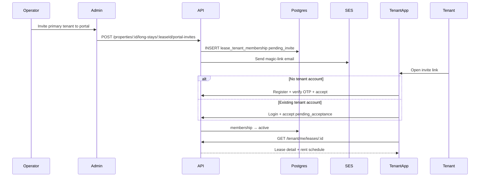

# Tenant Portal — Implementation Phases

Roadmap for a **resident-facing tenant app** (`apps/tenant`, Vite + React) backed by **lease-scoped portal access** on the existing `apps/server` API. v1 proves **invite → accept → view active lease** before payments, maintenance, or messaging.

Stack: **Postgres** (memberships + tenant accounts) + **SES** (invite emails) + **JWT** (tenant-scoped auth) + existing **lease** data in `property_long_stays`.

**Related code today**

- Lease records (CRM data, not portal access): `apps/server/src/db/property-long-stays.ts`, `packages/shared/src/property-long-stay-types.ts`
- Lease lifecycle: `apps/server/src/routes/admin/property-long-stay-routes.ts` (`end`, `extend`, update) and `notifyPrimaryTenantLeaseEnded` hook point
- Operator invite pattern (mirror, do not reuse): `apps/server/src/db/property-invites.ts`, `apps/server/src/routes/admin/property-routes.ts`, `apps/server/src/routes/auth/auth-routes.ts` (auto-claim on register)
- One-way tenant emails (no login): `apps/server/src/services/lease-notifications.ts`, `apps/server/src/ses/transactional-emails.ts`
- Tenant email audience resolver: `packages/shared/src/tenant-email-recipient-resolver.ts`
- Operator auth: `apps/server/src/auth/jwt.ts`, `apps/server/src/routes/auth/auth-routes.ts`
- Operator property access: `apps/server/src/routes/admin/property-route-access.ts`
- Admin lease UI: `apps/admin/src/pages/` (lease detail tabs), `apps/admin/src/components/leases/`
- Admin app scaffold to mirror: `apps/admin/` (Vite, TanStack Query, Zustand, shadcn, Tailwind v4)
- Shared API contract home: `packages/shared`
- Migrations: `apps/server/src/db/migrations.ts` (next version: **57**)

---

## Goals

- Tenants receive an **explicit portal invite** per lease (primary + secondary occupants).
- Tenants **accept or decline** before gaining access; returning platform users get a **pending acceptance** flow (no silent auto-link).
- Tenants sign in to a dedicated app and see **only leases they accepted** (active first).
- Operators see **portal access status** on each occupant in the lease **Tenants** tab (badge per primary/secondary row) and can invite, resend, or revoke from there.
- When a lease is **ended by the operator**, portal access closes automatically (archive policy in a later phase).
- Technical bar: tenant JWT with `aud: tenant`, lease-scoped authorization on every `/tenant/*` route, shared request/response types in `packages/shared`.

## Non-goals (initial release through Phase 4)

- Separate Postgres database (extend `apps/server`, not a second DB)
- Separate Node microservice for tenants (extend `apps/server` with `routes/tenant/`)
- Short-term / reservation guests (long-stay leases only)
- Native mobile app (responsive web only)
- Rent payments / Stripe / bank linking
- Maintenance requests, in-app messaging, document upload
- Push notifications to tenant app
- Tenant self-service “end lease” or “leave lease” (operators end leases; optional portal disconnect deferred)
- Auto-invite on lease create (manual invite button in v1; property setting later)
- Phone OTP sign-in (email + password + OTP verify in v1)
- Unified operator + tenant account on one `users` row
- Portfolio-wide tenant search for operators
- `packages/ui` extraction (duplicate shadcn primitives in `apps/tenant` until duplication hurts)

---

## Guiding principles

1. **Lease record ≠ portal access** — `property_long_stays.tenant_email` is operator CRM data; portal access requires a `lease_tenant_membership` the tenant accepted.
2. **Same Postgres, separate tables** — tenant rows live beside operator data; FK to `property_long_stays` keeps joins simple. Do not split databases until a bounded context justifies operational cost.
3. **Extend the monolith first** — `routes/tenant/*` on `apps/server`; extract a service later only with proven need.
4. **Explicit acceptance always** — new email: signup + accept; existing `tenant_users` row: `pending_acceptance` until tenant confirms. Never silently attach a new landlord’s lease.
5. **Lease-scoped authorization** — tenants see one lease at a time; no `property_members` checks. Operators retain existing admin routes unchanged.
6. **Postgres before side effects** — insert membership row, then send email; invite state recoverable from DB.
7. **Reuse server patterns** — OTP register flow, transactional emails, `reply-from-database-error`, mappers, `HttpStatus` from shared.
8. **Separate JWT audience** — operator tokens must not call `/tenant/*`; tenant tokens must not call `/properties/*` admin routes.
9. **Operators end leases** — tenants cannot terminate the lease in the app; ending in admin drives membership → `ended`.

---

## Database architecture — one DB or two?

### Recommendation: **one Postgres database** (new tables)

| Approach                                                             | Verdict                                                |
| -------------------------------------------------------------------- | ------------------------------------------------------ |
| **Same DB, new tables** (`tenant_users`, `lease_tenant_memberships`) | **Start here**                                         |
| **Same DB, separate schema** (`tenant.*`)                            | Optional later for clarity; not required for v1        |
| **Separate Postgres database**                                       | **Defer** until compliance or team boundaries force it |

**Why not a separate database now**

- Tenant portal reads **lease, unit, property, rent schedule** — all operator-owned tables today. Splitting DBs means cross-DB queries, sync jobs, or duplicated snapshots; you lose FK integrity.
- Fast growth is handled by **indexes, connection pooling, read replicas, and horizontal API replicas** — not by a second database on day one.
- This repo already runs one migration runner and one pool (`apps/server/src/db/pool.ts`); a second DB doubles migration tooling, backups, and consistency work.

**When to reconsider a split** (Phase 5+ / years out)

- Legal/compliance requires tenant PII in an isolated trust zone
- Tenant API team deploys independently with strict SLA separation
- Tenant traffic dominates and you extract `apps/tenant-api` with an explicit contract — still often **same DB** initially, split DB only if profiling proves connection/contention isolation is insufficient

**Scale path without a new DB**

1. v1–v2: new tables + indexes on `lease_id`, `tenant_user_id`, `invite_email`
2. Traffic growth: scale server replicas; CDN for `apps/tenant` static assets
3. Read-heavy endpoints: read replica for tenant list/detail (optional)
4. Extract worker/service: only if async tenant workloads appear (notifications at scale)

---

## Target architecture

```
Admin: lease detail → Invite to portal → POST .../portal-invites
                                              ↓
                                    lease_tenant_memberships (pending_*)
                                              ↓
                                    SES invite email (magic link)
                                              ↓
Tenant app: /accept-invite?token=… → register or login → accept/decline
                                              ↓
                                    membership → active
                                              ↓
Tenant app: GET /tenant/me/leases → lease summary + rent schedule (read-only)

Operator ends lease → membership → ended → tenant loses active access
```



### Permissions

**Tenant portal (v1)**

| Action                                    | Who                                                 |
| ----------------------------------------- | --------------------------------------------------- |
| View active lease summary + rent schedule | Primary or secondary with `active` membership       |
| Accept / decline pending invite           | Invited email / logged-in tenant user               |
| End lease                                 | **Operator only** (existing admin flow)             |
| Revoke portal access mid-lease            | Operator only                                       |
| Invite to portal                          | Property owner or manager (same as long-stay write) |

**Admin API**

| Action                            | Who                                                           |
| --------------------------------- | ------------------------------------------------------------- |
| View portal status on Tenants tab | Any property member (owner, manager, accountant)              |
| Invite / resend / revoke          | Property owner or manager (align with long-stay write access) |

**Role differences (v1)**

- **Primary** — full read access exposed in Phase 3.
- **Secondary** — same read access in v1; restrict payments/docs later when those features exist.

Mirror on server (`assertLeaseTenantAccess`) and tenant app (hide routes without active membership).

---

## Data model (sketch)

### `tenant_users`

| Column                     | Notes                        |
| -------------------------- | ---------------------------- |
| `id`                       | UUID PK                      |
| `email`                    | Unique, normalized lowercase |
| `name`                     | Display name                 |
| `password_hash`            | Nullable (social later)      |
| `phone`                    | Optional                     |
| `email_verified_at`        | Set on OTP verify            |
| `created_at`, `updated_at` | Timestamps                   |

Separate from operator `users` — different auth domain and JWT audience.

### `lease_tenant_memberships`

| Column                                                 | Notes                                                   |
| ------------------------------------------------------ | ------------------------------------------------------- |
| `id`                                                   | UUID PK                                                 |
| `lease_id`                                             | FK → `property_long_stays`                              |
| `tenant_user_id`                                       | FK → `tenant_users`, nullable until accepted            |
| `role`                                                 | `primary` \| `secondary`                                |
| `invite_email`                                         | Normalized email at invite time                         |
| `display_name`                                         | Snapshot from lease (`guestName` or secondary name)     |
| `status`                                               | See lifecycle below                                     |
| `invited_by`                                           | FK → operator `users`                                   |
| `invite_token_hash`                                    | Hashed magic-link token                                 |
| `invited_at`, `expires_at`                             | Invite TTL (default 30 days, mirror `property_invites`) |
| `accepted_at`, `declined_at`, `revoked_at`, `ended_at` | Lifecycle timestamps                                    |
| `created_at`, `updated_at`                             | Timestamps                                              |

**Status enum:** `pending_invite` | `pending_acceptance` | `active` | `declined` | `revoked` | `ended` | `expired`

**Uniqueness:** one non-terminal membership per `(lease_id, invite_email, role)` — re-invite after `declined`/`expired`/`revoked` creates a new row or resets per product rule (prefer new row for audit).

**Domain rules**

- Creating a lease does **not** create memberships.
- Inviting primary uses `lease.tenantEmail`; secondary uses `secondaryTenants[].email` (skip invalid/missing).
- If `tenant_users` exists for `invite_email` → `pending_acceptance`; else → `pending_invite`.
- Operator `end lease` → all `active`/`pending_*` memberships on that lease → `ended`.
- Tenant accept does **not** mutate `property_long_stays` — only membership.

---

## Shared contract (`packages/shared`)

| Type                               | Purpose                                               |
| ---------------------------------- | ----------------------------------------------------- |
| `TTenantMembershipStatus`          | Membership lifecycle enum                             |
| `TTenantMembershipRole`            | `primary` \| `secondary`                              |
| `ITenantUser`                      | Tenant account (client-safe fields)                   |
| `ILeaseTenantMembership`           | Membership row for admin + tenant                     |
| `ITenantInviteLeaseSummary`        | Property name, unit, dates for accept screen          |
| `ITenantLeaseListItem`             | Active/past lease card                                |
| `ITenantLeaseDetailResponse`       | Lease + rent schedule (read-only subset)              |
| `ICreateLeasePortalInviteResponse` | Admin invite result per recipient                     |
| `ITenantPendingInvite`             | Pending item for tenant home                          |
| `ITenantAuth*`                     | Register/login/refresh bodies (mirror operator shape) |

---

## API (sketch)

### Tenant auth (`routes/tenant/tenant-auth-routes.ts`)

| Method | Path                           | Notes                                                 |
| ------ | ------------------------------ | ----------------------------------------------------- |
| `POST` | `/tenant/auth/register/start`  | Email OTP                                             |
| `POST` | `/tenant/auth/register/verify` | Create `tenant_users`, optional pending invite accept |
| `POST` | `/tenant/auth/login`           | Email + password                                      |
| `POST` | `/tenant/auth/refresh`         | Refresh token (separate table or scoped column)       |
| `POST` | `/tenant/auth/logout`          | Revoke refresh token                                  |

### Tenant portal (`routes/tenant/tenant-lease-routes.ts`)

| Method | Path                                       | Notes                                   |
| ------ | ------------------------------------------ | --------------------------------------- |
| `GET`  | `/tenant/me`                               | Profile                                 |
| `GET`  | `/tenant/me/invites/pending`               | `pending_acceptance` for logged-in user |
| `POST` | `/tenant/me/invites/:membershipId/accept`  | `active`                                |
| `POST` | `/tenant/me/invites/:membershipId/decline` | `declined`                              |
| `GET`  | `/tenant/me/leases`                        | Active memberships only in v1           |
| `GET`  | `/tenant/me/leases/:leaseId`               | Detail + rent schedule                  |

### Public invite redemption

| Method | Path                             | Notes                                                     |
| ------ | -------------------------------- | --------------------------------------------------------- |
| `GET`  | `/tenant/invites/preview?token=` | Lease summary for accept page (no auth)                   |
| `POST` | `/tenant/invites/redeem`         | Exchange token + auth for accept (register or login body) |

### Admin — operator (`routes/admin/property-long-stay-routes.ts` or dedicated module)

| Method | Path                                                                              | Notes                                      |
| ------ | --------------------------------------------------------------------------------- | ------------------------------------------ |
| `GET`  | `/properties/:propertyId/long-stays/:leaseId/portal-access`                       | Memberships + statuses                     |
| `POST` | `/properties/:propertyId/long-stays/:leaseId/portal-invites`                      | Invite primary and/or selected secondaries |
| `POST` | `/properties/:propertyId/long-stays/:leaseId/portal-invites/:membershipId/resend` | New token + email                          |
| `POST` | `/properties/:propertyId/long-stays/:leaseId/portal-invites/:membershipId/revoke` | `revoked`                                  |

---

## Email

Reuse `apps/server/src/ses/transactional-emails.ts` + new templates:

| Template                             | When                                |
| ------------------------------------ | ----------------------------------- |
| `tenant-portal-invite-new.html`      | No `tenant_users` row — signup CTA  |
| `tenant-portal-invite-existing.html` | Account exists — login + accept CTA |

Link target: `TENANT_APP_URL/accept-invite?token=…` (new env var, mirror `PLATFORM_APP_URL`).

---

## UI surfaces

### `apps/tenant` (new app)

| Surface                                                               | Phase        |
| --------------------------------------------------------------------- | ------------ |
| Theme + scaffold                                                      | 2.1          |
| Auth — login, register (OTP)                                          | 2.3          |
| Accept invite — public route; lease summary; register or login inline | 2.4          |
| Pending invitations — accept/decline                                  | 2.5          |
| Home — active leases (cards)                                          | 2.5          |
| Lease detail — read-only unit, dates, rent schedule                   | 3            |
| Forgot password                                                       | 5 (optional) |

### `apps/admin` (extend)

1. **Lease detail → Tenants tab** ([`lease-tenants-section.tsx`](apps/admin/src/components/leases/lease-tenants-section.tsx)) — portal status **badge** on primary and each secondary row; per-occupant **Invite / Resend / Revoke** actions inline (no separate Portal access section).
2. **Communications** — no change in v1; portal is separate from email campaigns.

---

## Phased rollout

### Phase 0 — Foundation (no user-facing feature)

**Goal:** Schema, shared types, and tenant JWT plugin without exposing UI.

- [ ] Migration **57**: `tenant_users`, `lease_tenant_memberships`, enums, indexes
- [ ] `apps/server/src/db/tenant-users.ts`, `lease-tenant-memberships.ts`, mappers
- [ ] Shared types in `packages/shared` (status, role, membership, list/detail DTOs)
- [ ] Tenant JWT plugin: `aud: tenant`, `tenantUserId` payload; separate refresh token storage (`tenant_refresh_tokens` table or namespaced rows)
- [ ] `assertLeaseTenantAccess(leaseId, tenantUserId)` — requires `active` membership
- [ ] Register `tenantAuthRoutes` + stub `tenantLeaseRoutes` (handlers wired in Phases 1.1–1.3)
- [ ] `TENANT_APP_URL` in `apps/server/.env.example` (mirror `PLATFORM_APP_URL` pattern)

**Exit criteria:** Server boots; migrations pass; unit tests for membership state transitions and access helper; no UI.

---

### Phase 1.1 — Admin invite pipeline (API + email)

**Goal:** Operators can invite tenants via API; invite email sends; magic link token validates — no tenant auth or accept flow yet (~10–12 files).

**Tasks**

- [ ] Extend `lease-tenant-memberships` DB module: create, list by lease, find by token hash, resend/revoke helpers
- [ ] Shared admin request/response types (`ICreateLeasePortalInviteBody`, `ILeasePortalAccessResponse`, etc.)
- [ ] Invite token generate/hash/verify (mirror `ses/unsubscribe-token.ts`) → `ses/tenant-portal-invite-token.ts`
- [ ] `services/tenant-portal-invite-service.ts` — branch `pending_invite` vs `pending_acceptance` from existing `tenant_users`
- [ ] Admin routes: `POST .../portal-invites`, `GET .../portal-access`, `POST .../resend`, `POST .../revoke` (extend `property-long-stay-routes.ts` or dedicated module)
- [ ] Property owner/manager write access (align with long-stay write)
- [ ] `sendTenantPortalInviteEmail` in `transactional-emails.ts` + `tenant-portal-invite-new.html` / `tenant-portal-invite-existing.html`
- [ ] `TENANT_APP_URL` in transactional email links
- [ ] `GET /tenant/invites/preview?token=` — public lease summary for accept page (no auth)
- [ ] Idempotency: duplicate pending invite for same `(lease, email, role)` → 409

**Exit criteria:** `POST invite` via curl → membership row in DB + SES email received; preview endpoint returns lease summary for valid token; resend/revoke update membership as expected.

---

### Phase 1.2 — Tenant auth API

**Goal:** Tenants can register, login, and refresh tokens via API — independent of accept/redeem (~6–8 files).

**Tasks**

- [ ] `POST /tenant/auth/register/start` — email OTP (`auth_otps` with `purpose: tenant_register`; no migration — column is `VARCHAR`)
- [ ] `POST /tenant/auth/register/verify` — create `tenant_users`, issue tenant JWT + refresh token
- [ ] `POST /tenant/auth/login`, `refresh`, `logout` — wire `tenant-refresh-tokens` + `signTenantAccessToken`
- [ ] Extend `tenant-users` DB module: password lookup for login
- [ ] Reuse or share validators from `routes/auth/validators.ts`
- [ ] Fill in `tenant-auth-routes.ts`
- [ ] CORS: allow tenant app origin in dev (`http://localhost:5174` or chosen port) via `cors-headers.ts`

**Exit criteria:** curl/Postman: register → verify → access + refresh tokens; login with existing user; refresh rotation; logout revokes refresh token.

---

### Phase 1.3 — Accept/redeem + lease read + lifecycle

**Goal:** Close the invite loop and meet backend exit criteria before any tenant UI (~8–10 files).

**Tasks**

- [ ] `POST /tenant/invites/redeem` — exchange magic-link token (+ optional register/login body) → membership progress
- [ ] `POST /tenant/me/invites/:membershipId/accept|decline` for authenticated tenant
- [ ] Branch: new email → `pending_invite` → register → `active`; existing email → `pending_acceptance` → accept → `active`
- [ ] `GET /tenant/me` — tenant profile
- [ ] `GET /tenant/me/leases` — active memberships only in v1 (minimal list for exit criteria)
- [ ] `GET /tenant/me/invites/pending` — `pending_acceptance` for logged-in user
- [ ] Fill in `tenant-lease-routes.ts`
- [ ] Hook `notifyPrimaryTenantLeaseEnded` path: when lease ends, mark memberships → `ended`
- [ ] Constraint: cannot accept after `expired` / `declined` without operator resend
- [ ] Integration script or test: full happy path documented in repo

**Exit criteria:** Script or integration test: create lease → invite → register → accept → `GET /tenant/me/leases` returns lease; second property invite to same email requires accept; end lease removes active access.

---

### Phase 2 — Tenant app (UI)

**Goal:** First shippable tenant-facing surface — invite link to accepted lease view. Split into sub-phases so each slice is demoable in the browser; extract shared theme/auth/HTTP primitives from admin rather than copying wholesale.

**Shared package strategy:** Introduce `packages/app-ui` (or `packages/web-theme` + `packages/web-api`) incrementally — theme first (2.1), HTTP factory (2.2), auth shell (2.3). Refactor admin to import shared code in the same PR as each extraction.

---

#### Phase 2.1 — Shared theme + tenant scaffold

**Goal:** Two apps, one visual system; tenant app boots with working theme switcher.

**Tasks**

- [ ] Add shared front-end package (e.g. `packages/app-ui`):
  - [ ] Shared CSS: `:root` tokens + `html.dark[data-dark-preset=…]` blocks from [`apps/admin/src/index.css`](apps/admin/src/index.css)
  - [ ] Parameterized theme helpers: `createThemePreference({ appKey: 'admin' | 'tenant' })` — storage keys `${APP_SLUG}-admin-theme` vs `${APP_SLUG}-tenant-theme` (mirror existing admin pattern)
  - [ ] Shared dark preset types/options from [`dark-preset-preference.ts`](apps/admin/src/lib/dark-preset-preference.ts)
  - [ ] Shared components: `ThemeSwitcher`, `DarkPaletteMenu`, `ThemeSync`, `useResolvedDark`
  - [ ] Minimal shadcn primitives for auth shell only (~Button, Input, Label, Card) — defer moving all admin UI components
- [ ] **Refactor admin** to import theme CSS + helpers from shared package (behavior unchanged)
- [ ] Scaffold `apps/tenant` (Vite, React 19, Router, TanStack Query, Zustand, Tailwind v4, shadcn, React Compiler) — mirror `apps/admin` toolchain
- [ ] `apps/tenant/.env.example` with `VITE_API_URL`
- [ ] Root `package.json` scripts: `dev:tenant`, `build:tenant`, `lint:tenant`
- [ ] Minimal router: public placeholder + theme controls (same corner placement as admin auth pages)

**Exit criteria:** Admin and tenant both render; light/dark/system + dark palette presets behave identically; `bun run dev:tenant` works (port e.g. `5174`, already allowed in server CORS).

---

#### Phase 2.2 — Shared HTTP client core + tenant session layer

**Goal:** Typed tenant API access with refresh/logout, mirroring admin session patterns.

**Tasks**

- [x] Extract `createApiClient({ getBaseUrl, getAccessToken, getRefreshToken, refreshPath, onSessionExpired, clearSession })` — shared fetch wrapper, JSON parse, error shape, deduped refresh (from admin [`api-client.ts`](apps/admin/src/lib/api-client.ts))
- [x] Optional: refactor admin refresh block to use same factory
- [x] Tenant `lib/api-client.ts`:
  - [x] `tenantAuthApi`: register/start, register/verify, login, refresh, logout
  - [x] `tenantPortalApi`: me, leases, pending invites, accept/decline, preview, redeem
  - [x] All request/response types from `@/packages/shared`
- [x] Tenant `stores/auth-store.ts` (`ITenantUser`, persist key `${APP_SLUG}-tenant-auth`)
- [x] Tenant `lib/clear-app-session.ts` (Query cache clear + store clear)
- [x] `lib/query-client.ts`, `lib/query-keys.ts`
- [x] `ProtectedRoute`, `useAuthHydrated`

**Exit criteria:** After login (manual or temporary debug), `GET /tenant/me` succeeds; refresh works; logout clears state.

---

#### Phase 2.3 — Auth UI (login + register OTP)

**Goal:** Tenant can create an account and sign in (no invite flow yet).

**Tasks**

- [x] Shared auth UI in `packages/app-ui` (or tenant-local first, then extract):
  - [x] Generic `AuthPageShell` with slots: `brandLabel`, `subtitle`, `redirectWhenAuthed`, optional OAuth slot (admin uses; tenant omits)
  - [x] `AuthCardBody` / `AuthCardFooter`
  - [x] `useOtpResendCooldown` + shared OTP cooldown constant (align with server)
  - [x] Shared helpers: `getAuthApiErrorMessage`, `maskEmail`, `getOtpResendButtonLabel`
- [x] **Refactor admin** auth pages to use shared `AuthPageShell` where possible
- [x] Tenant pages: `/login`, `/register` → `/register/verify`
- [x] Tenant form schemas (Zod): email, name, password, OTP — mirror admin shape
- [x] Wire to Phase 1.2 `/tenant/auth/*` API

**Exit criteria:** Register → OTP verify → session; login with existing user; authed user redirected away from auth pages.

---

#### Phase 2.4 — Accept invite (public magic link)

**Goal:** Close the invite loop in the browser (Phase 1.3 API).

**Tasks**

- [x] Public route: `/accept-invite?token=` (matches `TENANT_APP_URL/accept-invite?token=…`)
- [x] `InvitePreviewPage`: `GET /tenant/invites/preview`; lease summary card; branch on `hasExistingAccount` → login vs register CTAs
- [x] Post-auth redeem: `POST /tenant/invites/redeem` with Bearer + `{ token }`, or inline `{ token, email, password }` → session + membership
- [x] Return URL: after register verify, return to accept-invite with same token
- [x] Shared `InviteLeaseSummaryCard` (reused in 2.5 pending list)

**Exit criteria:** Operator invite (curl/admin until Phase 3) → email link → register or login → accept → redirect to `/leases` with one active lease.

---

#### Phase 2.5 — Portal home (pending invites + lease list)

**Goal:** Logged-in tenant has a usable home beyond first accept.

**Tasks**

- [x] Authenticated layout: header, theme switcher, logout (minimal — no property nav)
- [x] `/leases` — cards from `GET /tenant/me/leases`
- [x] `/invites/pending` — list from `GET /tenant/me/invites/pending` with accept/decline
- [x] Shared `TenantLeaseCard`, `TenantPendingInviteCard`
- [x] Empty states: no leases, no pending invites
- [x] Optional: home banner when pending invites exist

**Exit criteria:** Existing user invited to a **second** property sees pending invite; must accept before it appears in active leases.

---

#### Phase 2.6 — Polish (optional / defer)

**Goal:** Production-ready shell; not required for first demo.

- [x] `DocumentTitle`, favicons, `ErrorPage` / `NotFoundPage`
- [x] `docker/Dockerfile.tenant` + compose service
- [x] Datadog RUM for tenant (optional — admin has it; tenant may skip v1)

**Exit criteria:** Tenant app deployable via Docker; basic error/not-found pages.

---

**Phase 2 overall exit criteria:** Operator invites email (Phase 3 can be stubbed with curl until then); tenant completes flow in browser; lands on lease list with one active lease; second-property invite requires accept on pending page.

---

### Phase 3 — Admin Tenants tab + tenant lease detail

**Goal:** Operators manage portal invites from the existing lease **Tenants** tab; tenants see read-only lease detail.

- [x] Extend [`lease-tenants-section.tsx`](apps/admin/src/components/leases/lease-tenants-section.tsx): portal status **badge** on primary tenant row and each secondary tenant row (e.g. Not invited, Invite pending, Active, Declined, Revoked, Ended, Expired)
- [x] Per-row actions in Tenants tab: **Invite** (no membership / expired), **Resend** (`pending_*`), **Revoke** (`active`); disable Invite when email missing
- [x] Optional footer action: **Invite all** (primary + secondaries with valid emails) — same card, not a new section
- [x] API client methods + query keys for `GET .../portal-access` and invite/resend/revoke mutations; invalidate on success
- [x] Tenant app: lease detail page (summary + rent schedule from `GET /tenant/me/leases/:id`)

**Exit criteria:** Full happy path without curl: admin invites from Tenants tab → tenant email → accept in tenant app → view rent schedule; operator revokes from tenant row → tenant loses access on next request.

---

### Phase 4 — Hardening + lifecycle polish

**Goal:** Production-safe invites and clear lease-end behavior. Split into sub-phases so each slice is shippable and testable before the next.

**Already shipped (Phase 1 / 3 — do not re-implement):**

| Concern               | Status                                                                                                                 |
| --------------------- | ---------------------------------------------------------------------------------------------------------------------- |
| Idempotency / 409     | Duplicate pending invite → `DuplicatePortalInviteError` → 409                                                          |
| Resend replaces token | `updateInviteToken()` on resend                                                                                        |
| Hash tokens at rest   | `hashPortalInviteToken()` (SHA-256)                                                                                    |
| Lazy expiry checks    | Preview/redeem/accept reject when `expiresAt <= now` **and** persist `expired` (Phase 4.1); cron + portal-access sweep |
| Lease end → `ended`   | `endAllNonTerminalForLease()` on end-lease                                                                             |
| Revoke + re-invite    | Admin Tenants tab + API; terminal statuses allow new invite row                                                        |
| Global API rate limit | Fastify `rate-limit` on all routes (20/min prod)                                                                       |

---

#### Phase 4.1 — Invite expiry (DB + admin truth)

**Goal:** Expired invites are `expired` in the DB, not only rejected at read time.

**Tasks**

- [x] `expirePendingPortalInvites()` in `lease-tenant-memberships` — `pending_*` where `expires_at <= now` → `expired`
- [x] Cron (mirror `property-export-expiry-cron`) **or** lazy sweep on `GET .../portal-access` / accept paths
- [x] Register cron in `server.ts` (production only, if cron path)
- [x] Tests: pending past TTL → `expired`; admin badge **Expired**; **Invite** available again

**Exit criteria:** Admin Tenants tab status matches DB; accept/preview still blocked after TTL.

---

#### Phase 4.2 — Observability

**Goal:** Debuggable invite lifecycle in production (Datadog / logs).

**Tasks**

- [x] Structured logs: `tenant_portal.invited`, `.resent`, `.revoked`, `.accepted`, `.declined`, `.ended`
- [x] Mirror `tenant-email-campaign-observability.ts` pattern (`WinstonLogger.info` with stable keys)
- [x] Emit from invite service, membership service, and lease-end hook
- [x] Include `leaseId`, `membershipId`, `inviteEmail` (normalized) in context

**Exit criteria:** Each happy/sad path emits one grep-able event; no raw invite tokens in logs.

---

#### Phase 4.3 — Rate limits (abuse protection)

**Goal:** Throttle invite spam and auth brute-force without breaking normal operator flow.

**Tasks**

- [x] Per-lease portal invite create limit (Redis counter; mirror `tenant-email-campaign-create-rate-limit`)
- [x] Optional tighter limits on `/tenant/auth/register/start` and `/tenant/auth/login` (per IP + per email)
- [x] Env vars + 429 responses documented in `apps/server/.env.example`
- [x] Tests or manual curl matrix for burst → 429

**Exit criteria:** Burst invite/create returns 429; normal Tenants-tab usage unaffected.

---

#### Phase 4.4 — Security hardening

**Goal:** Close remaining token-handling gaps.

**Tasks**

- [ ] Constant-time compare where raw tokens are verified (if applicable beyond hash lookup)
- [ ] Optional single-use: clear `invite_token_hash` on accept/redeem so link cannot be reused
- [ ] Confirm no raw tokens in server logs or RUM (`beforeSend` redaction already in tenant/admin RUM)

**Exit criteria:** Accepted invite link cannot be reused (if single-use enabled); security checklist pass.

---

#### Phase 4.5 — Ended-lease archive (tenant read-only)

**Goal:** Tenants see past leases after move-out.

**Tasks**

- [ ] `GET /tenant/me/leases?status=ended` — extend list endpoint (active remains default)
- [ ] DB: `findEndedByTenantUserId` (or generalized list with status filter)
- [ ] Shared types: ended list item / optional ended detail shape
- [ ] Tenant UI: “Past leases” on `/leases` (or filter); read-only cards
- [ ] Optional: ended lease detail page (summary only; rent schedule optional)

**Exit criteria:** End lease in admin → tenant sees lease under archive, not active list; no write APIs.

---

#### Phase 4.6 — Docs + E2E matrix

**Goal:** Operators and devs know how failures should behave.

**Tasks**

- [ ] `docs/TENANT_PORTAL_FAILURE_MODES.md` (mirror `TENANT_EMAIL_CAMPAIGN_FAILURE_MODES.md`)
- [ ] Wrong-email playbook: revoke → fix email on lease → re-invite (no tenant self-removal in v1)
- [ ] Manual test matrix: new user, returning user, decline, revoke, lease end, secondary tenant, expired invite
- [ ] Extend `tenant-portal-happy-path.test.ts` or integration script for gaps (expired DB row, 409, revoke)

**Exit criteria:** Failure modes documented; matrix checked off; idempotency/resend still verified.

---

#### Phase 4.7 — Load / soak (optional, pre-prod)

**Goal:** Accept path holds under concurrency.

**Tasks**

- [ ] Document or run light load test on redeem/accept (staging)
- [ ] Verify no duplicate `active` rows; 409/429 under parallel invites

**Exit criteria:** No regressions under documented concurrency; optional for first production cut.

---

**Phase 4 overall exit criteria:** Failure modes documented; invite TTL works in DB; ended leases in archive; observability in place; rate limits and security hardening shipped (4.3–4.4); load test optional (4.7).

**Suggested implementation order:** 4.1 → 4.2 → 4.3 → 4.4 → 4.5 → 4.6 → 4.7 (optional).

**Minimal three-release cut:**

1. **4.1 + 4.2** — TTL in DB + observable logs
2. **4.3 + 4.4** — abuse protection + token hardening
3. **4.5 + 4.6** — archive + documentation

---

### Phase 5 — Enhancements + scale (post-launch)

**Product enhancements**

- [ ] Auto-invite on lease create (per-property setting, default off)
- [ ] Google / Apple sign-in for tenants
- [ ] Phone OTP for tenants without email
- [ ] Push notifications (Expo) for invite received, rent recorded
- [ ] Maintenance requests + attachments (MinIO)
- [ ] Rent payments
- [ ] In-app messaging with operators
- [ ] Tenant “disconnect from lease” (portal-only, not lease end)
- [ ] `packages/app-ui` — extend shared primitives extracted in Phase 2.1–2.3 (full shadcn catalog only if both apps need it)
- [ ] SSE for tenant notifications (extend `notification-stream-hub` with tenant channel or separate stream)
- [ ] Docker compose: tenant app + document local dev in `CLAUDE.md`

**Scale / infra**

- [ ] Read replica for tenant lease list/detail queries
- [ ] Separate Railway process for tenant API (same DB, same codebase, different start command)
- [ ] CDN + caching for `apps/tenant` static assets
- [ ] Split Postgres database — only if compliance/organizational boundaries require it (unlikely near-term); define sync boundary and migration plan if pursued

---

## What not to do

- Do **not** create a second Postgres database for v1 — membership rows need FK joins to `property_long_stays`.
- Do **not** grant portal access when a lease is created — only on explicit invite + tenant accept.
- Do **not** auto-attach a new lease to an existing `tenant_users` row without `pending_acceptance` + accept.
- Do **not** reuse `users` + `property_members` for tenant portal authorization.
- Do **not** let tenant JWT call operator `/properties/*` routes (audience check on both sides).
- Do **not** let tenants end leases from the tenant app — reuse operator `end lease` only.
- Do **not** build a separate microservice before Phase 4 ships and pain is demonstrated.
- Do **not** block Phase 2 on Docker — `bun run dev:tenant` is enough for local dev (Docker is Phase 2.6).
- Do **not** copy all of `apps/admin` into `apps/tenant` — extract theme/HTTP/auth shell to shared packages as you go (Phase 2.1–2.3).
- Do **not** duplicate financial write APIs on `/tenant/*` in early phases — read-only views only.

---

## Safest sequencing summary

1. **Phase 0 — DB + shared types + tenant JWT** — everything else depends on membership rows and auth audience.
2. **Phase 1.1 — Admin invite + email** — prove operator invite pipeline before tenant auth.
3. **Phase 1.2 — Tenant auth API** — register/login/refresh independently testable.
4. **Phase 1.3 — Accept/redeem + lease list + lifecycle** — full backend state machine before any UI.
5. **Phase 2.1 — Shared theme + tenant scaffold** — one visual system before feature UI.
6. **Phase 2.2 — HTTP + session layer** — typed tenant API client and auth store.
7. **Phase 2.3 — Auth UI** — login/register OTP wired to Phase 1.2.
8. **Phase 2.4 — Accept invite** — magic link closes the invite loop (primary Phase 2 milestone).
9. **Phase 2.5 — Portal home** — pending invites + lease list.
10. **Phase 3 — Admin Tenants tab + lease detail** — operators invite from existing tenant list; no new section.
11. **Phase 4.1 — Invite expiry (DB)** — pending rows transition to `expired`; admin truth.
12. **Phase 4.2 — Observability** — `tenant_portal.*` structured logs.
13. **Phase 4.3 — Rate limits** — per-lease invite + tenant auth throttles.
14. **Phase 4.4 — Security hardening** — single-use token option, constant-time compare.
15. **Phase 4.5 — Ended-lease archive** — `GET /tenant/me/leases?status=ended` + tenant UI.
16. **Phase 4.6 — Docs + E2E matrix** — failure modes + manual test matrix.
17. **Phase 4.7 — Load / soak (optional)** — staging concurrency check.
18. **Phase 5 — Enhancements + scale** — product features and infra scaling only after access control is boring and reliable.

---

## Where to start (this week)

| Order | Task                                                               | Phase |
| ----- | ------------------------------------------------------------------ | ----- |
| 1     | Read this doc + skim `property-invites.ts` and `auth-routes.ts`    | —     |
| 2     | Migration 57 + `lease-tenant-memberships` DB module + shared enums | 0     |
| 3     | Tenant JWT plugin                                                  | 0     |
| 4     | `POST .../portal-invites` + email templates + invite token         | 1.1   |
| 5     | Tenant register/login/refresh routes                               | 1.2   |
| 6     | Accept/redeem + `GET /tenant/me/leases` + lease-end hook           | 1.3   |
| 7     | Shared theme package + scaffold `apps/tenant`                      | 2.1   |
| 8     | Tenant API client + auth store                                     | 2.2   |
| 9     | Login + register OTP pages                                         | 2.3   |
| 10    | Accept-invite page + redeem                                        | 2.4   |
| 11    | Pending invites + lease list home                                  | 2.5   |

**First backend milestone:** Phase 1.3 exit — full invite → register → accept → lease list via curl/script.

**First user-visible milestone:** Phase 2.4 exit — tenant opens email, registers, accepts, sees lease on home.

**First operator-visible milestone:** Phase 3 exit — portal badge + Invite on the lease **Tenants** tab in admin.

---

## Phase dependency diagram

```
Phase 0 (schema + JWT)
    ↓
Phase 1.1 (admin invite + email + preview)
    ↓
Phase 1.2 (tenant auth API)
    ↓
Phase 1.3 (accept/redeem + lease list + lifecycle)
    ↓
Phase 2.1 (shared theme + tenant scaffold)
    ↓
Phase 2.2 (HTTP + session) → Phase 2.3 (auth UI)
    ↓
Phase 2.4 (accept invite) ──────────────────────┐
    ↓                                           │
Phase 2.5 (portal home)                         │
    ↓                                           │
Phase 3 (Tenants tab badges + lease detail) ←───┘
    ↓
Phase 4.1 (invite expiry DB)
    ↓
Phase 4.2 (observability)
    ↓
Phase 4.3 (rate limits) + Phase 4.4 (security) — can parallelize
    ↓
Phase 4.5 (ended-lease archive)
    ↓
Phase 4.6 (docs + E2E matrix)
    ↓
Phase 4.7 (load / soak, optional)
    ↓
Phase 5 (enhancements + scale)
```
