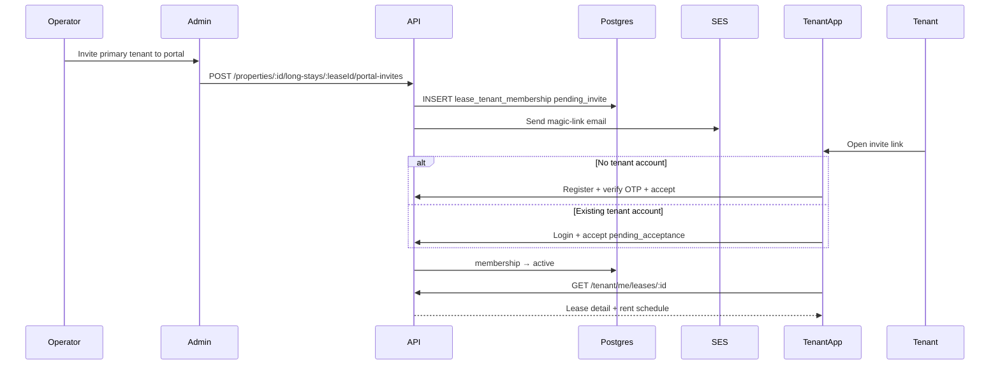

# Tenant Portal — Implementation Phases

Roadmap for a **resident-facing tenant app** (`apps/tenant`, Vite + React) backed by **lease-scoped portal access** on the existing `apps/server` API. v1 proves **invite → accept → view active lease** before payments, maintenance, or messaging.

Stack: **Postgres** (memberships + tenant accounts) + **SES** (invite emails) + **JWT** (tenant-scoped auth) + existing **lease** data in `property_long_stays`.

**Related code today**

- Lease records (CRM data, not portal access): `apps/server/src/db/property-long-stays.ts`, `packages/shared/src/property-long-stay-types.ts`
- Lease lifecycle: `apps/server/src/routes/admin/property-long-stay-routes.ts` (`end`, `extend`, update) and `notifyPrimaryTenantLeaseEnded` hook point
- Operator invite pattern (mirror, do not reuse): `apps/server/src/db/property-invites.ts`, `apps/server/src/routes/admin/property-routes.ts`, `apps/server/src/routes/auth/auth-routes.ts` (auto-claim on register)
- One-way tenant emails (no login): `apps/server/src/services/lease-notifications.ts`, `apps/server/src/ses/transactional-emails.ts`
- Tenant email audience resolver: `packages/shared/src/tenant-email-recipient-resolver.ts`
- Operator auth: `apps/server/src/auth/jwt.ts`, `apps/server/src/routes/auth/auth-routes.ts`
- Operator property access: `apps/server/src/routes/admin/property-route-access.ts`
- Admin lease UI: `apps/admin/src/pages/` (lease detail tabs), `apps/admin/src/components/leases/`
- Admin app scaffold to mirror: `apps/admin/` (Vite, TanStack Query, Zustand, shadcn, Tailwind v4)
- Shared API contract home: `packages/shared`
- Migrations: `apps/server/src/db/migrations.ts` (next version: **57**)

---

## Goals

- Tenants receive an **explicit portal invite** per lease (primary + secondary occupants).
- Tenants **accept or decline** before gaining access; returning platform users get a **pending acceptance** flow (no silent auto-link).
- Tenants sign in to a dedicated app and see **only leases they accepted** (active first).
- Operators see **portal access status** on each occupant in the lease **Tenants** tab (badge per primary/secondary row) and can invite, resend, or revoke from there.
- When a lease is **ended by the operator**, portal access closes automatically (archive policy in a later phase).
- Technical bar: tenant JWT with `aud: tenant`, lease-scoped authorization on every `/tenant/*` route, shared request/response types in `packages/shared`.

## Non-goals (initial release through Phase 4)

- Separate Postgres database (extend `apps/server`, not a second DB)
- Separate Node microservice for tenants (extend `apps/server` with `routes/tenant/`)
- Short-term / reservation guests (long-stay leases only)
- Native mobile app (responsive web only)
- Rent payments / Stripe / bank linking
- Maintenance requests, in-app messaging, document upload
- Push notifications to tenant app
- Tenant self-service “end lease” or “leave lease” (operators end leases; optional portal disconnect deferred)
- Auto-invite on lease create (manual invite button in v1; property setting later)
- Phone OTP sign-in (email + password + OTP verify in v1)
- Unified operator + tenant account on one `users` row
- Portfolio-wide tenant search for operators
- `packages/ui` extraction (duplicate shadcn primitives in `apps/tenant` until duplication hurts)

---

## Guiding principles

1. **Lease record ≠ portal access** — `property_long_stays.tenant_email` is operator CRM data; portal access requires a `lease_tenant_membership` the tenant accepted.
2. **Same Postgres, separate tables** — tenant rows live beside operator data; FK to `property_long_stays` keeps joins simple. Do not split databases until a bounded context justifies operational cost.
3. **Extend the monolith first** — `routes/tenant/*` on `apps/server`; extract a service later only with proven need.
4. **Explicit acceptance always** — new email: signup + accept; existing `tenant_users` row: `pending_acceptance` until tenant confirms. Never silently attach a new landlord’s lease.
5. **Lease-scoped authorization** — tenants see one lease at a time; no `property_members` checks. Operators retain existing admin routes unchanged.
6. **Postgres before side effects** — insert membership row, then send email; invite state recoverable from DB.
7. **Reuse server patterns** — OTP register flow, transactional emails, `reply-from-database-error`, mappers, `HttpStatus` from shared.
8. **Separate JWT audience** — operator tokens must not call `/tenant/*`; tenant tokens must not call `/properties/*` admin routes.
9. **Operators end leases** — tenants cannot terminate the lease in the app; ending in admin drives membership → `ended`.

---

## Database architecture — one DB or two?

### Recommendation: **one Postgres database** (new tables)

| Approach | Verdict |
| --- | --- |
| **Same DB, new tables** (`tenant_users`, `lease_tenant_memberships`) | **Start here** |
| **Same DB, separate schema** (`tenant.*`) | Optional later for clarity; not required for v1 |
| **Separate Postgres database** | **Defer** until compliance or team boundaries force it |

**Why not a separate database now**

- Tenant portal reads **lease, unit, property, rent schedule** — all operator-owned tables today. Splitting DBs means cross-DB queries, sync jobs, or duplicated snapshots; you lose FK integrity.
- Fast growth is handled by **indexes, connection pooling, read replicas, and horizontal API replicas** — not by a second database on day one.
- This repo already runs one migration runner and one pool (`apps/server/src/db/pool.ts`); a second DB doubles migration tooling, backups, and consistency work.

**When to reconsider a split** (Phase 5+ / years out)

- Legal/compliance requires tenant PII in an isolated trust zone
- Tenant API team deploys independently with strict SLA separation
- Tenant traffic dominates and you extract `apps/tenant-api` with an explicit contract — still often **same DB** initially, split DB only if profiling proves connection/contention isolation is insufficient

**Scale path without a new DB**

1. v1–v2: new tables + indexes on `lease_id`, `tenant_user_id`, `invite_email`
2. Traffic growth: scale server replicas; CDN for `apps/tenant` static assets
3. Read-heavy endpoints: read replica for tenant list/detail (optional)
4. Extract worker/service: only if async tenant workloads appear (notifications at scale)

---

## Target architecture

```
Admin: lease detail → Invite to portal → POST .../portal-invites
                                              ↓
                                    lease_tenant_memberships (pending_*)
                                              ↓
                                    SES invite email (magic link)
                                              ↓
Tenant app: /accept-invite?token=… → register or login → accept/decline
                                              ↓
                                    membership → active
                                              ↓
Tenant app: GET /tenant/me/leases → lease summary + rent schedule (read-only)

Operator ends lease → membership → ended → tenant loses active access
```



### Permissions

**Tenant portal (v1)**

| Action | Who |
| --- | --- |
| View active lease summary + rent schedule | Primary or secondary with `active` membership |
| Accept / decline pending invite | Invited email / logged-in tenant user |
| End lease | **Operator only** (existing admin flow) |
| Revoke portal access mid-lease | Operator only |
| Invite to portal | Property owner or manager (same as long-stay write) |

**Admin API**

| Action | Who |
| --- | --- |
| View portal status on Tenants tab | Any property member (owner, manager, accountant) |
| Invite / resend / revoke | Property owner or manager (align with long-stay write access) |

**Role differences (v1)**

- **Primary** — full read access exposed in Phase 3.
- **Secondary** — same read access in v1; restrict payments/docs later when those features exist.

Mirror on server (`assertLeaseTenantAccess`) and tenant app (hide routes without active membership).

---

## Data model (sketch)

### `tenant_users`

| Column | Notes |
| --- | --- |
| `id` | UUID PK |
| `email` | Unique, normalized lowercase |
| `name` | Display name |
| `password_hash` | Nullable (social later) |
| `phone` | Optional |
| `email_verified_at` | Set on OTP verify |
| `created_at`, `updated_at` | Timestamps |

Separate from operator `users` — different auth domain and JWT audience.

### `lease_tenant_memberships`

| Column | Notes |
| --- | --- |
| `id` | UUID PK |
| `lease_id` | FK → `property_long_stays` |
| `tenant_user_id` | FK → `tenant_users`, nullable until accepted |
| `role` | `primary` \| `secondary` |
| `invite_email` | Normalized email at invite time |
| `display_name` | Snapshot from lease (`guestName` or secondary name) |
| `status` | See lifecycle below |
| `invited_by` | FK → operator `users` |
| `invite_token_hash` | Hashed magic-link token |
| `invited_at`, `expires_at` | Invite TTL (default 30 days, mirror `property_invites`) |
| `accepted_at`, `declined_at`, `revoked_at`, `ended_at` | Lifecycle timestamps |
| `created_at`, `updated_at` | Timestamps |

**Status enum:** `pending_invite` | `pending_acceptance` | `active` | `declined` | `revoked` | `ended` | `expired`

**Uniqueness:** one non-terminal membership per `(lease_id, invite_email, role)` — re-invite after `declined`/`expired`/`revoked` creates a new row or resets per product rule (prefer new row for audit).

**Domain rules**

- Creating a lease does **not** create memberships.
- Inviting primary uses `lease.tenantEmail`; secondary uses `secondaryTenants[].email` (skip invalid/missing).
- If `tenant_users` exists for `invite_email` → `pending_acceptance`; else → `pending_invite`.
- Operator `end lease` → all `active`/`pending_*` memberships on that lease → `ended`.
- Tenant accept does **not** mutate `property_long_stays` — only membership.

---

## Shared contract (`packages/shared`)

| Type | Purpose |
| --- | --- |
| `TTenantMembershipStatus` | Membership lifecycle enum |
| `TTenantMembershipRole` | `primary` \| `secondary` |
| `ITenantUser` | Tenant account (client-safe fields) |
| `ILeaseTenantMembership` | Membership row for admin + tenant |
| `ITenantInviteLeaseSummary` | Property name, unit, dates for accept screen |
| `ITenantLeaseListItem` | Active/past lease card |
| `ITenantLeaseDetailResponse` | Lease + rent schedule (read-only subset) |
| `ICreateLeasePortalInviteResponse` | Admin invite result per recipient |
| `ITenantPendingInvite` | Pending item for tenant home |
| `ITenantAuth*` | Register/login/refresh bodies (mirror operator shape) |

---

## API (sketch)

### Tenant auth (`routes/tenant/tenant-auth-routes.ts`)

| Method | Path | Notes |
| --- | --- | --- |
| `POST` | `/tenant/auth/register/start` | Email OTP |
| `POST` | `/tenant/auth/register/verify` | Create `tenant_users`, optional pending invite accept |
| `POST` | `/tenant/auth/login` | Email + password |
| `POST` | `/tenant/auth/refresh` | Refresh token (separate table or scoped column) |
| `POST` | `/tenant/auth/logout` | Revoke refresh token |

### Tenant portal (`routes/tenant/tenant-lease-routes.ts`)

| Method | Path | Notes |
| --- | --- | --- |
| `GET` | `/tenant/me` | Profile |
| `GET` | `/tenant/me/invites/pending` | `pending_acceptance` for logged-in user |
| `POST` | `/tenant/me/invites/:membershipId/accept` | `active` |
| `POST` | `/tenant/me/invites/:membershipId/decline` | `declined` |
| `GET` | `/tenant/me/leases` | Active memberships only in v1 |
| `GET` | `/tenant/me/leases/:leaseId` | Detail + rent schedule |

### Public invite redemption

| Method | Path | Notes |
| --- | --- | --- |
| `GET` | `/tenant/invites/preview?token=` | Lease summary for accept page (no auth) |
| `POST` | `/tenant/invites/redeem` | Exchange token + auth for accept (register or login body) |

### Admin — operator (`routes/admin/property-long-stay-routes.ts` or dedicated module)

| Method | Path | Notes |
| --- | --- | --- |
| `GET` | `/properties/:propertyId/long-stays/:leaseId/portal-access` | Memberships + statuses |
| `POST` | `/properties/:propertyId/long-stays/:leaseId/portal-invites` | Invite primary and/or selected secondaries |
| `POST` | `/properties/:propertyId/long-stays/:leaseId/portal-invites/:membershipId/resend` | New token + email |
| `POST` | `/properties/:propertyId/long-stays/:leaseId/portal-invites/:membershipId/revoke` | `revoked` |

---

## Email

Reuse `apps/server/src/ses/transactional-emails.ts` + new templates:

| Template | When |
| --- | --- |
| `tenant-portal-invite-new.html` | No `tenant_users` row — signup CTA |
| `tenant-portal-invite-existing.html` | Account exists — login + accept CTA |

Link target: `TENANT_APP_URL/accept-invite?token=…` (new env var, mirror `PLATFORM_APP_URL`).

---

## UI surfaces

### `apps/tenant` (new app)

1. **Auth** — login, register (OTP), forgot password (optional Phase 3b).
2. **Accept invite** — public route; shows lease summary; register or login inline.
3. **Pending invitations** — list for logged-in user with accept/decline.
4. **Home** — active leases (cards).
5. **Lease detail** — read-only: unit, dates, rent schedule, property contact (from property settings).

### `apps/admin` (extend)

1. **Lease detail → Tenants tab** ([`lease-tenants-section.tsx`](apps/admin/src/components/leases/lease-tenants-section.tsx)) — portal status **badge** on primary and each secondary row; per-occupant **Invite / Resend / Revoke** actions inline (no separate Portal access section).
2. **Communications** — no change in v1; portal is separate from email campaigns.

---

## Phased rollout

### Phase 0 — Foundation (no user-facing feature)

**Goal:** Schema, shared types, and tenant JWT plugin without exposing UI.

- [ ] Migration **57**: `tenant_users`, `lease_tenant_memberships`, enums, indexes
- [ ] `apps/server/src/db/tenant-users.ts`, `lease-tenant-memberships.ts`, mappers
- [ ] Shared types in `packages/shared` (status, role, membership, list/detail DTOs)
- [ ] Tenant JWT plugin: `aud: tenant`, `tenantUserId` payload; separate refresh token storage (`tenant_refresh_tokens` table or namespaced rows)
- [ ] `assertLeaseTenantAccess(leaseId, tenantUserId)` — requires `active` membership
- [ ] Register `tenantAuthRoutes` + stub `tenantLeaseRoutes` (handlers wired in Phase 1)
- [ ] `TENANT_APP_URL` in `apps/server/.env.example` (mirror `PLATFORM_APP_URL` pattern)

**Exit criteria:** Server boots; migrations pass; unit tests for membership state transitions and access helper; no UI.

---

### Phase 1 — Backend invite + accept pipeline (API only)

**Goal:** End-to-end invite and accept without tenant app UI (verify via API tests or curl).

- [ ] `POST .../portal-invites` — create memberships, send SES emails
- [ ] Invite token generate/hash/verify (mirror unsubscribe token pattern in `ses/unsubscribe-token.ts`)
- [ ] `GET /tenant/invites/preview?token=`
- [ ] `POST /tenant/auth/register/start|verify` for tenant users (reuse OTP table with `purpose: tenant_register` or separate `tenant_auth_otps`)
- [ ] `POST /tenant/auth/login`, refresh, logout
- [ ] `POST /tenant/invites/redeem` and `POST /tenant/me/invites/:membershipId/accept|decline` for authenticated user
- [ ] Branch: new email → `pending_invite` → register → `active`; existing email → `pending_acceptance` → accept → `active`
- [ ] Hook `notifyPrimaryTenantLeaseEnded` path: when lease ends, mark memberships `ended`
- [ ] Admin `GET .../portal-access`, `resend`, `revoke`
- [ ] `TENANT_APP_URL` in transactional email links
- [ ] CORS: allow tenant app origin in dev (`http://localhost:5174` or chosen port)
- [ ] Constraint: cannot accept after `expired` / `declined` without operator resend

**Exit criteria:** Script or integration test: create lease → invite → register → accept → `GET /tenant/me/leases` returns lease; second property invite to same email requires accept; end lease removes active access.

---

### Phase 2 — Tenant app scaffold + auth + accept flow

**Goal:** First shippable tenant-facing surface — invite link to accepted lease view.

- [ ] Scaffold `apps/tenant` (Vite, React 19, Router, TanStack Query, Zustand, Tailwind v4, shadcn) — mirror `apps/admin` conventions
- [ ] `apps/tenant/.env.example` with `VITE_API_URL`
- [ ] `lib/api-client.ts` typed against `packages/shared`
- [ ] Auth store + session clear
- [ ] Pages: login, register (OTP), accept-invite (public)
- [ ] Pending invitations page (accept/decline)
- [ ] Wire register/login/redeem/accept to Phase 1 API
- [ ] Root `package.json` scripts: `dev:tenant`, `build:tenant`, `lint:tenant`
- [ ] Docker: optional `docker/Dockerfile.tenant` + compose service (defer if not needed for local dev)

**Exit criteria:** Operator invites email from admin (Phase 3 can be stubbed with curl until then); tenant completes flow in browser; lands on lease list with one active lease.

---

### Phase 3 — Admin Tenants tab + tenant lease detail

**Goal:** Operators manage portal invites from the existing lease **Tenants** tab; tenants see read-only lease detail.

- [ ] Extend [`lease-tenants-section.tsx`](apps/admin/src/components/leases/lease-tenants-section.tsx): portal status **badge** on primary tenant row and each secondary tenant row (e.g. Not invited, Invite pending, Active, Declined, Revoked, Ended, Expired)
- [ ] Per-row actions in Tenants tab: **Invite** (no membership / expired), **Resend** (`pending_*`), **Revoke** (`active`); disable Invite when email missing
- [ ] Optional footer action: **Invite all** (primary + secondaries with valid emails) — same card, not a new section
- [ ] API client methods + query keys for `GET .../portal-access` and invite/resend/revoke mutations; invalidate on success
- [ ] Tenant app: lease detail page (summary + rent schedule from `GET /tenant/me/leases/:id`)
- [ ] Tenant app: empty states (no invites, no active leases)

**Exit criteria:** Full happy path without curl: admin invites from Tenants tab → tenant email → accept in tenant app → view rent schedule; operator revokes from tenant row → tenant loses access on next request.

---

### Phase 4 — Hardening + lifecycle polish

**Goal:** Production-safe invites and clear lease-end behavior.

| Concern | Action |
| --- | --- |
| Invite expiry | Cron or lazy check: `pending_*` past `expires_at` → `expired` |
| Rate limits | Invite create per lease; tenant login/register limits |
| Idempotency | Resend replaces token; duplicate invite returns 409 with existing membership |
| Wrong email | Document operator revoke + re-invite; no tenant self-removal in v1 |
| Observability | Structured logs: `tenant_portal.invited`, `.accepted`, `.declined`, `.ended` |
| Security | Single-use token option; hash tokens at rest; constant-time compare |
| Past leases | `GET /tenant/me/leases?status=ended` read-only archive (move-out summary) |
| E2E | Manual test matrix: new user, returning user, decline, revoke, lease end, secondary tenant |

**Exit criteria:** Failure modes documented; invite TTL works; ended leases move to archive; load test invite accept path.

---

### Phase 5 — Enhancements + scale (post-launch)

**Product enhancements**

- [ ] Auto-invite on lease create (per-property setting, default off)
- [ ] Google / Apple sign-in for tenants
- [ ] Phone OTP for tenants without email
- [ ] Push notifications (Expo) for invite received, rent recorded
- [ ] Maintenance requests + attachments (MinIO)
- [ ] Rent payments
- [ ] In-app messaging with operators
- [ ] Tenant “disconnect from lease” (portal-only, not lease end)
- [ ] `packages/ui` — extract shared shadcn primitives from admin + tenant
- [ ] SSE for tenant notifications (extend `notification-stream-hub` with tenant channel or separate stream)
- [ ] Docker compose: tenant app + document local dev in `CLAUDE.md`

**Scale / infra**

- [ ] Read replica for tenant lease list/detail queries
- [ ] Separate Railway process for tenant API (same DB, same codebase, different start command)
- [ ] CDN + caching for `apps/tenant` static assets
- [ ] Split Postgres database — only if compliance/organizational boundaries require it (unlikely near-term); define sync boundary and migration plan if pursued

---

## What not to do

- Do **not** create a second Postgres database for v1 — membership rows need FK joins to `property_long_stays`.
- Do **not** grant portal access when a lease is created — only on explicit invite + tenant accept.
- Do **not** auto-attach a new lease to an existing `tenant_users` row without `pending_acceptance` + accept.
- Do **not** reuse `users` + `property_members` for tenant portal authorization.
- Do **not** let tenant JWT call operator `/properties/*` routes (audience check on both sides).
- Do **not** let tenants end leases from the tenant app — reuse operator `end lease` only.
- Do **not** build a separate microservice before Phase 4 ships and pain is demonstrated.
- Do **not** block Phase 2 on Docker — `bun run dev:tenant` is enough for local dev.
- Do **not** duplicate financial write APIs on `/tenant/*` in early phases — read-only views only.

---

## Safest sequencing summary

1. **Phase 0 — DB + shared types + tenant JWT** — everything else depends on membership rows and auth audience.
2. **Phase 1 — Invite/accept API** — prove the full state machine with tests before any UI.
3. **Phase 2 — Tenant app auth + accept** — smallest UI that closes the invite loop.
4. **Phase 3 — Admin Tenants tab + lease detail** — operators invite from existing tenant list; no new section.
5. **Phase 4 — Hardening + ended-lease archive** — production readiness before marketing the portal.
6. **Phase 5 — Enhancements + scale** — product features and infra scaling only after access control is boring and reliable.

---

## Where to start (this week)

| Order | Task | Phase |
| --- | --- | --- |
| 1 | Read this doc + skim `property-invites.ts` and `auth-routes.ts` | — |
| 2 | Migration 57 + `lease-tenant-memberships` DB module + shared enums | 0 |
| 3 | Tenant JWT plugin | 0 |
| 4 | `POST .../portal-invites` + email template + token | 1 |
| 5 | Tenant register/login + accept/decline routes | 1 |
| 6 | Scaffold `apps/tenant` with accept-invite page | 2 |

**First user-visible milestone:** Phase 2 exit — tenant opens email, registers, accepts, sees lease on home.

**First operator-visible milestone:** Phase 3 exit — portal badge + Invite on the lease **Tenants** tab in admin.

---

## Phase dependency diagram

```
Phase 0 (schema + JWT)
    ↓
Phase 1 (invite/accept API) ──────────────────┐
    ↓                                         │
Phase 2 (tenant app auth + accept)            │
    ↓                                         │
Phase 3 (Tenants tab badges + lease detail) ←───────────┘
    ↓
Phase 4 (hardening + archive)
    ↓
Phase 5 (enhancements + scale)
```
