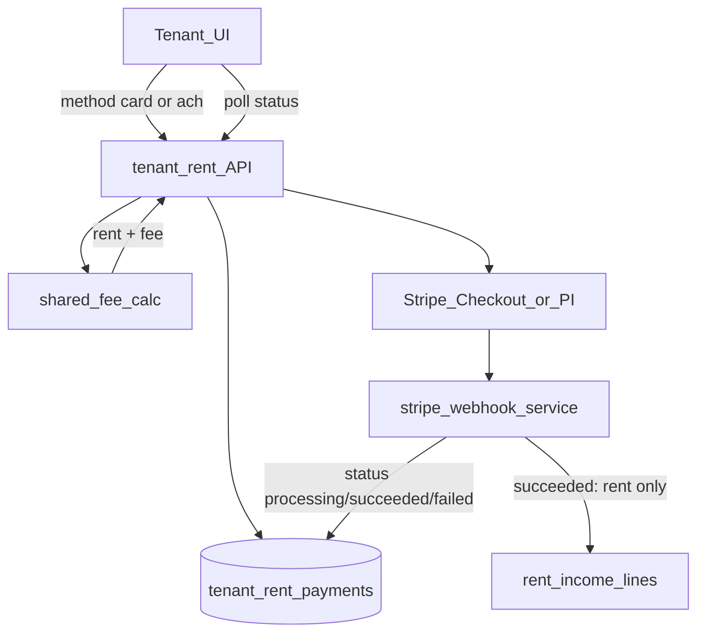

# Tenant rent card fee + ACH — Implementation Phases

Dual-price rent pay for tenants: **ACH = rent only**, **card = rent + platform convenience fee**. Money still uses Connect **destination charges**. **Platform keeps the card fee** via Stripe `application_fee_amount` (connected account receives charge − app fee − Stripe’s processing fee). Fee formula (locked for v1): **2.9% + $0.30**, rounded to cents. This is a **tenant convenience fee**, not a pass-through of ACH network cost (ACH is cheaper for the platform).

Ship **locked Checkout** first (method chosen in-app), then **Payment Element + PaymentIntent** for one-screen live totals. Same fee math, ledger columns, and webhooks for both paths.

**Constraint:** ≤8 files touched per phase (use `1a` / `1b` sub-phases).

**Parent rent plan:** [`TENANT_STRIPE_RENT_PAYMENTS.md`](./TENANT_STRIPE_RENT_PAYMENTS.md).

**Follow-on ledger (post-settle):** after rent payment **succeeds**, auto-book Stripe **processing** fees (`stripe_fee` only — never platform `application_fee` / card convenience fee) as property expenses under system category **Payment processing**. See [`TENANT_STRIPE_PROCESSING_FEE_EXPENSE_PHASES.md`](./TENANT_STRIPE_PROCESSING_FEE_EXPENSE_PHASES.md). Do not import the same fees again via CSV (double-count risk documented there).

**Related code today**

- [`apps/server/src/services/tenant-rent-payment-service.ts`](../apps/server/src/services/tenant-rent-payment-service.ts) — Checkout create, succeed → income
- [`apps/server/src/services/stripe-webhook-service.ts`](../apps/server/src/services/stripe-webhook-service.ts) — session/PI/refund/dispute handlers
- [`apps/server/src/services/tenant-rent-payment-reconcile-service.ts`](../apps/server/src/services/tenant-rent-payment-reconcile-service.ts) — PI retrieve failsafe (succeeded/canceled only today)
- [`apps/server/src/db/tenant-rent-payments.ts`](../apps/server/src/db/tenant-rent-payments.ts) — `tenant_rent_payments` DAO (`amount_cents` only today)
- [`packages/shared/src/tenant-rent-payment-utils.ts`](../packages/shared/src/tenant-rent-payment-utils.ts) — idempotency + checkout validation
- [`apps/tenant/src/lib/start-rent-checkout.ts`](../apps/tenant/src/lib/start-rent-checkout.ts) — balance → checkout → redirect
- [`apps/tenant/src/pages/rent-payment-return-page.tsx`](../apps/tenant/src/pages/rent-payment-return-page.tsx) — post-Checkout poll

---

## Goals

- Tenant can pay rent by ACH (no fee) or card (fee disclosed before pay).
- Charged total always matches selected method; no mid-session amount flip abuse.
- Ledger stores rent vs fee vs method; income lines still cover **rent only**.
- ACH can sit in `processing` until settlement succeeds.
- Payment Element path recalculates fee live without abandoning fee integrity.

## Non-goals (v1)

- Property-retained convenience fee / dual pricing per property.
- Saved bank/card for autopay / subscriptions.
- Instant Bank Payments (only ACH Direct Debit + card).
- Admin UI to edit fee formula (env/shared constants only).
- Partial period picker changes (keep server amount-due).

## Guiding principles

1. **Price before confirm** — Amount is fixed when the Stripe object is created (locked Checkout) or when PI amount is updated before `confirm` (Elements).
2. **Rent vs fee** — `amount_cents` stays rent due for allocations/income; `fee_cents` is platform fee; charge = rent + fee.
3. **Platform fee via Connect** — Card sessions/PIs set `application_fee_amount = fee_cents`; ACH fee = 0.
4. **Webhook is truth** — UI polls; settlement and ACH `processing` → `succeeded` are webhook-driven. Do **not** mark succeeded on `checkout.session.completed` when `payment_status` is unpaid (already true today).
5. **One fee module** — Checkout and PaymentIntent both call the same shared calc.
6. **Ops is part of the phase** — Dashboard/CLI/env steps are exit criteria, not afterthoughts.

---

## Target architecture

### Feature flag

| Flag                     | Role                                                                                     |
| ------------------------ | ---------------------------------------------------------------------------------------- |
| `STRIPE_CONNECT_ENABLED` | Existing master switch for Connect + rent pay (unchanged). When off, no tenant payments. |

Card convenience fee + ACH dual-pricing is **always on** whenever Connect rent pay is enabled — no separate fee feature flag.

### Money split (card)

| Party                      | Receives                                 |
| -------------------------- | ---------------------------------------- |
| Platform                   | `application_fee_amount` (= `fee_cents`) |
| Connected property account | Charge − app fee − Stripe processing fee |
| Tenant                     | Pays `amount_cents + fee_cents`          |

---

## Stripe ops checklist (do not skip)

Recurring exit item for any phase that touches live Stripe behavior: complete the relevant rows below (test mode first, then live).

### Platform Dashboard

| Step                                                                                            | When                               |
| ----------------------------------------------------------------------------------------------- | ---------------------------------- |
| Enable **ACH Direct Debit** / US bank account under Payment methods                             | Before Phase 1b ACH Checkout works |
| Confirm platform may collect **application fees** on Connect destination charges                | Before Phase 1b card + fee         |
| Connect → Payment methods: ACH **on by default** (or eligible) for connected accounts           | Before ACH to properties           |
| Webhook / Event Destination (same `/webhooks/stripe` URL + secret): **add events** listed below | Before Phase 2a can fire in prod   |

### Webhook events to add (test + live + `stripe listen`)

**Keep existing:** `checkout.session.completed`, `checkout.session.expired`, `payment_intent.payment_failed`, `charge.refunded`, `charge.dispute.created`, `charge.dispute.closed`, `account.updated`.

**Add for ACH / dual settlement:**

| Event                                      | Purpose                            |
| ------------------------------------------ | ---------------------------------- |
| `payment_intent.processing`                | Set local status `processing`      |
| `payment_intent.succeeded`                 | Mark succeeded + apply rent income |
| `checkout.session.async_payment_succeeded` | ACH Checkout success path          |
| `checkout.session.async_payment_failed`    | ACH Checkout failure path          |

Update the events table in [`TENANT_STRIPE_RENT_PAYMENTS.md`](./TENANT_STRIPE_RENT_PAYMENTS.md) when these are enabled.

Local: `stripe listen --forward-to localhost:3001/webhooks/stripe` must include the new events (or forward all).

### Connected accounts

| Step                                                                                       | When                                                                 |
| ------------------------------------------------------------------------------------------ | -------------------------------------------------------------------- |
| New Express creates request `us_bank_account_ach_payments`                                 | Phase 1c                                                             |
| **Backfill** existing Express **and Standard** connected accounts with the same capability | Phase 1c / 1d — otherwise ACH fails for already-onboarded properties |
| Verify account `charges_enabled` + ACH capability active before offering ACH in UI         | Phase 3b                                                             |

### Env / tenant app

| Variable                                                                                          | When                                                                              |
| ------------------------------------------------------------------------------------------------- | --------------------------------------------------------------------------------- |
| `VITE_STRIPE_PUBLISHABLE_KEY`                                                                     | **Required for Phase 4b Payment Element** (Checkout redirect can work without it) |
| Existing `STRIPE_SECRET_KEY`, `STRIPE_WEBHOOK_SECRET`, `STRIPE_CONNECT_ENABLED`, `TENANT_APP_URL` | Unchanged prerequisites                                                           |

### QA notes

- ACH sandbox: Financial Connections instant verify vs microdeposit delay — budget time in Phase 2a exit.
- Card path: confirm app fee appears on PaymentIntent in Stripe Dashboard.
- Switching ACH ↔ card must not reuse the other method’s open Checkout session (idempotency includes method + charge).

---

## Data model (sketch)

### `tenant_rent_payments` (add columns)

| Column                  | Notes                                               |
| ----------------------- | --------------------------------------------------- |
| `fee_cents`             | `INT NOT NULL DEFAULT 0` — platform convenience fee |
| `payment_method_family` | `card` \| `us_bank_account` \| null (legacy)        |
| `charge_cents`          | Stored `amount_cents + fee_cents` for audit         |

**Domain rule:** Allocations and `applyIncomeForFullyCoveredMonths` use **rent** `amount_cents` only, never `fee_cents`.

---

## Shared contract (`packages/shared`)

| Symbol                                          | Purpose                                                               |
| ----------------------------------------------- | --------------------------------------------------------------------- |
| `TRentPaymentMethodFamily`                      | `card` \| `us_bank_account`                                           |
| `computeRentCardConvenienceFeeCents(rentCents)` | 2.9% + 30¢                                                            |
| `ICreateRentCheckoutBody`                       | `{ paymentMethodFamily }`                                             |
| Checkout / PI responses                         | include `rentCents`, `feeCents`, `chargeCents`, `paymentMethodFamily` |

Idempotency key must include method + charge total so card and ACH don’t collide.

---

## API (sketch)

| Method | Path                                                      | Notes                                                                                       |
| ------ | --------------------------------------------------------- | ------------------------------------------------------------------------------------------- |
| `POST` | `/tenant/me/leases/:leaseId/rent-payments/checkout`       | Body: `paymentMethodFamily`; locked `payment_method_types`; card → `application_fee_amount` |
| `POST` | `/tenant/me/leases/:leaseId/rent-payments/payment-intent` | Creates/updates PI + returns `clientSecret`; attach/reuse Stripe Customer (Phase 4)         |
| `GET`  | existing payment status                                   | Surface `processing` copy for ACH                                                           |

---

## Phased rollout

### Phase 0a — Plan doc + pointer

**Goal:** Canonical phases doc linked from existing rent docs.

- [x] Write this file
- [x] Link from [`TENANT_RENT_PAYMENTS_PHASES.md`](./TENANT_RENT_PAYMENTS_PHASES.md)
- [x] Short pointer + webhook event list update note in [`TENANT_STRIPE_RENT_PAYMENTS.md`](./TENANT_STRIPE_RENT_PAYMENTS.md)

**Files (≤3):** this doc; `TENANT_RENT_PAYMENTS_PHASES.md`; `TENANT_STRIPE_RENT_PAYMENTS.md`.

**Exit criteria:** Ops checklist and webhook event additions are documented here and referenced from parent rent docs.

---

### Phase 0b — Fee math (shared only)

**Goal:** Pure fee helper + tests; no API yet.

- [x] `packages/shared/src/tenant-rent-card-fee.ts` + tests
- [x] `TRentPaymentMethodFamily` in types
- [x] Export from `packages/shared/src/index.ts`

**Files (≤4).**

**Exit criteria:** Unit tests for $0, small rent, typical rent (~$1500 → fee), rounding.

---

### Phase 0c — Schema + DAO

**Goal:** Persist fee + method on payments.

- [x] Migration (next version after current head) on `tenant_rent_payments`
- [x] DAO + fixture updates

**Files (≤4):** `migrations.ts`; `tenant-rent-payments.ts`; fixture; optional DAO test.

**Exit criteria:** Migration up/down; insert/read fee + method + charge.

---

### Phase 1a — Checkout validation + idempotency (shared)

**Goal:** Checkout body requires method; idempotency includes method + charge.

- [x] Update `validateCreateRentCheckoutBody` / `buildRentCheckoutIdempotencyKey`
- [x] Tests: keys differ for card vs ACH; invalid method rejected

**Files (≤4).**

**Exit criteria:** Shared tests green.

---

### Phase 1b — Locked Checkout create (server)

**Goal:** Server creates method-locked Checkout; card sets `application_fee_amount`; row stores fee/method.

- [x] Checkout create: `payment_method_types` locked; card → `application_fee_amount`; metadata includes fee/method
- [x] Do not reuse an open session when method/charge differs (idempotency)
- [x] **Ops:** platform ACH enabled; application fees allowed (test mode)

**Files (≤5):** service; routes; tests; small helper if needed.

**Exit criteria:** ACH session `us_bank_account` + fee 0; card session `card` + fee + app fee; Dashboard smoke create succeeds.

---

### Phase 1c — Connect ACH capability (new accounts)

**Goal:** New connected accounts request `us_bank_account_ach_payments`.

- [x] Express account create capabilities include ACH
- [x] Standard OAuth / account path requests ACH where capabilities are set in code
- [x] **Ops:** Connect Payment methods default for ACH

**Files (≤3):** connect service; test; doc note if needed.

**Exit criteria:** New account create payload requests ACH capability.

---

### Phase 1d — Backfill ACH capability on existing accounts

**Goal:** Already-linked properties can accept ACH.

- [x] Script or service method: `accounts.update` requesting `us_bank_account_ach_payments` for rows in `property_stripe_accounts` (Express + Standard)
- [x] Idempotent; log failures per account
- [ ] **Ops:** run in test then live; confirm capabilities active in Dashboard

**Files (≤4):** script and/or connect service; dry-run logging; short runbook section in this doc.

**Exit criteria:** Sample existing account shows ACH capability `active` (or clearly blocked with Stripe requirements).

#### Runbook (test → live)

1. **Dry-run** (no Stripe writes):  
   `bun apps/server/scripts/backfill-stripe-connect-ach-capability.ts --dry-run`  
   Review JSON output: `dry_run` rows are accounts that would be updated; `skipped_*` are already requested/active.

2. **Execute in test mode** (`STRIPE_SECRET_KEY=sk_test_…`):  
   `bun apps/server/scripts/backfill-stripe-connect-ach-capability.ts`  
   Exit code `1` if any account failed; check server logs for `tenant_payments.connect_ach_backfill_failed`.

3. **Verify in Stripe Dashboard** (test): Connect → Accounts → pick a backfilled account → Capabilities → `US bank account ACH payments` should be `active` or `pending` (with requirements listed if blocked).

4. **Repeat steps 1–3 in live** before enabling ACH rent pay for production traffic.

5. **New accounts** from Phase 1c already request ACH; this backfill is only for rows linked before that change.

---

### Phase 2a — Webhook ACH processing + settlement

**Goal:** Don’t treat ACH as paid early; set `processing`; succeed only on definitive success events.

- [x] Handlers: `payment_intent.processing`, `payment_intent.succeeded`, `checkout.session.async_payment_succeeded`, `checkout.session.async_payment_failed`
- [x] Keep ignoring unpaid `checkout.session.completed` (do not “fix” into succeeded)
- [x] `markProcessing` / succeed / fail on rent payment service
- [ ] **Ops (blocking):** add the four events to Dashboard destination (test + live) and local `stripe listen`; update parent rent doc event table

**Files (≤4):** `stripe-webhook-service.ts`; webhook tests; `tenant-rent-payment-service.ts`; optional shared status helper.

**Exit criteria:** Simulated ACH: `processing` → `succeeded`; income only on succeeded; rent amount not fee; **prod/test webhook config updated** (checklist signed off in PR description).

---

### Phase 2b — Income / fee invariant + reconcile `processing`

**Goal:** Income ignores fee; reconcile can sync `processing` and still recover `succeeded`.

- [x] Tests: succeeded payment with fee allocates rent `amount_cents` only
- [x] Reconcile: if PI `processing` and local not terminal → `markProcessing`; keep succeeded recovery
- [x] Return-page contract: `processing` is non-terminal (poll continues)

**Files (≤4):** income/service tests; `tenant-rent-payment-reconcile-service.ts`; reconcile test.

**Exit criteria:** Fee never enters income lines; reconcile promotes processing and succeeded correctly.

---

### Phase 3a — Tenant API client + method types

**Goal:** Client can pass `paymentMethodFamily` into checkout.

- [x] API client + `start-rent-checkout` signature

**Files (≤4).**

**Exit criteria:** Typed checkout call accepts method.

---

### Phase 3b — Method picker UI + return copy

**Goal:** Before redirect, tenant chooses ACH vs Card; show rent, fee, total; disclose convenience fee; handle `processing` on return.

- [x] Picker UI (rent / fee / total); wire through shared start helper so home/leases/detail stay thin
- [x] Copy: card convenience fee disclosure (not “Stripe fee”)
- [x] [`rent-payment-return-page.tsx`](../apps/tenant/src/pages/rent-payment-return-page.tsx): `processing` = pending ACH, not error
- [x] Offer ACH only when property Connect ACH-ready (or fail gracefully with clear error)
- [ ] **Ops:** confirm test webhook events already enabled from 2a

**Files (≤6).**

**Exit criteria:** Picker → locked Checkout; disclosure visible; ACH return shows processing.

---

### Phase 4a — PaymentIntent API (+ Customer)

**Goal:** Create/update PI with same fee rules + `clientSecret`.

- [x] Create/reuse Stripe **Customer** for tenant (ACH/PE mandate-friendly); store id if needed (new column or existing user metadata — prefer minimal: Stripe Customer id on tenant user or payment row)
- [x] PI amount = rent+fee; card → `application_fee_amount`; ACH fee 0; destination transfer
- [x] Idempotent update when method changes before confirm

**Files (≤5):** service; routes; shared types; tests; small persistence for customer id if required.

**Exit criteria:** API returns client secret; Dashboard shows correct amount/fee/method.

---

### Phase 4b — Tenant Payment Element UI

**Goal:** One-screen pay; on method change, update PI amount/fee then confirm.

- [x] `@stripe/stripe-js` (+ React Stripe if used); `VITE_STRIPE_PUBLISHABLE_KEY` required
- [x] Pay page/component; router; start helper branch to Elements vs Checkout
- [x] Live total updates on method change

**Files (≤6):** package.json + lockfile; pay UI; api-client; router; start helper; status UX.

**Exit criteria:** Test mode: switch card↔ACH updates total and succeeds; webhooks still settle; publishable key documented in `.env.example`.

---

### Phase 5 — Hardening

**Goal:** Observability, abuse checks, docs, live cutover runbook.

- [x] Winston fields: `method`, `feeCents`, `chargeCents`, `eventType` on create, status transitions, webhook settlement, and create failures (`tenant-rent-payment-observability.ts`)
- [x] Rate-limit / abuse notes for checkout + PI create (Redis per tenant+lease and tenant+IP; see below)
- [x] Failure matrix: ACH return, dispute, app fee create failure, capability missing (see below)
- [ ] Full ops checklist re-run on **live** before shipping dual-price to production traffic (operator sign-off)

**Files:** `tenant-rent-payment-observability.ts`; `tenant-rent-payment-create-rate-limit.ts`; `tenant-rent-payment-routes.ts`; `tenant-rent-payment-service.ts`; `stripe-webhook-service.ts`.

**Exit criteria:** Checklist: idempotency, ACH processing copy, fee disclosure, webhook events live, ACH capability backfill done, PE publishable key set.

#### Observability (`tenant_payments.*` logs)

Structured fields on rent-payment logs:

| Field         | Meaning                                                                 |
| ------------- | ----------------------------------------------------------------------- |
| `method`      | `card` \| `us_bank_account` \| null (legacy)                            |
| `feeCents`    | Platform convenience fee (0 for ACH)                                    |
| `chargeCents` | Rent + fee charged to tenant                                            |
| `amountCents` | Rent due only (income allocation base)                                  |
| `eventType`   | Stripe webhook type, create outcome, or status transition (see below) |

**Create:** `checkout_created`, `payment_intent_created` — includes method/fee/charge.

**Status transitions:** `rent_payment_succeeded`, `rent_payment_processing`, `rent_payment_failed`, `rent_payment_refunded`, `rent_payment_canceled`.

**Webhooks:** `webhook_processed` with `eventType` = Stripe event (e.g. `payment_intent.succeeded`, `checkout.session.async_payment_failed`).

**Create failures:** `checkout_failed`, `payment_intent_failed`; Stripe application-fee errors also set `eventType: application_fee_create_failed` and `failureReason`.

#### Rate limits (checkout + PaymentIntent create)

Both `POST .../rent-payments/checkout` and `POST .../rent-payments/payment-intent` enforce **two** Redis fixed-window limits (in addition to the global Fastify IP cap):

| Limit   | Key                                              | Default              | Env override                                              |
| ------- | ------------------------------------------------ | -------------------- | --------------------------------------------------------- |
| Lease   | `tenant-rent-payment:create:lease:{user}:{lease}` | 10 / 15 min          | `TENANT_RENT_PAYMENT_CREATE_LEASE_RATE_LIMIT_*`           |
| IP      | `tenant-rent-payment:create:ip:{user}:{ip}`        | 20 / 15 min          | `TENANT_RENT_PAYMENT_CREATE_IP_RATE_LIMIT_*`              |

Exceeded → **429** + `Retry-After`. Idempotent retries that hit an existing open session do not bypass limits (each create attempt counts).

**Abuse notes:** Limits throttle session/PI spam and method-flip probing; they do not replace Stripe Radar or Connect account review. Monitor `tenant_payments.checkout_failed` / `payment_intent_failed` volume per tenant.

#### Failure matrix

| Scenario                         | Tenant UX / API                                      | Local status / ledger                         | Logs / alerts                                                                 |
| -------------------------------- | ---------------------------------------------------- | --------------------------------------------- | ----------------------------------------------------------------------------- |
| **ACH return / async failure**   | Return page shows failed; can retry                  | `failed`; income not applied                  | `payment_intent.payment_failed`, `checkout.session.async_payment_failed`, `rent_payment_failed`; optional ACH return fee expense via `charge.failed` |
| **ACH return fee (late)**        | N/A (payment may already be `failed`)                | Property expense under Payment processing     | `charge.failed` → `ach_return_fee_expense_failed` on book failure             |
| **Dispute opened**               | No tenant action required                            | Status unchanged until closed                 | `dispute_created` + optional Discord (`DISCORD_TENANT_PAYMENTS_WEBHOOK_URL`)  |
| **Dispute lost**                 | N/A                                                  | `refunded`; rent income lines clawed back     | `charge.dispute.closed`, `rent_payment_refunded`, `webhook_processed`         |
| **Dispute won**                  | N/A                                                  | No status change                              | `dispute_closed`                                                              |
| **Card refund (full)**           | N/A                                                  | `refunded`; income clawback                   | `charge.refunded`, `rent_payment_refunded`                                    |
| **Partial refund**               | N/A                                                  | Manual ops — not auto-handled                 | `refund_partial_unhandled`                                                    |
| **Application fee create failure** | **500** “Failed to create…”                        | No Stripe object / row may exist              | `application_fee_create_failed` + `failureReason`; verify platform app fees enabled |
| **ACH capability missing**       | **400** ACH unavailable message; ACH hidden in UI    | No payment created                            | `ach_capability_read_failed`; run Phase 1d backfill                           |
| **Connect not ready**            | **409** connect not ready                            | No payment created                            | Domain error only                                                             |
| **Rate limited**                 | **429** + retry message                              | No payment created                            | No dedicated log (use HTTP metrics)                                           |

See also [`TENANT_STRIPE_RENT_REFUNDS.md`](./TENANT_STRIPE_RENT_REFUNDS.md) and [`TENANT_STRIPE_PROCESSING_FEE_EXPENSE_PHASES.md`](./TENANT_STRIPE_PROCESSING_FEE_EXPENSE_PHASES.md).

#### Live cutover checklist (operator sign-off)

Complete in **Stripe live mode** before enabling dual-price rent pay for production tenants. Copy this checklist into the release PR when done.

| #   | Item                                                                                         | Test ✓ | Live ✓ |
| --- | -------------------------------------------------------------------------------------------- | ------ | ------ |
| 1   | Platform Dashboard: ACH Direct Debit enabled                                                 |        |        |
| 2   | Platform Dashboard: application fees allowed on Connect destination charges                    |        |        |
| 3   | Webhook destination includes all events in [Stripe ops checklist](#stripe-ops-checklist-do-not-skip) (+ `charge.failed` for ACH return fees) |        |        |
| 4   | ACH capability backfill dry-run reviewed; execute live (`backfill-stripe-connect-ach-capability.ts`) |        |        |
| 5   | Sample live connected account: ACH capability `active` or `pending`                          |        |        |
| 6   | `VITE_STRIPE_PUBLISHABLE_KEY` set on tenant app (Payment Element path)                       |        |        |
| 7   | Smoke: card Checkout — fee disclosed, `application_fee_amount` on PI in Dashboard            |        |        |
| 8   | Smoke: ACH Checkout — `processing` → `succeeded`; income = rent only                         |        |        |
| 9   | Smoke: Payment Element — method switch updates total; webhooks settle                        |        |        |
| 10  | Idempotency: card vs ACH open sessions do not collide                                        |        |        |
| 11  | Redis reachable for rent create rate limits (`REDIS_URL` / `REDISHOST`)                       |        |        |

---

## Hardening table

| Concern                           | Action                                                                                                                                                                                             |
| --------------------------------- | -------------------------------------------------------------------------------------------------------------------------------------------------------------------------------------------------- |
| Method/amount mismatch            | Lock Checkout PMs; PE updates PI before confirm                                                                                                                                                    |
| Fee vs rent ledger                | Income uses `amount_cents` only                                                                                                                                                                    |
| Post-settle Stripe processing fee | Property expense under **Payment processing** — [`TENANT_STRIPE_PROCESSING_FEE_EXPENSE_PHASES.md`](./TENANT_STRIPE_PROCESSING_FEE_EXPENSE_PHASES.md); never book `application_fee` as that expense |
| ACH delay                         | Status `processing`; UI + reconcile                                                                                                                                                                |
| ACH returns                       | Existing refund/dispute path; clawback income if refunded; optional ACH return fee expense (same processing-fee plan)                                                                              |
| Double checkout                   | Idempotency includes method + chargeCents; Redis create limits per lease + IP (Phase 5)                                            |
| Webhook config drift              | Ops checklist; parent doc event table                                                                                                                                                              |
| Existing Connect accounts         | Phase 1d capability backfill                                                                                                                                                                       |
| Connect master switch             | `STRIPE_CONNECT_ENABLED` only — fee/ACH always on when payments are on                                                                                                                             |
| PE without pk                     | Fail fast if `VITE_STRIPE_PUBLISHABLE_KEY` missing                                                                                                                                                 |

## What not to do

- One Checkout with both methods and dynamic fee after selection.
- Apply `charge_cents` (rent+fee) into rent income lines.
- Mark paid on ACH before definitive succeeded / async_payment_succeeded.
- Skip Connect `us_bank_account_ach_payments` or skip **existing-account** backfill.
- Ship Phase 2a code without Dashboard/CLI webhook event updates.
- Touch more than 8 files in a single phase—split instead.

## Safest sequencing summary

1. Doc + fee math + schema.
2. Locked Checkout + application fee + ACH capability **including backfill**.
3. Webhook handlers **and** Dashboard event subscription; income invariant; reconcile `processing`.
4. Tenant method picker + return-page `processing` copy.
5. PaymentIntent + Customer, then Payment Element (+ publishable key).
6. Live ops checklist before production traffic.
