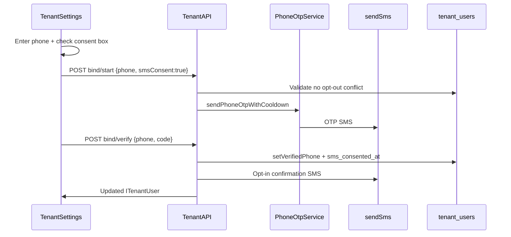
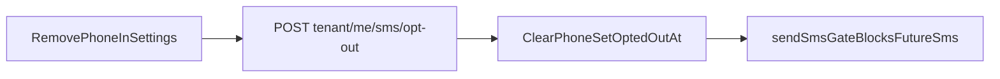

# Tenant SMS Opt-In — Implementation Phases

Ship a **10DLC-compliant tenant SMS consent flow** in the resident portal: explicit opt-in checkbox, persisted consent/opt-out, phone bind via existing OTP routes, opt-in confirmation SMS, and in-app opt-out. Primary near-term goal is an **AWS campaign resubmission screenshot** of the Settings UI; production SMS volume requires STOP/HELP handling in a later phase. Stack: Postgres + Fastify + SNS + existing phone OTP services. Admin operator SMS is deferred.

**Mapping:** Unblocks [AWS_SMS_10DLC_CAMPAIGN.md](./AWS_SMS_10DLC_CAMPAIGN.md) pre-launch checklist. Builds on phone bind/login from [TENANT_PORTAL_AUTH_EXPANSION_PHASES.md](./TENANT_PORTAL_AUTH_EXPANSION_PHASES.md).

**Related code today**

- `apps/server/src/services/tenant-phone-auth-service.ts` — phone login + bind OTP start/verify
- `apps/server/src/services/auth-phone-otp-service.ts` — OTP hash, cooldown, SNS send for phone
- `apps/server/src/routes/tenant/tenant-auth-routes.ts` — `/tenant/auth/phone/*` bind/login routes
- `apps/server/src/db/tenant-users.ts` — `phone`, `phone_verified_at`; no SMS consent columns
- `apps/server/src/db/mappers.ts` — `mapTenantUserRow`
- `apps/server/src/sns/sns.ts` — `sendSms`, E.164 validation, origination number attribute
- `apps/server/src/services/sync-lease-phone-to-tenant-on-accept.ts` — copies lease phone as **unverified** contact (not consent)
- `apps/server/src/lib/tenant-auth-expansion-config.ts` — `TENANT_PHONE_AUTH_ENABLED` gate
- `packages/shared/src/tenant-portal-types.ts` — `ITenantUser`, phone auth request bodies
- `packages/shared/src/phone.ts` — E.164 helpers
- `apps/tenant/src/pages/settings-page.tsx` — read-only phone display; Verify stub
- `apps/tenant/src/lib/api-client.ts` — `getMe()` only; no bind/opt-out client methods
- `apps/tenant/src/lib/tenant-auth-expansion-flags.ts` — `VITE_TENANT_PHONE_AUTH_ENABLED`
- `apps/admin/src/components/ui/phone-input.tsx` — PhoneInput (admin only today)
- `apps/admin/src/components/ui/checkbox.tsx` — Checkbox (admin only today)
- `packages/app-ui/src/auth/auth-terms-notice.tsx` — passive ToS/Privacy links pattern
- `apps/web/app/(landing)/privacy-policy/page.tsx` — SMS consent/opt-out legal copy
- `apps/web/app/(landing)/terms-of-service/page.tsx` — SMS messaging terms
- `docs/AWS_SMS_10DLC_CAMPAIGN.md` — campaign description, samples, opt-in workflow text

---

## Goals

- Tenant can **voluntarily enable SMS** in Settings with an **unchecked consent checkbox** and disclosure matching the registered campaign copy.
- Server **persists consent and opt-out** and **gates all outbound SMS** to tenants on consent state.
- After successful phone bind verify, send **one opt-in confirmation SMS** (campaign sample 2).
- Tenant can **opt out in-app** (remove phone / disable SMS) as described in privacy/terms.
- Produce a **screenshot-ready Settings UI** for AWS 10DLC campaign resubmission.
- Align outbound message bodies with registered samples (STOP/HELP footer on opt-in confirmation only; disclosed at checkbox consent).

## Non-goals (initial release)

- **Admin operator SMS opt-in** — no `users.phone`, no admin account settings page today.
- **Rent/lease alert SMS delivery** — only consent plumbing + OTP + opt-in confirmation in v1.
- **Inbound STOP/HELP auto-reply** — Phase 3a (handler) + Phase 3b (AWS wiring); required for production sandbox exit, not for screenshot.
- **Phone-only tenant accounts** — unchanged deferral from auth expansion doc.
- **Marketing SMS** — transactional campaign only.

---

## Guiding principles

1. **Recipient must consent** — operator-entered lease phone is contact data, not SMS consent. No SMS until the tenant completes Settings opt-in.
2. **Contracts first** — extend `packages/shared`; server and tenant import the same types.
3. **Consent before subscription** — checkbox required on bind/start; set `sms_consented_at` only after OTP verify succeeds.
4. **Single send gate** — route tenant SMS through a consent-aware wrapper so future alert SMS cannot bypass compliance.
5. **Reuse existing bind routes** — extend `/tenant/auth/phone/bind/*` rather than parallel phone APIs.
6. **Flag together** — `TENANT_PHONE_AUTH_ENABLED` / `VITE_TENANT_PHONE_AUTH_ENABLED` gate server routes and tenant UI.

---

## Target architecture



**In-app opt-out:**



### Permissions

- Phone bind + SMS opt-in: authenticated tenant only (`authenticateTenant`).
- Opt-out: authenticated tenant only; affects only the caller's `tenant_users` row.
- No admin UI in v1.

### Feature flags

| Flag                             | Gates                                                      |
| -------------------------------- | ---------------------------------------------------------- |
| `TENANT_PHONE_AUTH_ENABLED`      | Bind/login phone routes, consent flow, OTP send            |
| `VITE_TENANT_PHONE_AUTH_ENABLED` | Tenant Settings SMS section visibility (must match server) |

---

## Data model (sketch)

### `tenant_users` (extend — migration v67)

| Column             | Notes                                                                         |
| ------------------ | ----------------------------------------------------------------------------- |
| `sms_consented_at` | `TIMESTAMPTZ` nullable — set on successful bind verify after explicit consent |
| `sms_opted_out_at` | `TIMESTAMPTZ` nullable — set on in-app opt-out (and later STOP keyword)       |

Existing columns reused: `phone`, `phone_verified_at`.

**Eligibility rule (shared helper):**

```typescript
canReceiveSms(user) =
  user.phoneVerifiedAt != null && user.smsConsentedAt != null && user.smsOptedOutAt == null;
```

New DB helpers in `tenant-users.ts`:

- `grantSmsConsent(tenantUserId, phone)` — used inside bind verify
- `optOutOfSms(tenantUserId)` — clear `phone`, `phone_verified_at`, set `sms_opted_out_at`

**Lease phone sync:** `sync-lease-phone-to-tenant-on-accept` may set an unverified phone; tenant must still complete Settings opt-in before any SMS is sent.

---

## Shared contract (`packages/shared`)

| Type                                        | Purpose                                           |
| ------------------------------------------- | ------------------------------------------------- |
| `ITenantUser` (extend)                      | Add `smsConsentedAt`, `smsOptedOutAt`             |
| `ITenantPhoneBindStartBody` (extend)        | Add required `smsConsent: true`                   |
| `ITenantSmsOptOutResponse`                  | `{ user: ITenantUser }`                           |
| `canReceiveSms(user)`                       | Pure eligibility helper                           |
| `buildTenantPhoneOtpSmsMessage(code)`       | OTP body — campaign sample 1                      |
| `buildTenantSmsOptInConfirmationMessage()`  | Opt-in confirmation — sample 2                    |
| `buildTenantSmsOptOutConfirmationMessage()` | Stop confirmation — campaign stop sample          |
| `buildTenantSmsHelpMessage()`               | HELP auto-reply — campaign help sample (Phase 3a) |

---

## API (sketch)

| Method | Path                             | Auth                | Body                          | Notes                                                                        |
| ------ | -------------------------------- | ------------------- | ----------------------------- | ---------------------------------------------------------------------------- |
| `POST` | `/tenant/auth/phone/bind/start`  | Tenant JWT          | `{ phone, smsConsent: true }` | Reject if `smsConsent !== true`; then send OTP                               |
| `POST` | `/tenant/auth/phone/bind/verify` | Tenant JWT          | `{ phone, code }`             | Verify OTP, set consent, send opt-in confirmation SMS                        |
| `POST` | `/tenant/me/sms/opt-out`         | Tenant JWT          | —                             | In-app opt-out; return updated user                                          |
| `POST` | `/webhooks/sms/inbound`          | `X-Internal-Secret` | SNS/Lambda payload            | Inbound STOP/HELP (Phase 3a); exempt from rate limit like `/s3-notification` |
| `GET`  | `/tenant/me`                     | Tenant JWT          | —                             | Include new consent fields                                                   |

Server-side send path:

- Add `sendTenantSms({ tenantUserId, phoneNumber, message })` or equivalent wrapper that loads user, asserts `canReceiveSms`, then calls `sendSms`.
- Update `buildTenantPhoneOtpSmsMessage` in `auth-phone-otp-service.ts` to use shared templates.

---

## UI — Tenant Settings

**Primary page:** `apps/tenant/src/pages/settings-page.tsx`

**New component:** `apps/tenant/src/components/settings/tenant-sms-settings-section.tsx`

1. **Status row** — Not subscribed / Pending verification / Subscribed / Opted out
2. **PhoneInput** — editable when not subscribed (extract to app-ui)
3. **Consent checkbox (unchecked default)** — disclosure: “I agree to receive transactional SMS from PropertyOS, including verification codes and account notifications. Message frequency varies. Message and data rates may apply. Reply STOP to opt out or HELP for help.” + ToS/Privacy links
4. **Enable SMS** — disabled until valid phone + consent; triggers bind/start → OTP dialog
5. **OTP verify dialog** — code entry → bind/verify
6. **Remove / Disable SMS** — visible when subscribed; calls opt-out API

**Shared UI to extract into `packages/app-ui`:**

- `PhoneInput` — from `apps/admin/src/components/ui/phone-input.tsx`
- `Checkbox` — from `apps/admin/src/components/ui/checkbox.tsx`
- Optional `SmsConsentField` — checkbox + disclosure (reusable when admin SMS ships)

**AWS screenshot (campaign resubmission):**

After Phase 2 lands on staging, capture Settings showing phone field, **unchecked** consent box, and full disclosure text. Upload as the campaign **opt-in workflow image** — not the terms/privacy URLs alone.

---

## Phased rollout

### Phase 0 — Foundation (no user-facing feature)

**Goal:** Schema, shared types, and message templates without exposing UI.

- [x] Migration v67: `sms_consented_at`, `sms_opted_out_at` on `tenant_users`
- [x] Extend `ITenantUser` + `mapTenantUserRow`
- [x] Add `canReceiveSms` + SMS message template helpers in `packages/shared`
- [x] Unit tests for eligibility logic and message formatting

**Exit criteria:** Migration runs; `bun test` passes for new shared/server unit tests; no UI changes.

---

### Phase 1 — Backend consent pipeline (API only)

**Goal:** End-to-end consent-aware bind and opt-out without UI.

- [x] Require `smsConsent: true` on bind/start in `tenant-phone-auth-service.ts`
- [x] On bind/verify: `grantSmsConsent` + send opt-in confirmation SMS (once per subscription)
- [x] Add `POST /tenant/me/sms/opt-out` route + service
- [x] Gate login OTP: only send when target user `canReceiveSms`
- [x] Route tenant SMS through consent-aware send wrapper
- [x] Integration tests: bind-with-consent, opt-out blocks OTP, confirmation sent once

**Exit criteria:** Manual verification via API/script; opted-out users never receive OTP; opt-in confirmation matches campaign sample 2.

---

### Phase 2 — Tenant Settings UI (AWS screenshot milestone)

**Goal:** First shippable tenant surface for SMS opt-in/opt-out.

- [x] Extract `PhoneInput` + `Checkbox` to `packages/app-ui`; update admin imports
- [x] Build `TenantSmsSettingsSection` wired to bind + opt-out APIs
- [x] Extend tenant API client with bind/start, bind/verify, opt-out
- [x] Gate section with `isTenantPhoneAuthEnabled()`
- [x] Invalidate `queryKeys.me()` after bind/opt-out; sync auth store user
- [ ] Capture staging screenshot for AWS campaign resubmission

**Exit criteria:** Tenant completes enable → OTP → subscribed flow and disable flow in staging; screenshot matches campaign workflow description.

---

### Phase 3 — STOP/HELP + production compliance

**Goal:** Inbound keyword handling required before production SMS volume. Split into **3a (app backend)** and **3b (AWS wiring + proof)** so handler logic can ship and be tested with `curl` before two-way SMS is configured in AWS.

**Inbound flow (target):**

```mermaid
sequenceDiagram
  participant Tenant as TenantPhone
  participant AWS as AWSTwoWaySms
  participant Lambda as smsInboundLambda
  participant API as POST webhooks/sms/inbound
  participant DB as tenant_users
  participant SNS as sendSms

  Tenant->>AWS: SMS "STOP" or "HELP"
  AWS->>Lambda: Inbound event
  Lambda->>API: Forward payload (X-Internal-Secret)
  API->>DB: Lookup by phone; opt out or log keyword
  API->>SNS: Stop or help confirmation reply
```

**Pattern:** Reuse the S3 notification approach — `lambda/s3-notification` forwards to `POST /s3-notification` with `AWS_INTERNAL_SECRET`. Phase 3b uses [`lambda/sms-inbound`](../lambda/sms-inbound/README.md) → `POST /webhooks/sms/inbound`.

---

#### Phase 3a — Inbound handler (backend only)

**Goal:** STOP/HELP business logic + audit trail; verifiable locally without AWS.

- [x] Migration: `tenant_sms_keyword_events` (phone E.164, keyword, tenant_user_id nullable, raw payload snippet, created_at)
- [x] Add `buildTenantSmsHelpMessage()` in `packages/shared` (campaign help sample)
- [x] Keyword parser — normalize STOP / STOPALL / UNSUBSCRIBE / CANCEL / END / QUIT and HELP / INFO
- [x] `tenant-inbound-sms-service` (or equivalent):
  - STOP → `optOutOfSms` by phone lookup + send `buildTenantSmsOptOutConfirmationMessage()` (capture phone before clear)
  - HELP → send help message to sender (no subscription change)
  - Unknown keyword / unknown phone → log event; no outbound reply (or log-only)
- [x] `POST /webhooks/sms/inbound` — auth via `X-Internal-Secret`; register in `server.ts` rate-limit exempt list
- [x] Unit tests with mocked payloads; manual `curl` against local server

**Exit criteria:** `curl` with STOP payload opts out a subscribed tenant and sends stop confirmation; HELP returns registered help copy; events persisted; tests pass — **no AWS dependency**.

**Local test (`curl`):**

```bash
curl -X POST http://localhost:3001/webhooks/sms/inbound \
  -H "Content-Type: application/json" \
  -H "X-Internal-Secret: $AWS_INTERNAL_SECRET" \
  -d '{"phoneNumber":"+13055550100","message":"STOP"}'
```

---

#### Phase 3b — AWS two-way SMS + sandbox proof

**Goal:** Connect production/staging origination number to the Phase 3a handler; prove real handset STOP/HELP.

- [ ] Enable **two-way SMS** on PropertyOS origination number (End User Messaging / us-east-1)
- [ ] Route inbound messages → SNS topic → Lambda forwarder ([`lambda/sms-inbound`](../lambda/sms-inbound/README.md))
- [ ] Lambda env: `API_PUBLIC_URL`, `AWS_INTERNAL_SECRET` (same as API server)
- [x] Document setup in [AWS_SMS_10DLC_CAMPAIGN.md](./AWS_SMS_10DLC_CAMPAIGN.md) (two-way + inbound section)
- [ ] Manual STOP/HELP test on sandbox-verified handset against staging API

**Exit criteria:** Real SMS STOP suppresses future OTP/alerts; HELP returns registered help copy; [AWS_SMS_10DLC_CAMPAIGN.md](./AWS_SMS_10DLC_CAMPAIGN.md) checklist items for STOP/HELP checked.

**Phase 3 overall exit criteria:** Phase 3a + 3b complete.

---

### Phase 4 — Hardening

**Goal:** Production-safe consent behavior.

| Concern                  | Action                                                                            |
| ------------------------ | --------------------------------------------------------------------------------- |
| Consent bypass           | Server rejects bind/start without `smsConsent: true`                              |
| Re-opt-in after STOP     | Full bind + checkbox flow; clear `sms_opted_out_at` only via new explicit consent |
| Duplicate opt-in SMS     | Idempotent: skip confirmation if already consented for same verified phone        |
| OTP to opted-out numbers | Send gate + login start checks                                                    |
| Message drift            | Single shared template module; campaign doc references same strings               |
| Rate limits              | Reuse `phone_bind` limits in `tenant-auth-rate-limit.ts`                          |

**Exit criteria:** Failure modes documented; no SMS sent without recorded consent.

---

### Phase 5 — Admin operator SMS (post-launch)

- Add `users.phone` + consent columns
- New admin account settings route (e.g. `/settings`)
- Separate campaign review if operator message types diverge from tenant transactional SMS

---

## What not to do

- Do **not** treat admin lease tenant phone fields as SMS opt-in.
- Do **not** send OTP on bind/start without explicit `smsConsent: true` in the request body.
- Do **not** pre-check the consent checkbox.
- Do **not** call `sendSms` directly from new tenant SMS code without the consent gate wrapper.
- Do **not** block AWS resubmission on STOP/HELP — ship Phase 2 UI first, then Phase 3a → 3b before production volume.
- Do **not** add admin operator SMS in the same PR as tenant opt-in.

---

## Safest sequencing summary

1. **Migration + shared types** before any route or UI changes.
2. **Backend consent gating + opt-in confirmation** before relying on UI.
3. **Tenant Settings UI** next — unblocks AWS screenshot.
4. **Phase 3a inbound handler** (backend + tests) before AWS console work.
5. **Phase 3b two-way SMS wiring** + sandbox STOP/HELP proof before production volume.
6. **Admin operator SMS** only after tenant flow is proven.

---

## Related doc updates (after implementation)

- [AWS_SMS_10DLC_CAMPAIGN.md](./AWS_SMS_10DLC_CAMPAIGN.md) — add “Opt-in workflow screenshot” section; mark pre-launch checklist items when Phases 1–2 ship; add inbound two-way SMS setup when Phase 3b ships.
- [TENANT_PORTAL_AUTH_EXPANSION_PHASES.md](./TENANT_PORTAL_AUTH_EXPANSION_PHASES.md) — cross-link SMS consent as prerequisite for transactional SMS beyond OTP verification during bind.
