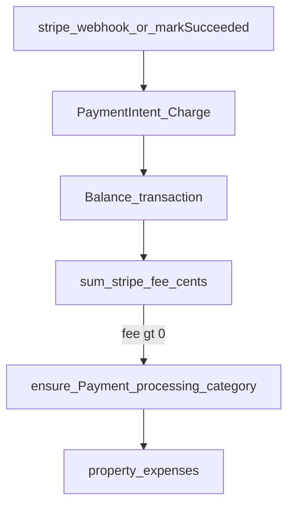

# Stripe processing fee → property expense — Implementation Phases

Auto-book **Stripe processing fees** (balance transaction `fee_details` with type `stripe_fee`) as property expenses under a **system** expense category **Payment processing**. Each property gets its own category row (UUID); the **name** is the stable key. Category is **unremovable / unrenamable**, mirroring system income types (`is_system`).

Triggered when a tenant rent payment **succeeds** (and optionally on ACH failure fees). **Never** book Connect `application_fee` (platform convenience fee) as this expense.

**Constraint:** ≤8 files touched per phase (use `0a` / `1a` sub-phases).

**Related plans**

- [`TENANT_STRIPE_RENT_PAYMENTS.md`](./TENANT_STRIPE_RENT_PAYMENTS.md) — rent Checkout / webhooks / income
- [`TENANT_RENT_CARD_CONVENIENCE_FEE_PHASES.md`](./TENANT_RENT_CARD_CONVENIENCE_FEE_PHASES.md) — ACH + card convenience fee (platform `application_fee`)
- [`SYSTEM_LEASE_RENT_INCOME_TYPE_PHASES.md`](./SYSTEM_LEASE_RENT_INCOME_TYPE_PHASES.md) — pattern for `is_system` catalog rows

**Related code today**

- [`apps/server/src/db/property-expense-category-types.ts`](../apps/server/src/db/property-expense-category-types.ts) — per-property categories; `ensureDefaults` / `replaceAll`
- [`packages/shared/src/property-expense-category-type-config.ts`](../packages/shared/src/property-expense-category-type-config.ts) — `DEFAULT_PROPERTY_EXPENSE_CATEGORY_TYPES`
- [`apps/server/src/db/property-income-line-types.ts`](../apps/server/src/db/property-income-line-types.ts) — `is_system` + `ensureSystem*` to mirror
- [`apps/server/src/services/tenant-rent-payment-service.ts`](../apps/server/src/services/tenant-rent-payment-service.ts) — `markSucceeded` → rent income
- [`apps/server/src/services/stripe-webhook-service.ts`](../apps/server/src/services/stripe-webhook-service.ts) — settlement webhooks
- [`apps/server/src/db/property-expenses.ts`](../apps/server/src/db/property-expenses.ts) — expense create
- [`apps/admin/src/components/settings/`](../apps/admin/src/components/settings/) — expense category catalog UI

---

## Goals

- Every property has an active system category named **Payment processing**.
- On rent payment **succeeded**, create one expense equal to Stripe’s **processing** fee from the balance transaction.
- Idempotent on Stripe source id; retries do not duplicate.
- Operators cannot archive or rename the system category.
- Property P&L shows payment-processing cost separately from rent income.

## Non-goals (initial release)

- Booking platform `application_fee` / card convenience fee as a property expense.
- Auto-expenses for non–rent-payment Stripe activity (Radar, invoice products, etc.).
- Operator UI to remap which category receives fees.
- Deduplicating against manual CSV bank imports (document the risk only).
- Estimating fees from % formulas when balance txn is available.

## Guiding principles

1. **Per-property category ids** — resolve by `propertyId` + canonical name; never one global UUID.
2. **Balance transaction is fee truth** — use `fee` / `fee_details`; do not invent amounts.
3. **Only `stripe_fee`** for v1 success path — exclude `application_fee` from the expense amount.
4. **Same protection model as system income types** — `is_system`, ensure helpers, archive/rename blocked.
5. **Idempotent writes** — unique Stripe source key on the expense row.
6. **Rent income unchanged** — fee expenses do not alter allocations or rent income lines.

---

## Target architecture

### Permissions

- Server-only automation (webhook / rent payment service). No new tenant routes.
- Admin can **view** the category and expenses; cannot delete/rename the system category.

### Feature flag

N/A — ship with rent payments when Connect is enabled. No separate fee-expense flag.

---

## Data model (sketch)

### `property_expense_category_types`

| Column | Notes |
| --- | --- |
| `is_system` | `BOOLEAN NOT NULL DEFAULT false` — mirror income types |

**Domain rule:** System row per property with name **Payment processing** (`is_system = true`). Unique active name still `(property_id, lower(name))`.

### `property_expenses`

| Column | Notes |
| --- | --- |
| `stripe_balance_transaction_id` | `TEXT NULL`, **UNIQUE** where not null — idempotency for auto fees |
| Optional `tenant_rent_payment_id` | Nullable FK for traceability (if added, keep under file budget or defer) |

**Domain rule:** One expense per balance transaction id. Amount = dollars from Stripe fee cents. `category_id` = that property’s Payment processing row.

---

## Shared contract (`packages/shared`)

| Symbol | Purpose |
| --- | --- |
| `SYSTEM_PAYMENT_PROCESSING_EXPENSE_CATEGORY_NAME` | `"Payment processing"` |
| `isSystemPaymentProcessingExpenseCategoryName(name)` | Case-insensitive match |
| Default list | Include Payment processing in `DEFAULT_PROPERTY_EXPENSE_CATEGORY_TYPES` (or ensure-only like income — prefer **ensure-only system** so operators don’t see it as a deletable default seed item; either way `is_system` wins) |

---

## API (sketch)

No new public API required for v1. Internal:

| Caller | Behavior |
| --- | --- |
| `markSucceeded` / post-income hook | Ensure category → fetch Stripe fee → create expense if needed |
| Expense category settings PATCH | Reject archive/rename when `is_system` |
| Category list GET | Include system row (visible, not removable in UI) |

---

## Phased rollout

### Phase 0a — Plan doc + pointers

**Goal:** Canonical phases doc linked from rent docs.

- [x] Write this file
- [x] Link from [`TENANT_RENT_PAYMENTS_PHASES.md`](./TENANT_RENT_PAYMENTS_PHASES.md)
- [x] Short pointer from [`TENANT_RENT_CARD_CONVENIENCE_FEE_PHASES.md`](./TENANT_RENT_CARD_CONVENIENCE_FEE_PHASES.md) (post-settle ledger)

**Files (≤3).**

**Exit criteria:** Links resolve; scope matches this doc.

---

### Phase 0b — Shared name + helpers

**Goal:** Canonical name and predicates; defaults list updated if needed.

- [ ] `SYSTEM_PAYMENT_PROCESSING_EXPENSE_CATEGORY_NAME` + `isSystemPaymentProcessingExpenseCategoryName`
- [ ] Unit tests
- [ ] Export from `packages/shared/src/index.ts`
- [ ] Add to default expense category config **or** document ensure-only (prefer ensure-only system row like income types, not a normal default the user can wipe via replaceAll)

**Files (≤4).**

**Exit criteria:** Name helper tests green.

---

### Phase 0c — Schema: `is_system` on expense categories

**Goal:** Persist system flag on expense category types.

- [ ] Migration: `ALTER TABLE property_expense_category_types ADD COLUMN is_system …`
- [ ] Mapper + DAO SELECT/INSERT include `is_system`
- [ ] Shared `IPropertyExpenseCategoryType` gains `isSystem?: boolean` (or required boolean)

**Files (≤4):** `migrations.ts`; `property-expense-category-types.ts`; `mappers.ts`; shared type config.

**Exit criteria:** Migration up/down; round-trip `is_system`.

---

### Phase 1a — Ensure system category per property

**Goal:** Idempotent ensure helper (insert or restore archived-by-name → set `is_system`).

- [ ] `ensureSystemPaymentProcessingExpenseCategory(propertyId)` in expense category DAO (mirror income `ensureSystemIncomeLineType`)
- [ ] Call from the same lifecycle points as expense defaults / property create (keep call sites minimal)
- [ ] DAO / service tests

**Files (≤5).**

**Exit criteria:** Ensure twice → one active system row; name stable.

---

### Phase 1b — Backfill existing properties

**Goal:** Every existing property has the category.

- [ ] Migration `INSERT … SELECT` from `properties` where missing (or script invoked once)
- [ ] Short note in this doc’s deploy checklist

**Files (≤3).**

**Exit criteria:** Query shows all properties have active `is_system` Payment processing row.

---

### Phase 1c — Unremovable / unrenamable

**Goal:** Operators cannot destroy the automation target.

- [ ] `archivePropertyCatalogTypesNotInIds` / `replaceAll` skip or re-ensure `is_system` rows
- [ ] Settings route rejects delete/rename of system expense categories
- [ ] Admin expense category catalog: hide delete; disable name edit for `isSystem`

**Files (≤6):** catalog utils and/or expense category DAO; settings route; admin catalog component(s); tests.

**Exit criteria:** API + UI cannot archive/rename Payment processing; ensure still restores if somehow archived.

---

### Phase 2a — Read Stripe processing fee

**Goal:** Pure/server helper: PI or Charge → balance transaction → `stripe_fee` cents.

- [ ] `getStripeProcessingFeeCentsFromPaymentIntent(piId)` (or charge) using Stripe SDK expand
- [ ] Sum only `fee_details` entries with `type === "stripe_fee"`
- [ ] Explicitly ignore `application_fee`
- [ ] Fixture-based unit tests (mocked Stripe objects)

**Files (≤4).**

**Exit criteria:** Fixtures for card success, ACH success, and app-fee+stripe-fee → correct cents.

---

### Phase 2b — Expense idempotency column

**Goal:** Persist Stripe balance transaction id on expenses.

- [ ] Migration: `stripe_balance_transaction_id TEXT NULL` + **UNIQUE** partial/unique index
- [ ] DAO create + mapper + shared type field (optional on API responses)
- [ ] Create conflict → treat as success / no-op

**Files (≤4).**

**Exit criteria:** Second insert with same txn id fails uniquely or no-ops cleanly.

---

### Phase 2c — Create expense on rent succeeded

**Goal:** Wire automation after rent success.

- [ ] After income apply in `markSucceeded` (or dedicated helper called from there): ensure category → fetch fee → if `> 0` create expense
- [ ] Description e.g. `Stripe processing fee` + payment id reference
- [ ] `expenseDate` = payment success date (UTC date from Stripe or local convention used elsewhere)
- [ ] Service tests: succeed with fee; succeed with 0 fee; duplicate webhook

**Files (≤5):** rent payment service; new small helper module; expense DAO usage; tests.

**Exit criteria:** Sandbox/simulated succeed creates one expense under Payment processing; retry does not duplicate; rent income unchanged.

---

### Phase 3a — ACH failure / return fees (optional)

**Goal:** Book Stripe failure-related fees when present.

- [ ] On payment failed / return balance activity linked to rent payment, if Stripe assesses a fee, create expense (same category; description distinguishes “ACH return fee”)
- [ ] Idempotent on balance txn id

**Files (≤4).**

**Exit criteria:** Failure fixture with fee → one expense; without fee → none.

---

### Phase 3b — Refund policy for processing-fee expenses

**Goal:** Define and implement behavior when rent payment is refunded.

- [ ] **Chosen default:** If Stripe reverses the processing fee, soft-delete or reverse the linked expense; if Stripe keeps the fee, leave the expense.
- [ ] Implement against `charge.refunded` / existing `markRefunded` path
- [ ] Tests for both cases if distinguishable in fixtures; otherwise document “leave expense” and assert no crash

**Files (≤4).**

**Exit criteria:** Documented + tested behavior; no duplicate reverse expenses.

---

### Phase 4 — Hardening

**Goal:** Observability and operator guidance.

- [ ] Winston: propertyId, paymentId, balanceTxnId, feeCents
- [ ] Doc note: importing Stripe/bank CSV that includes the same fees will double-count
- [ ] Cross-link from card-fee phases “post-settle ledger”

**Files (≤3).**

**Exit criteria:** Checklist complete in this doc.

---

## Hardening table

| Concern | Action |
| --- | --- |
| Wrong owner of fee | Only book `stripe_fee`; never `application_fee` |
| Global category id | Forbidden — per-property ensure |
| Operator deletes category | `is_system` + API/UI locks + ensure restore |
| Duplicate expenses | Unique `stripe_balance_transaction_id` |
| ACH still processing | Only run on rent **succeeded** |
| CSV double-count | Document; no auto-dedupe in v1 |
| Connect destination | Confirm on sandbox who the Stripe fee is assessed against; expense still attributed to the **property** that received the rent (product decision locked: property P&L) |

## What not to do

- Use one shared category UUID across all properties.
- Estimate fees with 2.9% / 0.8% when a balance transaction exists.
- Expense the platform convenience / `application_fee`.
- Allow archive/rename of Payment processing.
- Create the expense before rent payment is `succeeded`.
- Touch more than 8 files in a single phase — split instead.

## Safest sequencing summary

1. Doc → shared name → `is_system` schema.
2. Ensure + backfill + lock API/UI.
3. Fee reader → expense unique key → create on succeed.
4. Optional failure fees + refund policy.
5. Hardening / ops notes.

## Deploy checklist

| Checkpoint | Ship | Notes |
| --- | --- | --- |
| **A** | Phases 0c–1c | System category exists and cannot be removed |
| **B** | Phases 2a–2c | Succeeded rent pay creates processing-fee expense |
| **C** | Phases 3–4 | Failure/refund policy + docs |
