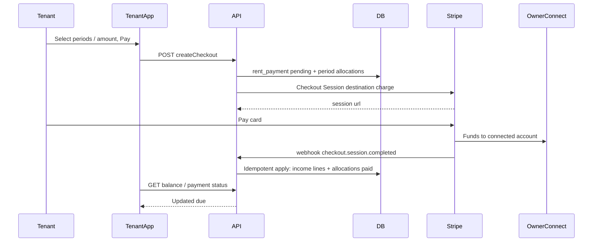

# Tenant rent payments (Stripe Connect) — Implementation Phases

Industry-standard Stripe rent collection for PropertyOS: **Connect** (money lands on the property owner’s connected account), **Checkout Session / PaymentIntent** per charge (not Subscriptions — rent prorates and changes), **webhook-first settlement**, **idempotent ledger**, **operator income lines remain schedule truth**.

**Product decisions locked:** Connect (1B). **Tenant portal v1 charges amount due only** (unpaid months ≤ today UTC); checkout is **server-authoritative**. Period selection + partial pay remain in the allocation helpers for a later phase.

**Related code today**

- [`docs/TENANT_PORTAL_ENHANCEMENTS_PHASES.md`](docs/TENANT_PORTAL_ENHANCEMENTS_PHASES.md) Phase 6 — payments sketch (intent + webhook + income)
- [`apps/server/src/db/property-long-stays.ts`](apps/server/src/db/property-long-stays.ts) `getRentSchedule` — `expectedRent` / `isPaid` via income lines
- [`apps/server/src/db/property-income-lines.ts`](apps/server/src/db/property-income-lines.ts) — create income lines operators already use
- [`apps/server/src/services/tenant-portal-membership-service.ts`](apps/server/src/services/tenant-portal-membership-service.ts) — lease access + tenant lease detail
- [`apps/server/src/db/property-members.ts`](apps/server/src/db/property-members.ts) — owner/manager roles (Connect onboarding eligibility)
- [`apps/server/src/lib/redis-fixed-window-rate-limit.ts`](apps/server/src/lib/redis-fixed-window-rate-limit.ts) — rate-limit pattern
- Tenant home placeholder: [`apps/tenant/src/pages/home-dashboard-page.tsx`](apps/tenant/src/pages/home-dashboard-page.tsx)

---

## Goals

- Tenant can see **amount due** from unpaid schedule periods (≤ today) and **pay via Stripe** (card first).
- Checkout amount and periods are computed **on the server**; tenant UI is a single Pay rent CTA (Home + lease).
- Period multi-select / partial amount UX is **deferred** (helpers + FIFO allocation remain for later).
- Funds settle to the **property’s Connect account** (Express recommended); optional platform **application fee** later.
- **Webhook** is the only path that marks rent paid; browser return URL is UX only.
- Successful payment creates/links **`property_income_lines`** so existing `isPaid` stays correct (when a month is fully covered).
- Admin can **onboard Connect** for a property and see payment status.

## Non-goals (v1)

- ACH / bank debit (Phase 5+)
- Stripe Subscriptions / fixed recurring products
- Tenant period selection / partial pay UI (deferred)
- Partial platform marketplace payouts beyond Connect destination charge + optional app fee
- Late fees, credits, deposits as first-class products (schema may allow extension)
- Multi-currency
- Letting tenants invent amounts outside computed due
- Dashboard polish beyond pay + balance (property manager contact is separate)

---

## Guiding principles

1. **Operator ledger is schedule truth** — unpaid = schedule months without sufficient applied payments/income; Stripe is money-rail truth.
2. **Webhook or it didn’t happen** — never mark paid from Checkout redirect alone.
3. **Idempotency everywhere** — Stripe Idempotency-Key on create; unique `stripe_event_id`; unique open payment per lease+periods hash.
4. **Connect Express + destination charges** — industry default for SaaS collecting on behalf of businesses with platform fee later; avoid direct charges until needed.
5. **Per-period charges, not Subscriptions** — matches prorations / rent periods / extensions.
6. **API + webhook before tenant UI** — same sequencing as Enhancements Phase 6.

---

## Target architecture

### Connect model (v1)

- **Express** accounts linked at **property** level (`properties.stripe_connect_account_id` or `property_payment_accounts` table).
- Only **property owner** (or designated billing admin) can complete Connect onboarding in admin.
- Checkout uses `payment_intent_data.transfer_data.destination = connectedAccountId` (destination charge on platform account).
- If property has **no** connected account / not `charges_enabled`: pay disabled with clear error.

### Permissions

- **Tenant (active membership):** read balance, create checkout for own lease, view own payment history.
- **Property owner:** Connect onboarding + view payment events for property leases.
- **Manager/accountant:** read-only payment status in admin (no Connect account change unless product expands later).

## Data model (sketch)

### `property_stripe_accounts`

| Column                | Notes                |
| --------------------- | -------------------- |
| `property_id`         | PK/FK unique         |
| `stripe_account_id`   | Connect acct\_…      |
| `charges_enabled`     | mirrored from Stripe |
| `payouts_enabled`     | mirrored             |
| `onboarding_complete` | boolean              |
| `details_submitted`   | boolean              |
| `updated_at`          |                      |

### `tenant_rent_payments`

| Column                       | Notes                                                                                                 |
| ---------------------------- | ----------------------------------------------------------------------------------------------------- |
| `id`                         | UUID                                                                                                  |
| `lease_id`                   | long stay                                                                                             |
| `property_id`                | denormalized                                                                                          |
| `tenant_user_id`             | payer                                                                                                 |
| `status`                     | `pending` \| `requires_action` \| `processing` \| `succeeded` \| `failed` \| `canceled` \| `refunded` |
| `currency`                   | `usd` v1                                                                                              |
| `amount_cents`               | requested charge                                                                                      |
| `stripe_checkout_session_id` | unique nullable                                                                                       |
| `stripe_payment_intent_id`   | unique nullable                                                                                       |
| `idempotency_key`            | unique — server-generated                                                                             |
| `connected_account_id`       | snapshot at create                                                                                    |
| `created_at` / `updated_at`  |                                                                                                       |

### `tenant_rent_payment_allocations`

| Column                    | Notes                            |
| ------------------------- | -------------------------------- |
| `id`                      | UUID                             |
| `payment_id`              | FK                               |
| `period_month`            | `YYYY-MM` matching schedule      |
| `allocated_cents`         | portion of this payment          |
| `expected_cents_snapshot` | schedule expected at charge time |
| Unique                    | `(payment_id, period_month)`     |

**Paid rule:** A schedule month is fully paid when sum(succeeded allocations for month) + existing income coverage ≥ expected rent (or income line exists covering month — keep current income-line `isPaid` as primary after webhook writes income).

### `stripe_webhook_events`

| Column            | Notes                    |
| ----------------- | ------------------------ |
| `stripe_event_id` | unique                   |
| `type`            |                          |
| `processed_at`    |                          |
| `payload`         | jsonb redacted / minimal |

---

## Shared contract (`packages/shared`)

| Type                                | Purpose                                                                                                |
| ----------------------------------- | ------------------------------------------------------------------------------------------------------ |
| `TTenantRentPaymentStatus`          | enum                                                                                                   |
| `ITenantLeaseBalanceResponse`       | `amountDueCents`, `currency`, `periods[]` with `month`, `expectedCents`, `paidCents`, `remainingCents` |
| `ITenantCreateRentCheckoutBody`     | Empty `{}` — amount due computed server-side                                                           |
| `ITenantCreateRentCheckoutResponse` | `paymentId`, `checkoutUrl`                                                                             |
| `ITenantRentPaymentStatusResponse`  | poll after return URL                                                                                  |
| Admin Connect types                 | onboarding link + account status                                                                       |

---

## API (sketch)

| Method | Path                                                | Notes                                                                                                     |
| ------ | --------------------------------------------------- | --------------------------------------------------------------------------------------------------------- |
| `GET`  | `/tenant/me/leases/:leaseId/balance`                | Auth tenant; membership active                                                                            |
| `POST` | `/tenant/me/leases/:leaseId/rent-payments/checkout` | Creates pending row + Checkout for **amount due**; empty body; 400 if nothing due; 409 if Connect missing |
| `GET`  | `/tenant/me/rent-payments/:paymentId`               | Status for return-page polling                                                                            |
| `POST` | `/webhooks/stripe`                                  | Raw body + signature verify; no tenant JWT                                                                |
| `POST` | `/properties/:id/stripe/connect/onboarding-link`    | Owner (admin JWT)                                                                                         |
| `GET`  | `/properties/:id/stripe/connect/status`             | Member read (admin JWT)                                                                                   |

Balance logic: from `getRentSchedule`, for each month with remaining > 0, expose remaining; default “amount due” = sum remaining for months ≤ current calendar month. Checkout ignores client amounts and charges that amount due (FIFO across due months).

---

## Webhook destination setup (platform snapshot)

Rent settlement requires a **platform snapshot** Event Destination (or classic webhook endpoint), not an Accounts v2 thin destination.

### Required destination

| Setting | Value                                                                                                                                  |
| ------- | -------------------------------------------------------------------------------------------------------------------------------------- |
| Scope   | **Your account** (platform) — Checkout Sessions are created on the platform with `transfer_data.destination`                           |
| Payload | **Snapshot** (`object: "event"`)                                                                                                       |
| URL     | `https://<api-host>/webhooks/stripe`                                                                                                   |
| Events  | `checkout.session.completed`, `checkout.session.expired`, `payment_intent.payment_failed`, `account.updated` (Connect capability sync); refunds/disputes per [`TENANT_STRIPE_RENT_REFUNDS.md`](./TENANT_STRIPE_RENT_REFUNDS.md). **ACH / card-fee (add when shipping):** `payment_intent.processing`, `payment_intent.succeeded`, `checkout.session.async_payment_succeeded`, `checkout.session.async_payment_failed` — see [`TENANT_RENT_CARD_CONVENIENCE_FEE_PHASES.md`](./TENANT_RENT_CARD_CONVENIENCE_FEE_PHASES.md) ops checklist. |

`STRIPE_WEBHOOK_SECRET` must be **that** destination’s signing secret (`whsec_…`).

### Feature flag

Set `STRIPE_CONNECT_ENABLED=true` on the API server to opt in (default off when unset). When disabled, Connect onboarding, tenant checkout, webhooks, and reconcile are inactive; admin Settings hides the Stripe section; tenant `paymentsEnabled` stays false even if a property row exists.

### Verifier behavior (code)

[`apps/server/src/stripe/stripe-client.ts`](apps/server/src/stripe/stripe-client.ts) `verifyStripeWebhookPayload`:

- Snapshot (`object: "event"`) → `webhooks.constructEvent`
- Thin (`object: "v2.core.event"`) → `parseEventNotification` (acks destination pings; other thin types ignored until handled)

**One signing secret per URL.** Do not point a thin Accounts v2 destination (`v2.core.account*`, `v2.core.account_person*`) at the same `/webhooks/stripe` with a different `whsec_` — verification will fail. Disable that destination or use a different path if you need Accounts lifecycle events later. Connect capability flags (`charges_enabled`, `details_submitted`, `payouts_enabled`) are synced from snapshot `account.updated` events when a linked `property_stripe_accounts` row exists; status/onboarding return also calls `accounts.retrieve`.

### Ops checklist

1. Create the snapshot destination (table above); set `STRIPE_WEBHOOK_SECRET`; restart/redeploy the API.
2. Disable or retarget any thin Accounts destination previously using `/webhooks/stripe`.
3. Smoke test: sandbox Checkout pay → `stripe_webhook_events` / logs show `checkout.session.completed` → `tenant_rent_payments.status = succeeded`.
4. Recover a missed webhook (e.g. earlier signature failures): Dashboard **Resend** of that session’s `checkout.session.completed`, or wait for / run reconcile (`tenant_payments.reconcile_*`, 48h lookback; cron runs when `NODE_ENV=production`).

Local forward: `stripe listen --forward-to localhost:3001/webhooks/stripe` and use the CLI-printed `whsec_` (not a Dashboard secret).

---

## Phases

### Phase 0 — Foundation

**Goal:** Schema, Stripe SDK, Connect account table, shared types — no live charges.

- [x] Env: `STRIPE_CONNECT_ENABLED` (opt-in, default off), `STRIPE_SECRET_KEY`, `STRIPE_WEBHOOK_SECRET`, `STRIPE_PUBLISHABLE_KEY`, Connect client ids as required; document in `.env.example`
- [x] Migration(s) for tables above
- [x] `stripe` package + thin `apps/server/src/stripe/` client wrapper
- [x] Shared types
- [x] Pure helpers: compute remaining by month; validate checkout body; allocation FIFO — unit tests

**Exit criteria:** Types compile; helpers tested; no routes live.

### Phase 1 — Backend pipeline (no tenant UI)

**Goal:** Create Checkout + webhook applies income; script/Postman can complete a sandbox payment.

- [x] Connect onboarding link API (admin) + account status sync
- [x] `GET balance` + `POST checkout`
- [x] Checkout Session: card, `mode=payment`, destination = property Connect account, metadata (`paymentId`, `leaseId`, periods, amounts)
- [x] Webhook handler: verify signature; store event id; on success allocate + create income line(s) linked to lease/month; transition payment `succeeded`
- [x] Handle `payment_intent.payment_failed`, `checkout.session.expired` → failed/canceled
- [x] Idempotency tests (double webhook, double checkout click)

**Exit criteria:** Sandbox card payment → webhook → income line → schedule `isPaid` true for covered months; duplicate webhook no-ops.

### Phase 2 — Return UX plumbing + reconcile

**Goal:** Failsafe sync without full product UI.

- [x] Success/cancel return URLs → tenant pages that **poll** `GET payment status` until terminal
- [x] Daily (or hourly) reconcile job: list recent succeeded PaymentIntents for platform; find missing local `succeeded`; alert/log `tenant_payments.reconcile_gap`
- [x] Structured logs `tenant_payments.*` (no secrets)

**Exit criteria:** Simulated missed webhook recovered by reconcile or clearly alerted; return page never marks paid alone.

### Phase 3a — Admin Connect UI

**Goal:** Property owners can complete Express onboarding from Settings and see Connect readiness.

- [x] Admin: property settings Connect onboarding + status badge
- [x] Handle `?stripe_connect=return|refresh` on settings (invalidate status + toast)

**Exit criteria:** Owner can start/finish Express onboarding from admin; badge reflects synced status.

### Phase 3b — Tenant pay UI

**Goal:** Tenant sees amount due, selects periods, pays via Checkout; Pay hidden when Connect not ready.

- [x] Tenant: amount due on home / lease; single Pay rent CTA → Checkout (server-authoritative amount due)
- [x] Return pages polish: confirming / success / failed
- [x] Hide Pay when Connect not ready (`paymentsEnabled` on balance)

**Exit criteria:** Staging E2E: onboard Connect (3a) → tenant pays amount due → admin income shows → schedule paid.

### Phase 4 — Hardening

| Concern                    | Action                                                                                                                            |
| -------------------------- | --------------------------------------------------------------------------------------------------------------------------------- |
| Rate limits                | Redis limits on checkout create per tenant/IP                                                                                     |
| Idempotency                | Unique constraints + Stripe Idempotency-Key                                                                                       |
| Refunds/disputes           | Done — [`TENANT_STRIPE_RENT_REFUNDS.md`](./TENANT_STRIPE_RENT_REFUNDS.md) (R0–R3): webhooks set `refunded` + refund linked income |
| Race with admin manual pay | Apply path re-reads remaining; overpay → don’t double income; prefer refund or credit note path documented                        |
| Observability              | Datadog/log metrics on webhook latency + failures                                                                                 |
| PCI                        | Checkout only; no card data on our servers                                                                                        |
| Failure modes              | Extend `TENANT_PORTAL_FAILURE_MODES.md`                                                                                           |

**Exit criteria:** Documented failure matrix; load light-test on webhook burst.

### Phase 5+ — Enhancements (deferred)

- Tenant period selection + partial pay UI (reuse FIFO helpers)
- ACH / bank debits (`us_bank_account`) with `processing` status
- Application fees / platform revenue
- Automatic rent-due emails with Checkout links
- Late fees
- Connect Standard / controller properties if Express limits hit

---

## What not to do

- Do not use Stripe Subscriptions for lease rent.
- Do not mark paid from frontend success query params.
- Do not trust client `amountCents` without recompute against schedule remaining.
- Do not skip Connect onboarding checks (“pay to platform then forget”).
- Do not create income lines without linking payment id + period months.
- Do not process webhooks without signature verification and raw body.
- Do not point a thin Accounts v2 destination at `/webhooks/stripe` with a different signing secret than the snapshot payments destination.
- Do not ship tenant Pay UI before Phase 1 sandbox webhook proof.

## Safest sequencing summary

1. Schema + balance math tests
2. Connect onboarding
3. Checkout create + webhook → income
4. Reconcile + return polling
5. Admin Connect UI + tenant Pay UI
6. Hardening → then ACH

---

## Doc delivery

On implementation kickoff, write the full plan to [`docs/TENANT_RENT_PAYMENTS_PHASES.md`](docs/TENANT_RENT_PAYMENTS_PHASES.md) and add a one-line pointer from Enhancements Phase 6 to that doc.
