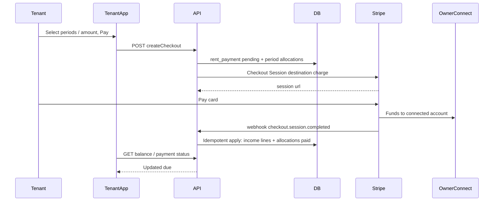

# Tenant rent payments (Stripe Connect) — Implementation Phases

Industry-standard Stripe rent collection for PropertyOS: **Connect** (money lands on the property owner’s connected account), **Checkout Session / PaymentIntent** per charge (not Subscriptions — rent prorates and changes), **webhook-first settlement**, **idempotent ledger**, **operator income lines remain schedule truth**. Tenant may **select periods** and **pay partial** amounts against allocated periods.

**Product decisions locked:** Connect (1B); period selection + partial pay (2B). ACH deferred to a later phase on the same payment ledger.

**Related code today**

- [`docs/TENANT_PORTAL_ENHANCEMENTS_PHASES.md`](docs/TENANT_PORTAL_ENHANCEMENTS_PHASES.md) Phase 6 — payments sketch (intent + webhook + income)
- [`apps/server/src/db/property-long-stays.ts`](apps/server/src/db/property-long-stays.ts) `getRentSchedule` — `expectedRent` / `isPaid` via income lines
- [`apps/server/src/db/property-income-lines.ts`](apps/server/src/db/property-income-lines.ts) — create income lines operators already use
- [`apps/server/src/services/tenant-portal-membership-service.ts`](apps/server/src/services/tenant-portal-membership-service.ts) — lease access + tenant lease detail
- [`apps/server/src/db/property-members.ts`](apps/server/src/db/property-members.ts) — owner/manager roles (Connect onboarding eligibility)
- [`apps/server/src/lib/redis-fixed-window-rate-limit.ts`](apps/server/src/lib/redis-fixed-window-rate-limit.ts) — rate-limit pattern
- Tenant home placeholder: [`apps/tenant/src/pages/home-dashboard-page.tsx`](apps/tenant/src/pages/home-dashboard-page.tsx)

---

## Goals

- Tenant can see **amount due** from unpaid schedule periods and **pay via Stripe** (card first).
- Tenant can **choose which unpaid periods** to pay and/or pay a **partial** amount allocated FIFO (or explicit allocation) across selected periods.
- Funds settle to the **property’s Connect account** (Express recommended); optional platform **application fee** later.
- **Webhook** is the only path that marks rent paid; browser return URL is UX only.
- Successful payment creates/links **`property_income_lines`** so existing `isPaid` stays correct.
- Admin can **onboard Connect** for a property and see payment status; feature-flagged until sandbox-proven.

## Non-goals (v1)

- ACH / bank debit (Phase 5+)
- Stripe Subscriptions / fixed recurring products
- Partial platform marketplace payouts beyond Connect destination charge + optional app fee
- Late fees, credits, deposits as first-class products (schema may allow extension)
- Multi-currency
- Letting tenants edit schedule or invent amounts outside computed due
- Dashboard polish beyond pay + balance (property manager contact is separate)

---

## Guiding principles

1. **Operator ledger is schedule truth** — unpaid = schedule months without sufficient applied payments/income; Stripe is money-rail truth.
2. **Webhook or it didn’t happen** — never mark paid from Checkout redirect alone.
3. **Idempotency everywhere** — Stripe Idempotency-Key on create; unique `stripe_event_id`; unique open payment per lease+periods hash.
4. **Connect Express + destination charges** — industry default for SaaS collecting on behalf of businesses with platform fee later; avoid direct charges until needed.
5. **Per-period charges, not Subscriptions** — matches prorations / rent periods / extensions.
6. **API + webhook before tenant UI** — same sequencing as Enhancements Phase 6.
7. **Feature flag** — `TENANT_RENT_PAYMENTS_ENABLED` (server) + `VITE_TENANT_RENT_PAYMENTS_ENABLED` (tenant).

---

## Target architecture

### Connect model (v1)

- **Express** accounts linked at **property** level (`properties.stripe_connect_account_id` or `property_payment_accounts` table).
- Only **property owner** (or designated billing admin) can complete Connect onboarding in admin.
- Checkout uses `payment_intent_data.transfer_data.destination = connectedAccountId` (destination charge on platform account).
- If property has **no** connected account / not `charges_enabled`: pay disabled with clear error.

### Permissions

- **Tenant (active membership):** read balance, create checkout for own lease, view own payment history.
- **Property owner:** Connect onboarding + view payment events for property leases.
- **Manager/accountant:** read-only payment status in admin (no Connect account change unless product expands later).

### Feature flag

`TENANT_RENT_PAYMENTS_ENABLED` / `VITE_TENANT_RENT_PAYMENTS_ENABLED` — gate create-checkout, webhooks apply path (still accept+log events when off if desired), and tenant Pay UI.

---

## Data model (sketch)

### `property_stripe_accounts`

| Column                | Notes                |
| --------------------- | -------------------- |
| `property_id`         | PK/FK unique         |
| `stripe_account_id`   | Connect acct\_…      |
| `charges_enabled`     | mirrored from Stripe |
| `payouts_enabled`     | mirrored             |
| `onboarding_complete` | boolean              |
| `details_submitted`   | boolean              |
| `updated_at`          |                      |

### `tenant_rent_payments`

| Column                       | Notes                                                                                                 |
| ---------------------------- | ----------------------------------------------------------------------------------------------------- |
| `id`                         | UUID                                                                                                  |
| `lease_id`                   | long stay                                                                                             |
| `property_id`                | denormalized                                                                                          |
| `tenant_user_id`             | payer                                                                                                 |
| `status`                     | `pending` \| `requires_action` \| `processing` \| `succeeded` \| `failed` \| `canceled` \| `refunded` |
| `currency`                   | `usd` v1                                                                                              |
| `amount_cents`               | requested charge                                                                                      |
| `stripe_checkout_session_id` | unique nullable                                                                                       |
| `stripe_payment_intent_id`   | unique nullable                                                                                       |
| `idempotency_key`            | unique — server-generated                                                                             |
| `connected_account_id`       | snapshot at create                                                                                    |
| `created_at` / `updated_at`  |                                                                                                       |

### `tenant_rent_payment_allocations`

| Column                    | Notes                            |
| ------------------------- | -------------------------------- |
| `id`                      | UUID                             |
| `payment_id`              | FK                               |
| `period_month`            | `YYYY-MM` matching schedule      |
| `allocated_cents`         | portion of this payment          |
| `expected_cents_snapshot` | schedule expected at charge time |
| Unique                    | `(payment_id, period_month)`     |

**Paid rule:** A schedule month is fully paid when sum(succeeded allocations for month) + existing income coverage ≥ expected rent (or income line exists covering month — keep current income-line `isPaid` as primary after webhook writes income).

### `stripe_webhook_events`

| Column            | Notes                    |
| ----------------- | ------------------------ |
| `stripe_event_id` | unique                   |
| `type`            |                          |
| `processed_at`    |                          |
| `payload`         | jsonb redacted / minimal |

---

## Shared contract (`packages/shared`)

| Type                                | Purpose                                                                                                |
| ----------------------------------- | ------------------------------------------------------------------------------------------------------ |
| `TTenantRentPaymentStatus`          | enum                                                                                                   |
| `ITenantLeaseBalanceResponse`       | `amountDueCents`, `currency`, `periods[]` with `month`, `expectedCents`, `paidCents`, `remainingCents` |
| `ITenantCreateRentCheckoutBody`     | `leaseId`, `periodMonths[]`, `amountCents` (must be ≤ sum remaining of selected; ≥ min Stripe amount)  |
| `ITenantCreateRentCheckoutResponse` | `paymentId`, `checkoutUrl`                                                                             |
| `ITenantRentPaymentStatusResponse`  | poll after return URL                                                                                  |
| Admin Connect types                 | onboarding link + account status                                                                       |

---

## API (sketch)

| Method | Path                                                   | Notes                                                          |
| ------ | ------------------------------------------------------ | -------------------------------------------------------------- |
| `GET`  | `/tenant/me/leases/:leaseId/balance`                   | Auth tenant; membership active                                 |
| `POST` | `/tenant/me/leases/:leaseId/rent-payments/checkout`    | Creates pending row + Checkout Session; 409 if Connect missing |
| `GET`  | `/tenant/me/rent-payments/:paymentId`                  | Status for return-page polling                                 |
| `POST` | `/webhooks/stripe`                                     | Raw body + signature verify; no tenant JWT                     |
| `POST` | `/admin/properties/:id/stripe/connect/onboarding-link` | Owner                                                          |
| `GET`  | `/admin/properties/:id/stripe/connect/status`          | Member read                                                    |

Balance logic: from `getRentSchedule`, for each month with remaining > 0, expose remaining; default “amount due” = sum remaining for months with due date ≤ today (or calendar month ≤ current). Checkout validates selected months unpaid remaining and `amountCents` ≤ sum(selected remaining). Allocation: explicit if client sends per-period amounts; else **FIFO** across selected months.

---

## Phases

### Phase 0 — Foundation

**Goal:** Schema, flags, Stripe SDK, Connect account table, shared types — no live charges.

- [ ] Env: `STRIPE_SECRET_KEY`, `STRIPE_WEBHOOK_SECRET`, `STRIPE_PUBLISHABLE_KEY`, Connect client ids as required; document in `.env.example`
- [ ] Migration(s) for tables above
- [ ] `stripe` package + thin `apps/server/src/stripe/` client wrapper
- [ ] Shared types + feature flag helpers
- [ ] Pure helpers: compute remaining by month; validate checkout body; allocation FIFO — unit tests

**Exit criteria:** Types compile; flag off by default; helpers tested; no routes live.

### Phase 1 — Backend pipeline (no tenant UI)

**Goal:** Create Checkout + webhook applies income; script/Postman can complete a sandbox payment.

- [ ] Connect onboarding link API (admin) + account status sync
- [ ] `GET balance` + `POST checkout` (flagged)
- [ ] Checkout Session: card, `mode=payment`, destination = property Connect account, metadata (`paymentId`, `leaseId`, periods, amounts)
- [ ] Webhook handler: verify signature; store event id; on success allocate + create income line(s) linked to lease/month; transition payment `succeeded`
- [ ] Handle `payment_intent.payment_failed`, `checkout.session.expired` → failed/canceled
- [ ] Idempotency tests (double webhook, double checkout click)

**Exit criteria:** Sandbox card payment → webhook → income line → schedule `isPaid` true for covered months; duplicate webhook no-ops.

### Phase 2 — Return UX plumbing + reconcile

**Goal:** Failsafe sync without full product UI.

- [ ] Success/cancel return URLs → tenant pages that **poll** `GET payment status` until terminal
- [ ] Daily (or hourly) reconcile job: list recent succeeded PaymentIntents for platform; find missing local `succeeded`; alert/log `tenant_payments.reconcile_gap`
- [ ] Structured logs `tenant_payments.*` (no secrets)

**Exit criteria:** Simulated missed webhook recovered by reconcile or clearly alerted; return page never marks paid alone.

### Phase 3 — UI MVP

**Goal:** Tenant can pay; admin can connect Stripe.

- [ ] Admin: property settings Connect onboarding + status badge
- [ ] Tenant: balance on home / lease; period multi-select; amount input (capped); Pay → redirect Checkout
- [ ] Return pages: confirming / success / failed
- [ ] Hide Pay when flag off or Connect not ready

**Exit criteria:** Staging E2E: onboard Connect → tenant pays selected/partial → admin income shows → schedule paid.

### Phase 4 — Hardening

| Concern                    | Action                                                                                                     |
| -------------------------- | ---------------------------------------------------------------------------------------------------------- |
| Rate limits                | Redis limits on checkout create per tenant/IP                                                              |
| Idempotency                | Unique constraints + Stripe Idempotency-Key                                                                |
| Refunds/disputes           | Webhooks set `refunded` / flag income; no silent ignore                                                    |
| Race with admin manual pay | Apply path re-reads remaining; overpay → don’t double income; prefer refund or credit note path documented |
| Observability              | Datadog/log metrics on webhook latency + failures                                                          |
| PCI                        | Checkout only; no card data on our servers                                                                 |
| Failure modes              | Extend `TENANT_PORTAL_FAILURE_MODES.md`                                                                    |

**Exit criteria:** Documented failure matrix; flag matrix staging; load light-test on webhook burst.

### Phase 5+ — Enhancements (deferred)

- ACH / bank debits (`us_bank_account`) with `processing` status
- Application fees / platform revenue
- Automatic rent-due emails with Checkout links
- Late fees
- Connect Standard / controller properties if Express limits hit

---

## What not to do

- Do not use Stripe Subscriptions for lease rent.
- Do not mark paid from frontend success query params.
- Do not trust client `amountCents` without recompute against schedule remaining.
- Do not skip Connect onboarding checks (“pay to platform then forget”).
- Do not create income lines without linking payment id + period months.
- Do not process webhooks without signature verification and raw body.
- Do not ship tenant Pay UI before Phase 1 sandbox webhook proof.

## Safest sequencing summary

1. Flag + schema + balance math tests
2. Connect onboarding
3. Checkout create + webhook → income
4. Reconcile + return polling
5. Admin Connect UI + tenant Pay UI
6. Hardening → then ACH

---

## Doc delivery

On implementation kickoff, write the full plan to [`docs/TENANT_RENT_PAYMENTS_PHASES.md`](docs/TENANT_RENT_PAYMENTS_PHASES.md) and add a one-line pointer from Enhancements Phase 6 to that doc.
