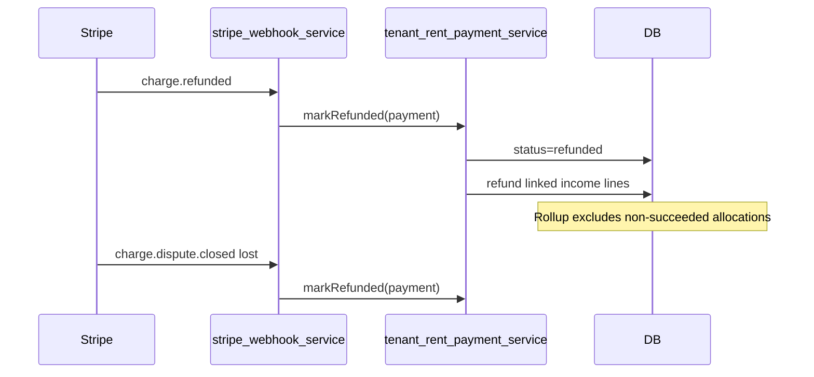

# Tenant Stripe rent — Refunds & disputes

Webhook-driven reversal for tenant rent charges. Complements manual admin refunds in [`LEASE_RENT_PERIOD_PAYMENTS_PHASES.md`](./LEASE_RENT_PERIOD_PAYMENTS_PHASES.md) Phase 4.1.

**Parent:** [`TENANT_STRIPE_RENT_PAYMENTS.md`](./TENANT_STRIPE_RENT_PAYMENTS.md) Phase 4 (refunds/disputes row).

---

## Gap today

| Layer | Status |
| --- | --- |
| Admin manual income refund | Done — rollup via `getReportableIncomeLineAmounts` |
| `tenant_rent_payments.status = refunded` | Done — `markRefunded` via `charge.refunded` / dispute lost |
| Webhooks | Done — `charge.refunded`, `charge.dispute.created`, `charge.dispute.closed` |
| Income ↔ payment link | Done — `tenant_rent_payment_id` on auto-created lines |
| Allocations rollup | Done — `sumSucceededAllocatedCents*` counts `status = succeeded` only |

**Partial Stripe refunds:** logged as `tenant_payments.refund_partial_unhandled`; operator fixes income manually.

---

## Goals

- `charge.refunded` (full) → payment `refunded`, allocations stop counting, linked income lines refunded.
- `charge.dispute.closed` with `status = lost` → same reversal as refund.
- Idempotent via existing `stripe_webhook_events`.
- Lease schedule + tenant balance correct without new rollup logic.

## Non-goals (v1)

- Partial Stripe refunds (log + manual admin refund)
- Webhook unrefund
- Admin UI for disputes
- New Stripe destination or signing secret

---

## Stripe Event Destination changes

Use the **same platform snapshot** destination as rent settlement ([`TENANT_STRIPE_RENT_PAYMENTS.md` § Webhook destination setup](./TENANT_STRIPE_RENT_PAYMENTS.md)): URL `/webhooks/stripe`, same `STRIPE_WEBHOOK_SECRET`.

**Add events** (Dashboard → Developers → Event destinations → edit → Add events):

| Event | Purpose |
| --- | --- |
| `charge.refunded` | Primary — resolve payment via `payment_intent`, reverse ledger |
| `charge.dispute.created` | Log + optional ops alert; no ledger change |
| `charge.dispute.closed` | If `status = lost` → same path as full refund |

**Keep:** `checkout.session.completed`, `checkout.session.expired`, `payment_intent.payment_failed`.

Prefer `charge.refunded` over `refund.updated` (one event per charge refund, includes `payment_intent`).

### Ops checklist

1. Add the three events above to the snapshot destination (no new URL/secret).
2. Deploy handler code (R1–R2) before relying on auto-reversal.
3. Sandbox: pay rent → Dashboard **Refund payment** → `stripe_webhook_events` has `charge.refunded` → `tenant_rent_payments.status = refunded` → lease month unpaid on admin + tenant balance.

---

## Flow

---

## Phased rollout

### Phase R0 — Link income to payment ✅

- [x] Migration: `property_income_lines.tenant_rent_payment_id UUID NULL REFERENCES tenant_rent_payments(id) ON DELETE SET NULL`
- [x] Set in [`applyIncomeForFullyCoveredMonths`](../apps/server/src/services/tenant-rent-payment-service.ts) when creating lines
- [x] Mapper + [`IPropertyIncomeLine`](../packages/shared/src/property-income-line-types.ts)

**Exit:** New Stripe-settled income rows carry `tenant_rent_payment_id`.

### Phase R1 — Refund webhook ✅

- [x] [`stripe-webhook-service.ts`](../apps/server/src/services/stripe-webhook-service.ts): `charge.refunded` → resolve payment by `payment_intent` → `markRefunded`
- [x] [`tenant-rent-payment-service.ts`](../apps/server/src/services/tenant-rent-payment-service.ts): `markRefunded`:
  - No-op if already `refunded`
  - `updateStatus(..., REFUNDED)` — allocations drop from rollup automatically
  - Refund income lines where `tenant_rent_payment_id = payment.id` (system actor; extend [`propertyIncomeLinesDb.refund`](../apps/server/src/db/property-income-lines.ts) or dedicated webhook helper)
- [x] **v1 full refund only:** if `amount_refunded < charge.amount`, log `tenant_payments.refund_partial_unhandled`, still mark payment `refunded`; operator fixes income manually

**Exit criteria:** Sandbox full refund → payment `refunded`, schedule `paidRent` drops, tenant `amountDueCents` restored.

### Phase R2 — Disputes ✅

- [x] `charge.dispute.created` → `tenant_payments.dispute_created` log; optional Discord via [`discord-webhook`](../apps/server/src/services/discord-webhook.ts) env (`DISCORD_TENANT_PAYMENTS_WEBHOOK_URL`)
- [x] `charge.dispute.closed` + `status = lost` → `markRefunded`
- [x] `won` / `warning_closed` → log only

**Exit criteria:** Dispute lost in sandbox → same ledger outcome as refund.

### Phase R3 — Tests + doc sign-off ✅

- [x] [`stripe-webhook-service.test.ts`](../apps/server/src/services/stripe-webhook-service.test.ts): refund + dispute.closed
- [x] Service: refunded payment excluded from [`sumSucceededAllocatedCents`](../apps/server/src/db/tenant-rent-payments.ts) — [`tenant-rent-payments-rollup.test.ts`](../apps/server/src/db/tenant-rent-payments-rollup.test.ts)
- [x] Schedule integration: linked income refund → month unpaid — [`property-long-stays-rent-schedule.test.ts`](../apps/server/src/db/property-long-stays-rent-schedule.test.ts)
- [x] Check off Phase 4 refunds row in [`TENANT_STRIPE_RENT_PAYMENTS.md`](./TENANT_STRIPE_RENT_PAYMENTS.md)

---

## Files (implementation)

| File | Change |
| --- | --- |
| `apps/server/src/db/migrations.ts` | `tenant_rent_payment_id` on income lines |
| `apps/server/src/services/stripe-webhook-service.ts` | Handlers |
| `apps/server/src/services/tenant-rent-payment-service.ts` | `markRefunded` |
| `apps/server/src/db/property-income-lines.ts` | Link + query by payment id |
| Tests | webhook + service + schedule |

No Dashboard changes beyond event subscription.
